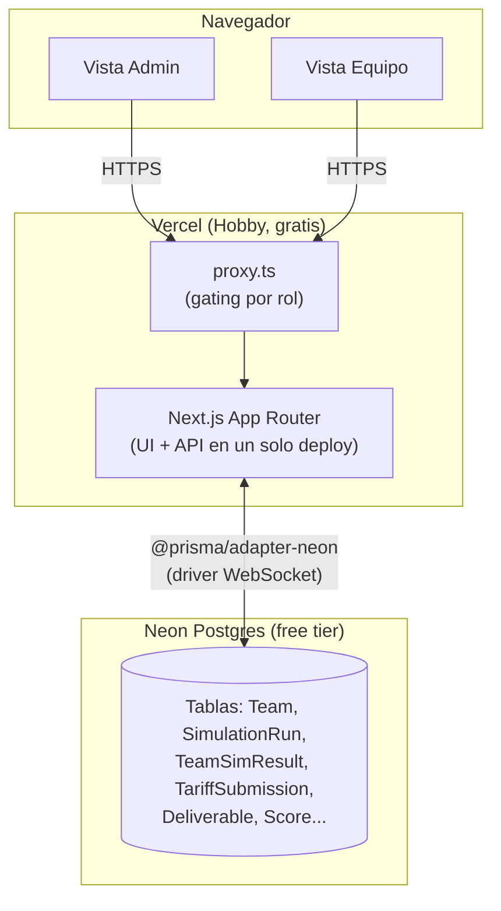
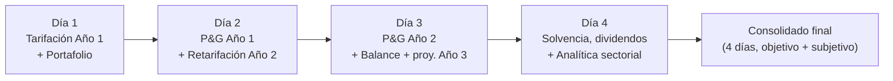
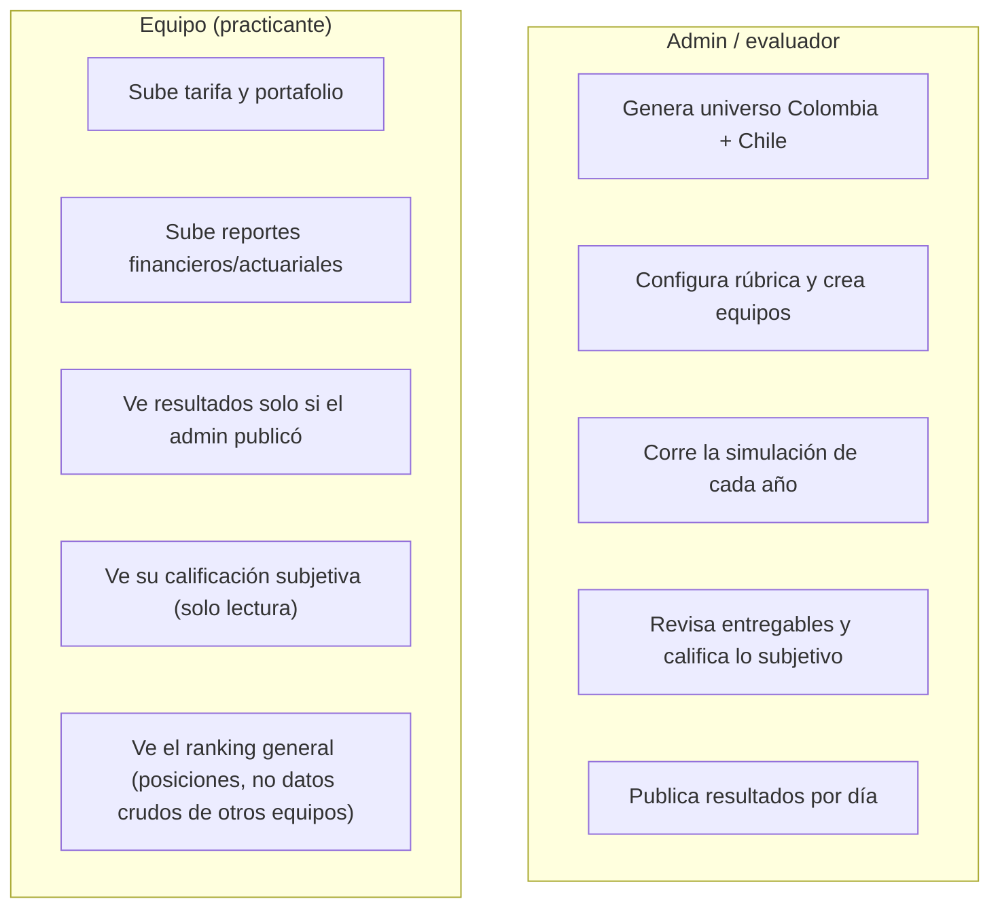

# simulador-financiero-y-actuarial

Plataforma web para una **prueba técnica de pasantía en ciencia actuarial, finanzas y riesgos** de una aseguradora colombiana. Equipos de practicantes tarifican un libro de autos, gestionan un portafolio de inversión y son evaluados a lo largo de **4 días de reto / 2 años simulados**, con calificación objetiva (motor actuarial/financiero) y subjetiva (rúbrica del evaluador).

Corre **100% en planes gratuitos** (Vercel Hobby + Neon Postgres free tier) — sin costo alguno para operar.

## Qué hace

- Genera un universo sintético de **1,000,000 de pólizas** de auto en Colombia (riesgo, siniestros y fechas fijados de forma determinística por semilla).
- Cada equipo sube su propia tarifa (prima por póliza) y compite contra los demás equipos en un mercado simulado (elección discreta tipo logit, con tope de cuota de mercado).
- A lo largo de 4 días, los equipos tarifican, invierten, reservan, cierran P&G, calculan solvencia y hacen recomendaciones sectoriales — todo evaluado automáticamente contra un motor de referencia, más una calificación subjetiva del evaluador.
- El evaluador (admin) controla cuándo cada equipo ve sus resultados (publicación por día, no todo-o-nada).

## Arquitectura



| Capa | Elección | Por qué |
|---|---|---|
| Framework | Next.js 16 (App Router) | Un solo repo/deploy para UI + API, roles vía rutas |
| Base de datos | Neon Postgres + Prisma (`@prisma/adapter-neon`) | Tipado end-to-end, migraciones versionadas, tier gratuito generoso |
| Auth | NextAuth (Credentials) | Cuentas de equipo usuario+contraseña creadas por el admin, sin correo (evita servicios de pago) |
| Datos masivos | `bytea` en el mismo Postgres | 1M números Float32 ≈ 4 MB; evita un segundo servicio (Vercel Blob) |
| Deploy | Vercel Hobby | Integración directa con Next.js, dominio `*.vercel.app` gratis |
| CSV | Papa Parse + zod | Parseo real con validación de esquema (no `split(',')`) |

## El motor: universo, mercado y reservas


La generación es **determinística**: la misma semilla siempre produce el mismo universo, lo mismo que la asignación de mercado (dado el mismo β, factor de marca y cuota máxima). Esto permite que cada corrida sea reproducible y auditable.

## Los 4 días



Cada día tiene las mismas 5 sub-pestañas que el prototipo original: **Tarifas/Portafolio/Simulación** (solo Días 1-2, ya que el Año 2 es el último año simulado), **Entregables**, **Resultados objetivos**, **Calificación subjetiva** y **Top del día**.

| Día | Actuarial | Financiero |
|---|---|---|
| 1 | Tarificar Año 1 | Elegir portafolio de inversión (calce con reservas) |
| 2 | Reservas Año 1 + retarifar Año 2 (con retención de clientes) | P&G Año 1 |
| 3 | Reservas Año 2 | P&G Año 2 (+ proyección Año 3) y Balance |
| 4 | Recomendación sectorial (crecer/mantener/disminuir por segmento) | Solvencia (capital requerido, margen) y dividendos |

## Roles



Todo acceso a datos de un equipo se filtra por `teamId` en la capa de datos (no solo en la UI), y ningún resultado se expone a una sesión de equipo sin que el flag `published` esté activo.

## Estructura del repo

```
/prisma            Schema y migraciones
/src
  /domain          Motor puro (sin Next.js/Prisma/React) — generación, mercado, reservas, finanzas, calificación
  /lib             Server Actions, helpers de Prisma/CSV/binario, orquestación por equipo
  /app
    /(team)/...    Vistas de equipo (dashboard, día/[n], ranking, modelo técnico)
    /admin/...     Vistas de admin (universo, configuración, día/[n], consolidado, modelo técnico)
    /api/...       Route Handlers (universo, simulación, tarifas, reporte)
    proxy.ts       Gating por rol (Next.js 16 renombró middleware.ts a proxy.ts)
```

`src/domain` no importa nada de Next.js/Prisma/React: recibe datos planos (arrays tipados) y devuelve datos planos, así que se prueba en aislamiento (`npm run test`).

## Cómo correrlo localmente

```bash
npm install
npx prisma migrate dev      # aplica migraciones contra tu Neon Postgres
npm run dev                 # servidor de desarrollo
npm run test                # tests unitarios del motor (src/domain)
```

Variables de entorno esperadas (`.env.local`, ver `.env.example`): `DATABASE_URL` (Neon), `AUTH_SECRET`.

## Despliegue

Vercel Hobby (gratis) + Neon Postgres free tier. Sin dominio propio (usa `*.vercel.app`). El cómputo pesado (generación del universo, simulación de mercado) corre de forma síncrona dentro de Route Handlers normales (`maxDuration = 300`, el máximo real del plan Hobby) — no hay cola ni worker separado, por diseño, para no depender de un servicio de pago.
