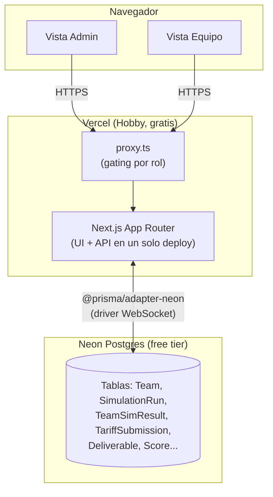
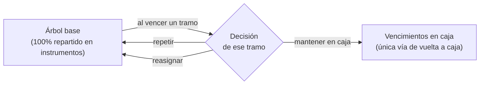
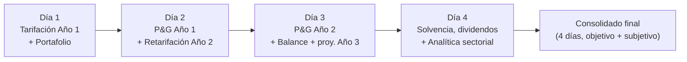
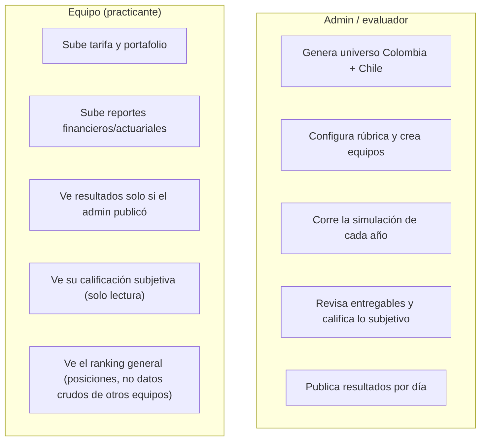

# simulador-financiero-y-actuarial

Plataforma web para una **prueba técnica de pasantía en ciencia actuarial, finanzas y riesgos** de una aseguradora colombiana. Equipos de practicantes tarifican un libro de autos, gestionan un portafolio de inversión y son evaluados a lo largo de **4 días de reto / 2 años simulados**, con calificación objetiva (motor actuarial/financiero) y subjetiva (rúbrica del evaluador).

Corre **100% en planes gratuitos** (Vercel Hobby + Neon Postgres free tier) — sin costo alguno para operar.

## Qué hace

- Genera un universo sintético de **1,000,000 de pólizas** de auto en Colombia (riesgo, siniestros y fechas fijados de forma determinística por semilla).
- Cada equipo sube su propia tarifa (prima por póliza) y compite contra los demás equipos en un mercado simulado (elección discreta tipo logit, con tope de cuota de mercado).
- A lo largo de 4 días, los equipos tarifican, invierten, reservan, cierran P&G, calculan solvencia y hacen recomendaciones sectoriales — todo evaluado automáticamente contra un motor de referencia, más una calificación subjetiva del evaluador.
- El evaluador (admin) controla cuándo cada equipo ve sus resultados (publicación por día, no todo-o-nada).

## Arquitectura



| Capa | Elección | Por qué |
|---|---|---|
| Framework | Next.js 16 (App Router) | Un solo repo/deploy para UI + API, roles vía rutas |
| Base de datos | Neon Postgres + Prisma (`@prisma/adapter-neon`) | Tipado end-to-end, migraciones versionadas, tier gratuito generoso |
| Auth | NextAuth (Credentials) | Cuentas de equipo usuario+contraseña creadas por el admin, sin correo (evita servicios de pago) |
| Datos masivos | `bytea` en el mismo Postgres | 1M números Float32 ≈ 4 MB; evita un segundo servicio (Vercel Blob) |
| Deploy | Vercel Hobby | Integración directa con Next.js, dominio `*.vercel.app` gratis |
| CSV | Papa Parse + zod | Parseo real con validación de esquema (no `split(',')`) |

## El motor: universo, mercado y reservas


La generación es **determinística**: la misma semilla siempre produce el mismo universo, lo mismo que la asignación de mercado (dado el mismo β, factor de marca y cuota máxima). Esto permite que cada corrida sea reproducible y auditable.

## Los modelos actuariales y financieros, en detalle

Esta sección explica **qué calcula el motor y por qué**, no solo el flujo general de arriba. Todo el código referenciado vive en `src/domain/` (puro, sin dependencias de Next.js/Prisma/React) y tiene tests unitarios con semilla fija.

### 1 · Generación del riesgo (frecuencia y severidad)

Cada póliza tiene 13 variables (edad, zona, tipo de vehículo, antigüedad, kilometraje, historial de siniestros, valor asegurado, uso, parqueadero, nivel educativo, estrato, género, marca). A partir de esas variables:

- **Frecuencia (λ)** — `calcLambda()` — un modelo GLM multiplicativo: se parte de una frecuencia base y se multiplica por factores de riesgo relativo por cada variable (ej. zona urbana ×1.45, historial de 2+ siniestros ×1.85–3.20, uso comercial ×1.70), más algunas **interacciones** (joven + deportivo, urbano + comercial) y un par de variables "trampa" deliberadamente débiles para que la señal real no sea trivial de encontrar. El resultado es la probabilidad de que esa póliza tenga al menos un siniestro en el año.
- **Severidad media** — `calcMediaSev()` — proporcional al valor asegurado del vehículo, con factores por tipo de vehículo, zona y antigüedad. El siniestro individual se muestrea de una **Gamma** con esa media (forma fija), lo que da una cola derecha realista (muchos siniestros pequeños, pocos grandes).
- **Fecha de ocurrencia y aviso** — el mes de ocurrencia sigue un patrón estacional (más siniestros en diciembre/enero, `sampleClaimDate()`). El aviso **no es inmediato**: el rezago ocurrencia→aviso sigue una **lognormal** (`sampleReportingLag()`, μ=3.0/σ=1.2 en días, mediana ~20 días, cola topada en 730 días — hasta 2 años en casos extremos) — este rezago es la fuente real de IBNR (ver §3).

Todo esto se fija en el momento de `generateColombia(seed)`: la misma semilla siempre produce el mismo universo, byte a byte.

### 2 · Mercado (a quién le toca cada póliza)

Cada equipo sube una tarifa (prima por póliza). El mercado se resuelve en 3 fases (`runSimulation()`):

1. **Preferencias (logit)**: cada póliza calcula una utilidad `u = -β·ln(prima/1,000,000) + ruido_Gumbel·factor_marca` por cada equipo, y "elige" al de mayor utilidad. β es la sensibilidad al precio (mayor β = mercado más sensible a precio); el ruido Gumbel con el factor de marca simula inercia/fidelidad de marca que no depende solo del precio.
2. **Racionamiento por cuota**: cada equipo tiene un tope de cuota de mercado (ej. 30% del universo). Si más pólizas lo prefieren de las que puede tomar, se queda con las de **mayor prima** (maximiza ingreso dado el cupo) y rechaza el resto.
3. **Redistribución**: las pólizas rechazadas se reasignan entre los equipos con cupo restante, con el mismo mecanismo logit.

**Año 2** (`runSimulationYear2()`) repite esto pero con dos diferencias: (a) los siniestros del Año 2 son un sorteo **independiente** del Año 1 (mismo modelo de riesgo, un año más de antigüedad, e historial actualizado si hubo siniestro en el Año 1) — no se reciclan los siniestros del Año 1; y (b) cada póliza tiene un **bono de retención** hacia el equipo que la aseguró en el Año 1 (ruido Gumbel adicional escalado por un factor de retención configurable) — a mayor factor, más difícil que un equipo pierda un cliente solo por precio.

### 3 · Reservas e IBNR

Al cierre del Año 1, no todos los siniestros ya ocurridos han sido *avisados* — el rezago aviso→pago (§1) implica que una porción real de la siniestralidad todavía no se conoce. `computeLiabilitySchedules()` construye, por equipo:

- **RSA** (reserva de siniestros avisados): siniestros ya notificados, pendientes de pago según un patrón de desarrollo (curva acumulada de pagos calibrada contra el dataset de Chile).
- **IBNR** (*Incurred But Not Reported*): estimado a partir del **factor de desarrollo de mercado** — qué fracción de la siniestralidad total del mercado típicamente se avisa dentro del mismo año — aplicado al patrón agregado, no a la experiencia individual de cada equipo (un solo equipo tiene muy poca data propia para estimar esto de forma confiable, igual que en la práctica real).

Al cierre del Año 2, `computeDevelopment()` compara lo **realmente emergido** (siniestros del Año 1 avisados tarde, ya en el Año 2) contra lo que el IBNR había estimado — esa diferencia es la ganancia/pérdida de desarrollo que entra al P&G del Año 2 (ver §4). Esto es deliberado: un equipo puede tarifar bien pero reservar mal (o viceversa), y ambas cosas se califican por separado.

**Cuándo se paga un siniestro, en detalle** — el pago de un siniestro puntual sigue tres tramos consecutivos, no uno solo (una fuente común de confusión al leer la tabla de caja del ALM, ver §5):

1. **Ocurrencia → aviso**: el rezago lognormal de §1 (mediana ~20 días, cola hasta 730 días/~24 meses).
2. **Aviso → primer pago**: un rezago **fijo** de 3 meses (`LAG_AVISO_PAGO`).
3. **Desarrollo del pago**: se reparte en 3 años (36 meses) desde ese primer pago, según `DEV_FRAC = [0.55, 0.30, 0.15]` (`buildKernel()` en `src/domain/reserving/constants.ts`) — 55% del monto en el año 1 de desarrollo, 30% en el año 2, 15% en el año 3.

En el peor caso estos tramos se **suman**: un siniestro ocurrido cerca del cierre del Año 1, con un aviso especialmente tardío (cola de la lognormal), puede seguir generando pagos hasta cerca del límite de la ventana simulada. Por eso `HORIZON=48` meses desde la valoración (4 años, no 3): se dejó holgura deliberada frente a los 3 años de desarrollo puro, justamente para no cortar la cola de los siniestros avisados tarde dentro del Año 1. Lo que aun así exceda esa ventana de 48 meses se trunca — no se paga ni se refleja en la reserva —, una simplificación aceptada del modelo, no un error.

### 4 · P&G, Balance y Solvencia (`finBench()`)

El resultado técnico de cada año es `prima − siniestros − gastos`, donde los gastos son porcentajes fijos de la prima (adquisición 10%, comisión 4%, administración 6% — `FZ` en `src/domain/finance/constants.ts`). A esto se suma el **resultado de inversiones** (rendimiento del portafolio menos penalización por descalce, ver §5) para llegar a la utilidad antes de impuesto, y de ahí a la utilidad neta (tasa de renta 30%).

El balance es una aproximación simple: patrimonio (**Capital Social fijo** + utilidades retenidas − capital comprometido por el ALM, ver §5.1-§5.2), caja/CxC/CxP como porcentajes de la prima, e inversiones como el residual que cuadra el balance.

La **solvencia** combina tres riesgos — suscripción (con volatilidad de primas y reservas), financiero (sobre las inversiones, escalado por la **volatilidad realizada del portafolio del equipo**, ver §5.4) y operacional (sobre primas) — agregados con una **matriz de correlación** (similar en espíritu a un enfoque tipo Solvencia II, sin pretender ser una implementación regulatoria completa). El margen de solvencia es `fondos propios / capital requerido`; el dividendo sugerido es el excedente de fondos propios sobre un margen objetivo. Esta es la doble conexión directa entre la decisión de portafolio del Día 1/Día 2 y la solvencia del Día 4: (a) un equipo que concentró su portafolio en instrumentos volátiles paga un capital requerido mayor (`rFin` más alto → RK más alto → margen y dividendo más bajos), y (b) un equipo que tuvo que comprometer Capital Social para cubrir una brecha de caja ve sus fondos propios directamente reducidos por ese monto — ambos, sin importar qué tan bien le fue en rendimiento nominal.

El **Año 3 no se simula** — se proyecta aplicando una tasa de crecimiento fija al resultado del Año 2, solo para dar visibilidad de tendencia.

### 5 · Portafolio de inversión y ALM (asset-liability matching)

Cada equipo construye su portafolio como un **árbol de decisiones**, no una asignación estática en dos momentos. Parte de una base (cómo repartir 100 entre los instrumentos del menú) y, para **cada tramo** de esa base, decide qué pasa cuando llegue a su propio vencimiento:

```ts
interface Tranche {
  instrumentId: string;
  weight: number;
  durationM?: number; // obligatorio solo para LIQ/ACC — ninguno tiene plazo contractual propio
  onMaturity:
    | { action: "cash" }                            // pasa a caja disponible
    | { action: "repeat" }                           // se refondea igual, indefinidamente
    | { action: "reallocate"; tranches: Tranche[] }; // se reparte entre nuevos tramos, cada uno con su propia decisión
}
```

LIQ y acciones (ACC) no tienen un plazo fijo como un bono, así que el equipo les asigna un **vencimiento personalizado** (`durationM`): el momento en que se le vuelve a preguntar qué hacer con esa porción. La interfaz de equipo lo recoge como un asistente paso a paso — una decisión a la vez, incluyendo las que se generan en cascada cuando la respuesta es "reasignar" — no un formulario con todo el árbol a la vez.

**El menú de instrumentos tiene un verdadero trade-off riesgo/retorno**, no solo distintos rendimientos — cada instrumento también tiene una **volatilidad anualizada** (`volAnual` en `src/domain/finance/instruments.ts`):

| Instrumento | Rendimiento | Volatilidad | Rendimiento ajustado por riesgo* |
|---|---|---|---|
| LIQ (caja) | 8.0% | 1.0% | 7.65% |
| CDT 90 días | 9.5% | 2.0% | 8.80% |
| TES 1 año | 10.5% | 4.0% | 9.10% |
| TES 3 años | 11.5% | 7.0% | 9.05% |
| **TES UVR 8 años** | **12.0%** | **6.0%** | **9.90% (el mejor del menú)** |
| Acciones (ACC) | 14.0% | 20.0% | 7.00% (el peor del menú — peor que dejar todo en caja) |

*Rendimiento − 0.35 × Volatilidad (`VOL_PENALTY_LAMBDA` en `src/domain/finance/constants.ts`). El TES UVR está calibrado deliberadamente como el mejor balance del menú: su volatilidad es menor de lo que su plazo nominal de 8 años sugeriría, modelando que al estar indexado a inflación queda protegido de la inflación inesperada que sí penaliza a un bono nominal del mismo plazo — una simplificación explícita del modelo, no un dato de mercado real. Las acciones, en cambio, quedan claramente castigadas: su 14% nominal no compensa su volatilidad, ni en la nota (abajo) ni en el capital de solvencia (§4).



`almSim()` simula mes a mes (60 meses: 12 de fondeo + 48 de corrida) dos vistas separadas del mismo portafolio:

- **Un estado de caja** con seis columnas — **Caja Inicial, Prima Cobrada, Pago Siniestros, Gastos, Vencimientos en caja, Inversión Neta, Caja Final** — contra una **Caja Mínima** obligatoria cada mes (15% de Prima+Siniestros, `FZ.cajaPct`).
- **Una evolución del valor del portafolio** — Saldo Inicial, Rendimiento devengado, Saldo Final — separada del estado de caja anterior, porque responde una pregunta distinta: no "¿hay caja suficiente?" sino "¿cuánto vale lo que llevamos invertido?". `Saldo Final = Saldo Inicial + Rendimiento − Vencimientos en caja − Inversión Neta` (un mes con superávit invertido tiene Inversión Neta negativa, así que ese término *suma* al saldo; un mes con retiro para cubrir una brecha la *resta*) — es una identidad exacta, verificada en `alm.test.ts`, y **el Saldo Final puede ser negativo** (ver §5.1).

#### 5.1 · Capital Social y cuándo el portafolio se vuelve negativo

Todos los equipos parten del **mismo Capital Social fijo: $70,000,000,000 COP** (`CAPITAL_SOCIAL` en `src/domain/finance/constants.ts`), deliberadamente independiente de la prima propia de cada equipo — si dependiera de la prima, la elección de tarifa de un equipo alteraría indirectamente cuánto colchón de capital tiene su ALM, y eso no tiene nada que ver con el riesgo que realmente está asumiendo. El monto se calibró contra el tamaño real de los siniestros, no se inventó: un equipo representativo con ~10% de cuota de mercado (100,000 de las 1,000,000 pólizas) tiene una siniestralidad incurrida esperada de ≈$273.9B COP; de eso, ≈86.1% queda como reserva al cierre del Año 1 (medido con `computeLiabilitySchedules()` sobre el universo real, no estimado — ver §3), dando una reserva de referencia de ≈$235.9B COP; aplicando el 30% de capital de solvencia (la misma razón que ya usaba el modelo) da ≈$70.8B, redondeado a $70B.

Si en algún mes ni LIQ ni el resto del portafolio (vendido antes de tiempo, ver la jerarquía de venta forzada abajo) alcanzan a cubrir la Caja Mínima, la Caja Mínima **se sigue cumpliendo igual** — el motor cubre lo que falte directamente con Capital Social. Esto es intencional: en la vida real, una aseguradora que se queda sin activos líquidos no simplemente "no paga" — sus accionistas inyectan capital o se activa una línea de crédito para cubrir el bache, a costa de erosionar su patrimonio. Ese capital comprometido:

- **Nunca se "recupera" solo** — si el mes siguiente hay superávit, ese superávit se invierte de cero según el árbol de decisiones; el capital ya comprometido en meses anteriores queda como una marca permanente, no una sobregiro temporal que se paga sola.
- **Deja el Saldo Final del portafolio en negativo** — una vez que LIQ y el resto del portafolio llegan a 0, cualquier capital adicional comprometido resta directamente del Saldo Final reportado (ver la identidad de §5 arriba), y ese número puede quedar negativo indefinidamente.
- **Reduce el patrimonio real**, no solo el ficticio — ver §5.3 y §4: el capital comprometido a fin del Año 1 y a fin del Año 2 (dos cortes del mismo ALM ficticio de 60 meses) se resta directamente del patrimonio en `finBench()`, lo que baja el margen de solvencia del Día 4 automáticamente, sin lógica adicional.

#### 5.2 · Las cuatro notas del ALM (`scoreFinanciero()`)

- **Cumplimiento de Caja Mínima (35%)** — ya no mide "¿hubo una brecha sin cubrir?" (eso ya no existe: la Caja Mínima siempre se cumple, ver §5.1). Mide **cuánto Capital Social hubo que comprometer** para lograrlo: el peor mes individual (riesgo de cola) y lo acumulado en los 60 meses (erosión crónica), cada uno como fracción del Capital Social fijo, combinados 50/50. Un equipo que nunca tocó su capital obtiene 100 aquí, sin importar cómo lo logró.
- **Rendimiento ajustado por riesgo (35%)** — no es el rendimiento efectivo simulado a secas: es `rendimiento efectivo − 0.35 × volatilidad promedio realizada` (la misma fórmula y λ de la tabla de arriba, pero aplicada a lo que el equipo *realmente* mantuvo invertido mes a mes, no solo a su asignación inicial — un tramo que pasó la mayoría del horizonte en ACC pesa más en este promedio que uno que solo estuvo ahí un mes antes de reasignarse). Es la implementación directa de la "frontera eficiente": perseguir el rendimiento nominal más alto sin cuidar la volatilidad (todo en ACC) da una nota peor que un portafolio que también usa TES UVR, el instrumento con mejor balance riesgo/retorno del menú por diseño.
- **Venta forzada de portafolio (20%)** — el castigo por verse obligado a vender antes de tiempo (antes de llegar a comprometer capital), y no es un castigo plano: pesa el monto vendido por la volatilidad *del instrumento vendido* (`ventaForzadaVolWeighted`, normalizado contra el peor caso posible — vender toda la Caja Mínima acumulada en ACC — para dar un score 0-100). Vender ACC bajo presión sale mucho más caro en la nota que vender CDT90 o TES por el mismo monto; vender LIQ no cuenta en absoluto, porque ese es exactamente su trabajo. Esta nota mide *disciplina de liquidez*, no el riesgo del portafolio en sí (eso ya lo mide el Rendimiento ajustado por riesgo de arriba) ni la insolvencia (eso lo mide Cumplimiento de Caja Mínima).
- **Liquidez (10%)** — cobertura de los pagos de los siguientes 6 meses con lo que sigue líquido en ese momento (LIQ, más cualquier tramo que venza dentro de esa ventana).

En conjunto, las cuatro notas forman una **jerarquía de consecuencias** ante una misma brecha de caja: primero se drena LIQ (gratis), luego se vende el resto del portafolio empezando por lo menos volátil (castiga Venta forzada, proporcional a qué tan volátil era lo vendido), y solo si eso tampoco alcanza se compromete Capital Social (castiga Cumplimiento de Caja Mínima). Ningún paso de esta cadena está oculto — todos son visibles mes a mes en las tablas de la interfaz.

Por separado, `almNAV()` valora el portafolio y la reserva a valor de mercado bajo escenarios de tasa (base/alza/baja) — un diagnóstico de sensibilidad a tasa, informativo (no alimenta la solvencia, que usa la volatilidad realizada y el capital comprometido en su lugar, ver §4). Usa la asignación inicial como foto del balance en la fecha de valoración, no el árbol completo de reinversión.

#### 5.3 · El ALM es ficticio — el ALM real, lado a lado

Todo lo anterior corre sobre una **hipótesis deliberadamente irreal**: que la Prima Cobrada de cada mes es exactamente 1/12 de `reserva + pagos del Año 1` — es decir, que la prima cobrada siempre alcanza exactamente para fondear la reserva, ni más ni menos (ver la nota histórica en `almSim()`'s docstring). En la realidad, la prima de un equipo es la que **el mercado le pagó** por su tarifa (Día 1/§2), y casi nunca coincide con su reserva. Este ALM "ficticio" no es un error del modelo — es **a propósito**, y sigue siendo el único que se califica (§5.2).

Para que el equipo no tenga que adivinar cómo se vería su ALM con su propia prima, la interfaz corre y muestra **un segundo ALM, informativo, junto al ficticio**: el mismo árbol de decisiones, la misma reserva, los mismos siniestros — pero fondeado con la prima real del equipo (`almSim(lib, decision, primaReal/12)`, el mismo motor con un solo número distinto) en vez del supuesto prima=reserva. Dos cosas quedan claras al comparar ambos:

- **La Reserva y el Rendimiento del portafolio (`portYield`) nunca cambian** entre el ficticio y el real — ambos dependen solo de la reserva real y del árbol de decisión del equipo, nunca de qué prima fondeó la simulación.
- **Lo único que sí cambia es el capital comprometido** (§5.1) — porque depende de cuándo *realmente* entra la caja, y eso sí depende de la prima real.

Esto es exactamente lo que hace falta para dos entregables reales:

1. **El resultado de inversiones del P&G real** (Día 2, para el Año 1; Día 3, para el Año 2): la fórmula de referencia que usa `finBench()` para el Año 1 es `Reserva × Rendimiento del portafolio − 18% × peor mes de capital comprometido` — un bloque de la interfaz (`AlmPnlBreakdown`) la muestra ya resuelta con los números del ALM ficticio (la que se califica) *y* con los del ALM real, lado a lado, para que quede claro de dónde sale cada pieza. Para el Año 2/3 la fórmula es más simple (`Reserva de desarrollo × Rendimiento del portafolio`, sin el término de capital comprometido) — ahí el Rendimiento del portafolio es el mismo insumo, pero la Reserva de desarrollo sale del propio cálculo de reservas del equipo (Día 2/3), no de esta pantalla.
2. **Los activos, pasivos y patrimonio del Balance real** (Día 2/3): la señal de cuánto capital comprometió el ALM real (¿fue un mes puntual y pequeño, o una erosión crónica?) es la pista de cuánto colchón de capital le haría falta al equipo bajo su propia estructura real de primas.

`finBench()` (§4) es el motor de referencia que ya hace este mismo cálculo del lado del evaluador — usa la prima real (`year1.totalPremium`/`year2.totalPremium`) para el P&G, pero el `portYield`/`invInc`/capital comprometido del ALM **ficticio** (no el real) para el resultado de inversiones y la erosión de patrimonio, porque el ficticio sigue siendo el que se califica. El ALM real que ve el equipo es la misma cuenta, para que puedan verificar su propio número antes de reportarlo — no un cálculo paralelo distinto.

#### 5.4 · Qué es un portafolio óptimo, y por qué

No existe un solo instrumento "correcto" — un portafolio óptimo balancea las cuatro notas de §5.2 simultáneamente, y eso significa aceptar tensiones reales, no maximizar una sola cosa:

- **Necesita algo de LIQ**, no por su rendimiento (el más bajo del menú) sino porque es la única fuente de cobertura de caja sin castigo — sin nada de LIQ, cualquier brecha cae directo en venta forzada o, peor, en capital comprometido.
- **Debería inclinarse hacia TES UVR** — no porque sea el instrumento con mayor rendimiento nominal (no lo es: ACC lo supera), sino porque tiene el **mejor rendimiento ajustado por riesgo del menú por diseño** (ver la tabla de §5). Un portafolio que ignora TES UVR y se queda solo en instrumentos "seguros" (LIQ/CDT90/TES1) deja rentabilidad ajustada por riesgo sobre la mesa sin necesidad.
- **Debería evitar concentrarse en ACC** — su 14% nominal no compensa su 20% de volatilidad: pesa mal en Rendimiento ajustado por riesgo, pesa peor si alguna vez hay que vender ACC bajo presión (Venta forzada), y encima sube el capital de solvencia requerido en el Día 4 (§4). ACC no es un error por sí solo — un peso pequeño y deliberado puede tener sentido — pero concentrarse ahí persiguiendo el rendimiento nominal es, con estos números, un error sistemático.
- **Debería evitar cadenas de reasignación muy largas sin un colchón líquido** — reasignar un vencimiento hacia otro instrumento de plazo largo (o encadenar varios) puede ser una buena decisión de rendimiento, pero cada eslabón de esa cadena es dinero que no vuelve a estar disponible hasta que *ese* eslabón madure. Si esas cadenas absorben toda la liquidez del equipo justo cuando los siniestros están en su punto más alto, el resultado es venta forzada o capital comprometido, sin importar qué tan bien calibrado esté el resto del portafolio.

En resumen: el óptimo no es "todo seguro" (deja rentabilidad ajustada por riesgo sin aprovechar) ni "todo rendimiento" (castiga en tres de las cuatro notas y en solvencia) — es un balance deliberado, con suficiente LIQ para nunca depender de una venta forzada, un peso real en TES UVR, y cadenas de reasignación cortas o con salida líquida.

#### 5.5 · Errores comunes, y por qué son errores

- **"Todo en LIQ, para no arriesgar nada"** — cumple Caja Mínima y Venta forzada perfectamente, pero sacrifica casi toda la nota de Rendimiento ajustado por riesgo: LIQ es el instrumento con peor rendimiento del menú, y esa nota vale 35%, tanto como Cumplimiento de Caja Mínima.
- **"Todo en ACC, para maximizar el rendimiento"** — el error más costoso posible: castiga Rendimiento ajustado por riesgo (su volatilidad supera su rendimiento nominal en la fórmula), expone a Venta forzada al peor precio posible si hay que vender ACC bajo presión, y sube el capital de solvencia requerido en el Día 4 — tres penalizaciones distintas por la misma decisión.
- **"Vencimiento personalizado largo en LIQ, para no tener que decidir tan seguido"** — un error de incentivos, no de liquidez: el vencimiento personalizado de LIQ solo controla cuándo se le vuelve a preguntar al equipo qué hacer, LIQ sigue disponible para cubrir una brecha sin importar ese plazo. El error real es fijar un plazo tan largo que el equipo pierda la oportunidad de redirigir esa plata hacia TES UVR u otro instrumento con mejor rendimiento ajustado por riesgo mientras tanto.
- **"Vencimiento personalizado corto en ACC, pensando que es más líquido así"** — al revés de lo anterior: el vencimiento personalizado de ACC sí es un bloqueo de liquidez real (a diferencia de LIQ) — acortarlo no adelanta el acceso al dinero, solo adelanta cuándo toca decidir qué hacer con una posición que hasta ese momento sigue completamente ilíquida.
- **"Reasignar siempre hacia el instrumento de mayor plazo, para maximizar el rendimiento compuesto"** — encadenar TES3→TESUVR8→TES3... sin nunca dejar una salida en caja o LIQ construye una cadena de vencimientos cada vez más lejana; cuando por fin llega una brecha de caja que LIQ no cubre, esa cadena entera queda expuesta a venta forzada del instrumento más caro de liquidar (justo el de mayor plazo, ver el orden ascendente por volatilidad en §5.2).
- **"Copiar los números del ALM ficticio directo al Balance/P&G real, sin mirar el ALM real"** — ver §5.3: la interfaz ya muestra el ALM real (con la prima real del equipo) justo al lado del ficticio, con la fórmula del P&G resuelta con ambos — usarlo es la forma de verificar el número antes de reportarlo, no un paso opcional.

### 6 · Analítica sectorial (Día 4)

Cada póliza se agrupa en 4 dimensiones de segmento (zona, uso, edad, estrato). El equipo recomienda **crecer / mantener / disminuir** por segmento; la recomendación correcta se deriva del *loss ratio real* observado en ese segmento (>100% → disminuir, <85% → crecer, si no → mantener) usando la tarifa real del equipo (no un promedio plano) — un segmento puede tener buen loss ratio solo porque el equipo ya le cobra más caro ahí, y la nota debe reflejar eso.

### 7 · Calificación compuesta

- **Objetivo por día** — mezcla actuarial/financiero (peso configurable): el actuarial incluye la calidad de la tarifa (`notaTarifacionAnio` — normalización relativa entre percentil 10-90 del resultado técnico del mercado, o por posición/ranking) más cualquier entregable numérico de ese perfil; el financiero, los entregables financieros más la nota ALM/analítica cuando aplica.
- **Subjetivo** — es **por integrante**, no por equipo: el evaluador califica cada habilidad de la rúbrica a cada persona (`MemberScore`), y la nota del equipo es el **promedio** de sus integrantes (`notaSubjetivaEquipo`). Un equipo sin roster cargado no tiene nota subjetiva — no hay atajo de equipo.
- **Nota final** — promedio de los objetivos de los 4 días (ponderado actuarial/financiero) combinado con el promedio subjetivo de los 4 días, según el peso subjetivo configurado en la rúbrica.

## Los 4 días



Cada día tiene las mismas 5 sub-pestañas que el prototipo original: **Tarifas/Portafolio/Simulación** (solo Días 1-2, ya que el Año 2 es el último año simulado), **Entregables**, **Resultados objetivos**, **Calificación subjetiva** y **Top del día**.

| Día | Actuarial | Financiero |
|---|---|---|
| 1 | Tarificar Año 1 | Elegir portafolio de inversión Año 1 (ALM ficticio, calce con reservas — ver §5) |
| 2 | Reservas Año 1 + retarifar Año 2 (con retención de clientes) | P&G Año 1 real (deducido del ALM ficticio, §5.3) + actualizar el portafolio para el Año 2 |
| 3 | Reservas Año 2 | P&G Año 2 (+ proyección Año 3) y Balance |
| 4 | Recomendación sectorial (crecer/mantener/disminuir por segmento) | Solvencia (capital requerido, margen) y dividendos |

## Roles



Todo acceso a datos de un equipo se filtra por `teamId` en la capa de datos (no solo en la UI), y ningún resultado se expone a una sesión de equipo sin que el flag `published` esté activo.

## Estructura del repo

```
/prisma            Schema y migraciones
/src
  /domain          Motor puro (sin Next.js/Prisma/React) — generación, mercado, reservas, finanzas, calificación
  /lib             Server Actions, helpers de Prisma/CSV/binario, orquestación por equipo
  /app
    /(team)/...    Vistas de equipo (dashboard, día/[n], ranking, modelo técnico)
    /admin/...     Vistas de admin (universo, configuración, día/[n], consolidado, modelo técnico)
    /api/...       Route Handlers (universo, simulación, tarifas, reporte)
    proxy.ts       Gating por rol (Next.js 16 renombró middleware.ts a proxy.ts)
```

`src/domain` no importa nada de Next.js/Prisma/React: recibe datos planos (arrays tipados) y devuelve datos planos, así que se prueba en aislamiento (`npm run test`).

## Cómo correrlo localmente

```bash
npm install
npx prisma migrate dev      # aplica migraciones contra tu Neon Postgres
npm run dev                 # servidor de desarrollo
npm run test                # tests unitarios del motor (src/domain)
```

Variables de entorno esperadas (`.env.local`, ver `.env.example`): `DATABASE_URL` (Neon), `AUTH_SECRET`.

## Despliegue

Vercel Hobby (gratis) + Neon Postgres free tier. Sin dominio propio (usa `*.vercel.app`). El cómputo pesado (generación del universo, simulación de mercado) corre de forma síncrona dentro de Route Handlers normales (`maxDuration = 300`, el máximo real del plan Hobby) — no hay cola ni worker separado, por diseño, para no depender de un servicio de pago.
