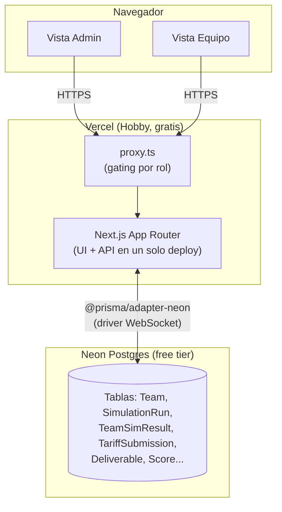
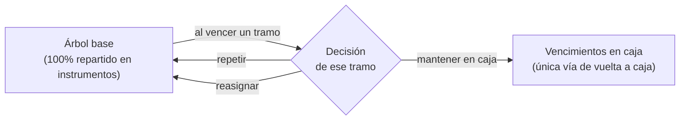
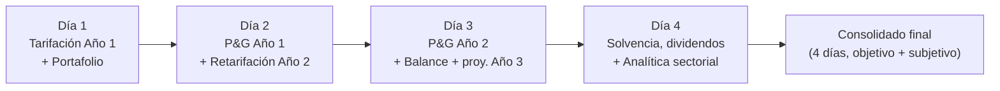
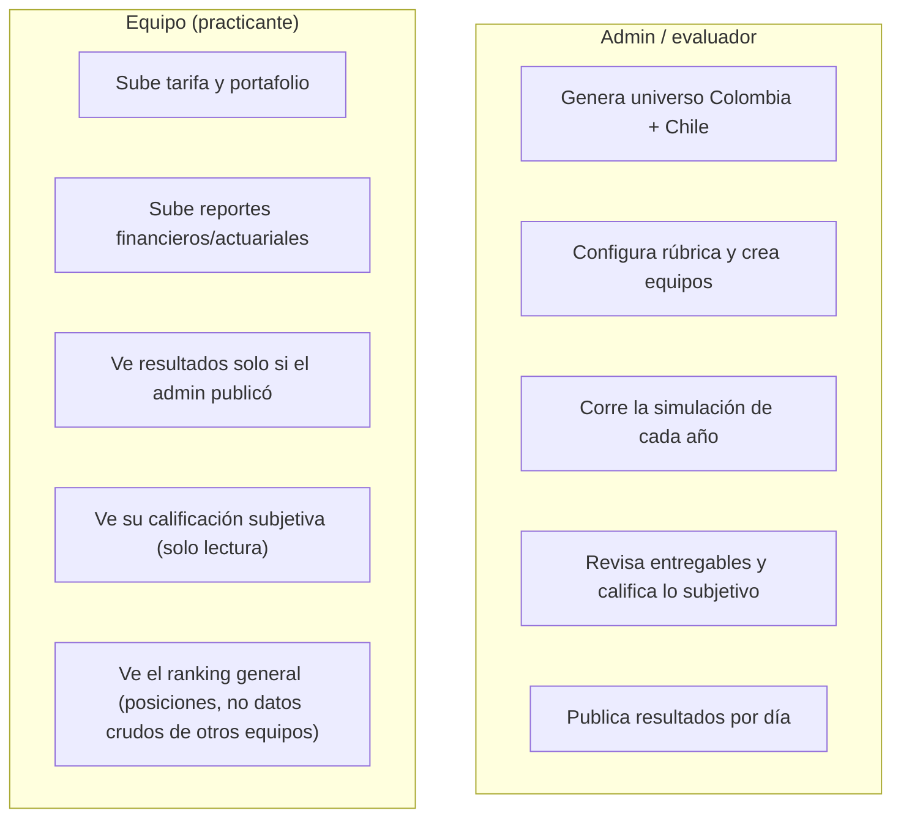

# simulador-financiero-y-actuarial

Plataforma web para una **prueba técnica de pasantía en ciencia actuarial, finanzas y riesgos** de una aseguradora colombiana. Equipos de practicantes tarifican un libro de autos, gestionan un portafolio de inversión y son evaluados a lo largo de **4 días de reto / 2 años simulados**, con calificación objetiva (motor actuarial/financiero) y subjetiva (rúbrica del evaluador).

Corre **100% en planes gratuitos** (Vercel Hobby + Neon Postgres free tier) — sin costo alguno para operar.

## Qué hace

- Genera un universo sintético de **1,000,000 de pólizas** de auto en Colombia (riesgo, siniestros y fechas fijados de forma determinística por semilla).
- Cada equipo sube su propia tarifa (prima por póliza) y compite contra los demás equipos en un mercado simulado (elección discreta tipo logit, con tope de cuota de mercado).
- A lo largo de 4 días, los equipos tarifican, invierten, reservan, cierran P&G, calculan solvencia y hacen recomendaciones sectoriales — todo evaluado automáticamente contra un motor de referencia, más una calificación subjetiva del evaluador.
- El evaluador (admin) controla cuándo cada equipo ve sus resultados (publicación por día, no todo-o-nada).

## Arquitectura



| Capa | Elección | Por qué |
|---|---|---|
| Framework | Next.js 16 (App Router) | Un solo repo/deploy para UI + API, roles vía rutas |
| Base de datos | Neon Postgres + Prisma (`@prisma/adapter-neon`) | Tipado end-to-end, migraciones versionadas, tier gratuito generoso |
| Auth | NextAuth (Credentials) | Cuentas de equipo usuario+contraseña creadas por el admin, sin correo (evita servicios de pago) |
| Datos masivos | `bytea` en el mismo Postgres | 1M números Float32 ≈ 4 MB; evita un segundo servicio (Vercel Blob) |
| Deploy | Vercel Hobby | Integración directa con Next.js, dominio `*.vercel.app` gratis |
| CSV | Papa Parse + zod | Parseo real con validación de esquema (no `split(',')`) |

## El motor: universo, mercado y reservas


La generación es **determinística**: la misma semilla siempre produce el mismo universo, lo mismo que la asignación de mercado (dado el mismo β, factor de marca y cuota máxima). Esto permite que cada corrida sea reproducible y auditable.

## Los modelos actuariales y financieros, en detalle

Esta sección explica **qué calcula el motor y por qué**, no solo el flujo general de arriba. Todo el código referenciado vive en `src/domain/` (puro, sin dependencias de Next.js/Prisma/React) y tiene tests unitarios con semilla fija.

### 1 · Generación del riesgo (frecuencia y severidad)

Cada póliza tiene 13 variables (edad, zona, tipo de vehículo, antigüedad, kilometraje, historial de siniestros, valor asegurado, uso, parqueadero, nivel educativo, estrato, género, marca). A partir de esas variables:

- **Frecuencia (λ)** — `calcLambda()` — un modelo GLM multiplicativo: se parte de una frecuencia base y se multiplica por factores de riesgo relativo por cada variable (ej. zona urbana ×1.45, historial de 2+ siniestros ×1.85–3.20, uso comercial ×1.70), más algunas **interacciones** (joven + deportivo, urbano + comercial) y un par de variables "trampa" deliberadamente débiles para que la señal real no sea trivial de encontrar. El resultado es la probabilidad de que esa póliza tenga al menos un siniestro en el año.
- **Severidad media** — `calcMediaSev()` — proporcional al valor asegurado del vehículo, con factores por tipo de vehículo, zona y antigüedad. El siniestro individual se muestrea de una **Gamma** con esa media (forma fija), lo que da una cola derecha realista (muchos siniestros pequeños, pocos grandes).
- **Fecha de ocurrencia y aviso** — el mes de ocurrencia sigue un patrón estacional (más siniestros en diciembre/enero, `sampleClaimDate()`). El aviso **no es inmediato**: el rezago ocurrencia→aviso sigue una **lognormal** (`sampleReportingLag()`, μ=3.0/σ=1.2 en días, mediana ~20 días, cola topada en 730 días — hasta 2 años en casos extremos) — este rezago es la fuente real de IBNR (ver §3).

Todo esto se fija en el momento de `generateColombia(seed)`: la misma semilla siempre produce el mismo universo, byte a byte.

### 2 · Mercado (a quién le toca cada póliza)

Cada equipo sube una tarifa (prima por póliza). El mercado se resuelve en 3 fases (`runSimulation()`):

1. **Preferencias (logit)**: cada póliza calcula una utilidad `u = -β·ln(prima/1,000,000) + ruido_Gumbel·factor_marca` por cada equipo, y "elige" al de mayor utilidad. β es la sensibilidad al precio (mayor β = mercado más sensible a precio); el ruido Gumbel con el factor de marca simula inercia/fidelidad de marca que no depende solo del precio.
2. **Racionamiento por cuota**: cada equipo tiene un tope de cuota de mercado (ej. 30% del universo). Si más pólizas lo prefieren de las que puede tomar, se queda con las de **mayor prima** (maximiza ingreso dado el cupo) y rechaza el resto.
3. **Redistribución**: las pólizas rechazadas se reasignan entre los equipos con cupo restante, con el mismo mecanismo logit.

**Año 2** (`runSimulationYear2()`) repite esto pero con dos diferencias: (a) los siniestros del Año 2 son un sorteo **independiente** del Año 1 (mismo modelo de riesgo, un año más de antigüedad, e historial actualizado si hubo siniestro en el Año 1) — no se reciclan los siniestros del Año 1; y (b) cada póliza tiene un **bono de retención** hacia el equipo que la aseguró en el Año 1 (ruido Gumbel adicional escalado por un factor de retención configurable) — a mayor factor, más difícil que un equipo pierda un cliente solo por precio.

### 3 · Reservas e IBNR

Al cierre del Año 1, no todos los siniestros ya ocurridos han sido *avisados* — el rezago aviso→pago (§1) implica que una porción real de la siniestralidad todavía no se conoce. `computeLiabilitySchedules()` construye, por equipo:

- **RSA** (reserva de siniestros avisados): siniestros ya notificados, pendientes de pago según un patrón de desarrollo (curva acumulada de pagos calibrada contra el dataset de Chile).
- **IBNR** (*Incurred But Not Reported*): estimado a partir del **factor de desarrollo de mercado** — qué fracción de la siniestralidad total del mercado típicamente se avisa dentro del mismo año — aplicado al patrón agregado, no a la experiencia individual de cada equipo (un solo equipo tiene muy poca data propia para estimar esto de forma confiable, igual que en la práctica real).

Al cierre del Año 2, `computeDevelopment()` compara lo **realmente emergido** (siniestros del Año 1 avisados tarde, ya en el Año 2) contra lo que el IBNR había estimado — esa diferencia es la ganancia/pérdida de desarrollo que entra al P&G del Año 2 (ver §4). Esto es deliberado: un equipo puede tarifar bien pero reservar mal (o viceversa), y ambas cosas se califican por separado.

**Cuándo se paga un siniestro, en detalle** — el pago de un siniestro puntual sigue tres tramos consecutivos, no uno solo (una fuente común de confusión al leer la tabla de caja del ALM, ver §5):

1. **Ocurrencia → aviso**: el rezago lognormal de §1 (mediana ~20 días, cola hasta 730 días/~24 meses).
2. **Aviso → primer pago**: un rezago **fijo** de 3 meses (`LAG_AVISO_PAGO`).
3. **Desarrollo del pago**: se reparte en 3 años (36 meses) desde ese primer pago, según `DEV_FRAC = [0.55, 0.30, 0.15]` (`buildKernel()` en `src/domain/reserving/constants.ts`) — 55% del monto en el año 1 de desarrollo, 30% en el año 2, 15% en el año 3.

En el peor caso estos tramos se **suman**: un siniestro ocurrido cerca del cierre del Año 1, con un aviso especialmente tardío (cola de la lognormal), puede seguir generando pagos hasta cerca del límite de la ventana simulada. Por eso `HORIZON=48` meses desde la valoración (4 años, no 3): se dejó holgura deliberada frente a los 3 años de desarrollo puro, justamente para no cortar la cola de los siniestros avisados tarde dentro del Año 1. Lo que aun así exceda esa ventana de 48 meses se trunca — no se paga ni se refleja en la reserva —, una simplificación aceptada del modelo, no un error.

### 4 · P&G, Balance y Solvencia (`finBench()`)

El resultado técnico de cada año es `prima − siniestros − gastos`, donde los gastos son porcentajes fijos de la prima (adquisición 10%, comisión 4%, administración 6% — `FZ` en `src/domain/finance/constants.ts`). A esto se suma el **resultado de inversiones** (rendimiento del portafolio menos penalización por descalce, ver §5) para llegar a la utilidad antes de impuesto, y de ahí a la utilidad neta (tasa de renta 30%).

El balance es una aproximación simple: patrimonio acumulado (capital inicial + utilidades retenidas), caja/CxC/CxP como porcentajes de la prima, e inversiones como el residual que cuadra el balance.

La **solvencia** combina tres riesgos — suscripción (con volatilidad de primas y reservas), financiero (sobre las inversiones, alimentado por el riesgo de tasa de `almNAV()`, ver §5) y operacional (sobre primas) — agregados con una **matriz de correlación** (similar en espíritu a un enfoque tipo Solvencia II, sin pretender ser una implementación regulatoria completa). El margen de solvencia es `fondos propios / capital requerido`; el dividendo sugerido es el excedente de fondos propios sobre un margen objetivo.

El **Año 3 no se simula** — se proyecta aplicando una tasa de crecimiento fija al resultado del Año 2, solo para dar visibilidad de tendencia.

### 5 · Portafolio de inversión y ALM (asset-liability matching)

Cada equipo construye su portafolio como un **árbol de decisiones**, no una asignación estática en dos momentos. Parte de una base (cómo repartir 100 entre los instrumentos del menú) y, para **cada tramo** de esa base, decide qué pasa cuando llegue a su propio vencimiento:

```ts
interface Tranche {
  instrumentId: string;
  weight: number;
  durationM?: number; // obligatorio solo para LIQ/ACC — ninguno tiene plazo contractual propio
  onMaturity:
    | { action: "cash" }                            // pasa a caja disponible
    | { action: "repeat" }                           // se refondea igual, indefinidamente
    | { action: "reallocate"; tranches: Tranche[] }; // se reparte entre nuevos tramos, cada uno con su propia decisión
}
```

LIQ y acciones (ACC) no tienen un plazo fijo como un bono, así que el equipo les asigna un **vencimiento personalizado** (`durationM`): el momento en que se le vuelve a preguntar qué hacer con esa porción. La interfaz de equipo lo recoge como un asistente paso a paso — una decisión a la vez, incluyendo las que se generan en cascada cuando la respuesta es "reasignar" — no un formulario con todo el árbol a la vez.



`almSim()` simula mes a mes (60 meses: 12 de fondeo + 48 de corrida) un estado de caja con seis columnas — **Caja Inicial, Prima Cobrada, Pago Siniestros, Gastos, Vencimientos en caja, Inversión Neta, Caja Final** — contra una **Caja Mínima** obligatoria cada mes (15% de Prima+Siniestros, `FZ.cajaPct`). *Vencimientos en caja* es la **única** vía por la que el dinero de una inversión regresa a la fila de caja: si la decisión de un tramo es "repetir" o "reasignar", esos recursos van directo a una posición nueva sin tocar caja — nunca ayudan a cubrir la Caja Mínima ese mes ni ningún mes futuro mientras sigan en ese ciclo, aunque sí siguen devengando rendimiento (entra a la nota de Rendimiento, no a la de Calce). La única excepción es **LIQ**: sin importar en qué punto esté su propio ciclo de vencimiento, siempre se puede retirar para cubrir una brecha de caja — su vencimiento personalizado solo decide cuándo se le vuelve a preguntar al equipo, nunca si el dinero está disponible. **ACC**, en cambio, queda genuinamente ilíquido hasta su propio vencimiento, igual que un bono — es la primera vez que una posición en acciones puede convertirse en caja utilizable, en el momento que el equipo elija.

De esa simulación salen tres notas (`scoreFinanciero()`):

- **Cumplimiento de Caja Mínima (45%)** — se penaliza tanto la **brecha máxima** (el peor mes — riesgo de cola, un solo mes muy malo puede significar insolvencia real) como la **brecha promedio acumulada** en los 60 meses (descalce crónico — un portafolio que queda corto casi todos los meses es peor que uno que queda corto una sola vez, aunque ese mes sea más grande). Ambas se combinan 50/50.
- **Rendimiento (45%)** — el rendimiento efectivo simulado (no el nominal ponderado) frente al rango de rendimientos del menú de instrumentos.
- **Liquidez (10%)** — cobertura de los pagos de los siguientes 6 meses con lo que sigue líquido en ese momento (LIQ, más cualquier tramo que venza dentro de esa ventana).

Por separado, `almNAV()` valora el portafolio y la reserva a valor de mercado bajo escenarios de tasa (base/alza/baja) — la sensibilidad del NAV neto a esos choques es el **riesgo de tasa** que alimenta el componente financiero de la solvencia (§4). Usa la asignación inicial como foto del balance en la fecha de valoración, no el árbol completo de reinversión: el calce mide *timing* de flujos a lo largo de toda la corrida; el riesgo de tasa mide *sensibilidad de valor* en un punto en el tiempo — son dos dimensiones distintas del mismo portafolio.

### 6 · Analítica sectorial (Día 4)

Cada póliza se agrupa en 4 dimensiones de segmento (zona, uso, edad, estrato). El equipo recomienda **crecer / mantener / disminuir** por segmento; la recomendación correcta se deriva del *loss ratio real* observado en ese segmento (>100% → disminuir, <85% → crecer, si no → mantener) usando la tarifa real del equipo (no un promedio plano) — un segmento puede tener buen loss ratio solo porque el equipo ya le cobra más caro ahí, y la nota debe reflejar eso.

### 7 · Calificación compuesta

- **Objetivo por día** — mezcla actuarial/financiero (peso configurable): el actuarial incluye la calidad de la tarifa (`notaTarifacionAnio` — normalización relativa entre percentil 10-90 del resultado técnico del mercado, o por posición/ranking) más cualquier entregable numérico de ese perfil; el financiero, los entregables financieros más la nota ALM/analítica cuando aplica.
- **Subjetivo** — es **por integrante**, no por equipo: el evaluador califica cada habilidad de la rúbrica a cada persona (`MemberScore`), y la nota del equipo es el **promedio** de sus integrantes (`notaSubjetivaEquipo`). Un equipo sin roster cargado no tiene nota subjetiva — no hay atajo de equipo.
- **Nota final** — promedio de los objetivos de los 4 días (ponderado actuarial/financiero) combinado con el promedio subjetivo de los 4 días, según el peso subjetivo configurado en la rúbrica.

## Los 4 días



Cada día tiene las mismas 5 sub-pestañas que el prototipo original: **Tarifas/Portafolio/Simulación** (solo Días 1-2, ya que el Año 2 es el último año simulado), **Entregables**, **Resultados objetivos**, **Calificación subjetiva** y **Top del día**.

| Día | Actuarial | Financiero |
|---|---|---|
| 1 | Tarificar Año 1 | Elegir portafolio de inversión (calce con reservas) |
| 2 | Reservas Año 1 + retarifar Año 2 (con retención de clientes) | P&G Año 1 |
| 3 | Reservas Año 2 | P&G Año 2 (+ proyección Año 3) y Balance |
| 4 | Recomendación sectorial (crecer/mantener/disminuir por segmento) | Solvencia (capital requerido, margen) y dividendos |

## Roles



Todo acceso a datos de un equipo se filtra por `teamId` en la capa de datos (no solo en la UI), y ningún resultado se expone a una sesión de equipo sin que el flag `published` esté activo.

## Estructura del repo

```
/prisma            Schema y migraciones
/src
  /domain          Motor puro (sin Next.js/Prisma/React) — generación, mercado, reservas, finanzas, calificación
  /lib             Server Actions, helpers de Prisma/CSV/binario, orquestación por equipo
  /app
    /(team)/...    Vistas de equipo (dashboard, día/[n], ranking, modelo técnico)
    /admin/...     Vistas de admin (universo, configuración, día/[n], consolidado, modelo técnico)
    /api/...       Route Handlers (universo, simulación, tarifas, reporte)
    proxy.ts       Gating por rol (Next.js 16 renombró middleware.ts a proxy.ts)
```

`src/domain` no importa nada de Next.js/Prisma/React: recibe datos planos (arrays tipados) y devuelve datos planos, así que se prueba en aislamiento (`npm run test`).

## Cómo correrlo localmente

```bash
npm install
npx prisma migrate dev      # aplica migraciones contra tu Neon Postgres
npm run dev                 # servidor de desarrollo
npm run test                # tests unitarios del motor (src/domain)
```

Variables de entorno esperadas (`.env.local`, ver `.env.example`): `DATABASE_URL` (Neon), `AUTH_SECRET`.

## Despliegue

Vercel Hobby (gratis) + Neon Postgres free tier. Sin dominio propio (usa `*.vercel.app`). El cómputo pesado (generación del universo, simulación de mercado) corre de forma síncrona dentro de Route Handlers normales (`maxDuration = 300`, el máximo real del plan Hobby) — no hay cola ni worker separado, por diseño, para no depender de un servicio de pago.
