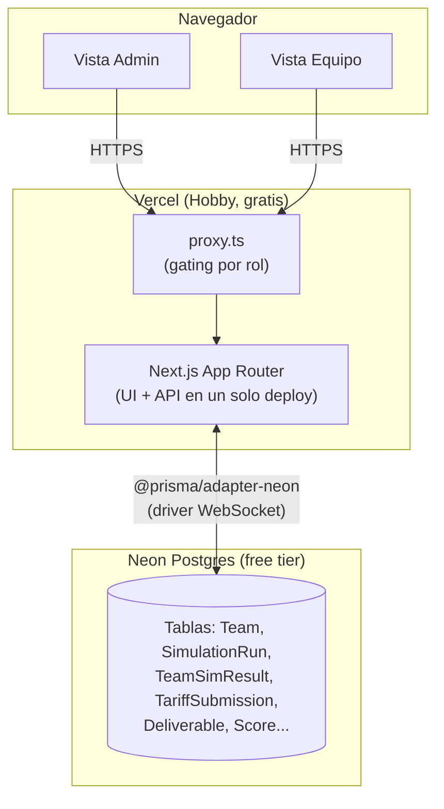
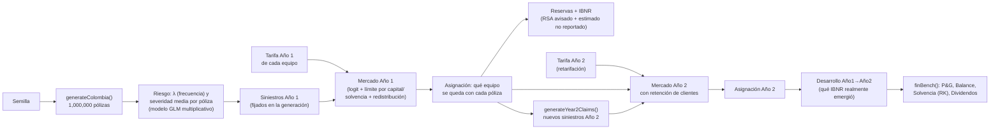
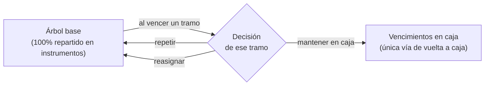
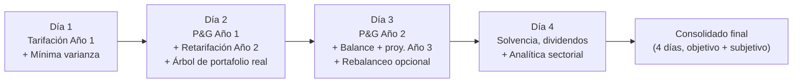
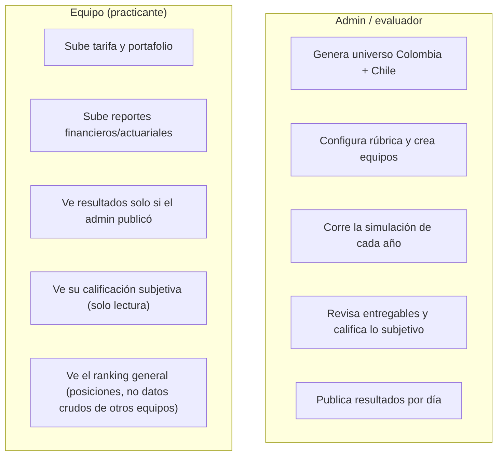

# simulador-financiero-y-actuarial

Plataforma web para una **prueba técnica de pasantía en ciencia actuarial, finanzas y riesgos** de una aseguradora colombiana. Equipos de practicantes tarifican un libro de autos, gestionan un portafolio de inversión y son evaluados a lo largo de **4 días de reto / 2 años simulados**, con calificación objetiva (motor actuarial/financiero) y subjetiva (rúbrica del evaluador).

Corre **100% en planes gratuitos** (Vercel Hobby + Neon Postgres free tier) — sin costo alguno para operar.

## Qué hace

- Genera un universo sintético de **1,000,000 de pólizas** de auto en Colombia (riesgo, siniestros y fechas fijados de forma determinística por semilla).
- Cada equipo sube su propia tarifa (prima por póliza) y compite contra los demás equipos en un mercado simulado (elección discreta tipo logit); lo que limita cuánto puede crecer cada equipo es su propio capital y solvencia, no un tope de cuota fijo igual para todos (ver §2.1).
- A lo largo de 4 días, los equipos tarifican, invierten, reservan, cierran P&G, calculan solvencia y hacen recomendaciones sectoriales — todo evaluado automáticamente contra un motor de referencia, más una calificación subjetiva del evaluador.
- El evaluador (admin) controla cuándo cada equipo ve sus resultados (publicación por día, no todo-o-nada).

## Arquitectura



| Capa | Elección | Por qué |
|---|---|---|
| Framework | Next.js 16 (App Router) | Un solo repo/deploy para UI + API, roles vía rutas |
| Base de datos | Neon Postgres + Prisma (`@prisma/adapter-neon`) | Tipado end-to-end, migraciones versionadas, tier gratuito generoso |
| Auth | NextAuth (Credentials) | Cuentas de equipo usuario+contraseña creadas por el admin, sin correo (evita servicios de pago) |
| Datos masivos | `bytea` en el mismo Postgres | 1M números Float32 ≈ 4 MB; evita un segundo servicio (Vercel Blob) |
| Deploy | Vercel Hobby | Integración directa con Next.js, dominio `*.vercel.app` gratis |
| CSV | Papa Parse + zod | Parseo real con validación de esquema (no `split(',')`) |

## El motor: universo, mercado y reservas



La generación es **determinística**: la misma semilla siempre produce el mismo universo, lo mismo que la asignación de mercado (dado el mismo β, factor de marca y techo de cuota — el límite de capital de cada equipo, ver §2.1, es una función pura de sus propios datos ya guardados, así que también es determinístico). Esto permite que cada corrida sea reproducible y auditable.

## Los modelos actuariales y financieros, en detalle

Esta sección explica **qué calcula el motor y por qué**, no solo el flujo general de arriba. Todo el código referenciado vive en `src/domain/` (puro, sin dependencias de Next.js/Prisma/React) y tiene tests unitarios con semilla fija.

### 1 · Generación del riesgo (frecuencia y severidad)

Cada póliza tiene 13 variables (edad, zona, tipo de vehículo, antigüedad, kilometraje, historial de siniestros, valor asegurado, uso, parqueadero, nivel educativo, estrato, género, marca). A partir de esas variables:

- **Frecuencia (λ)** — `calcLambda()` — un modelo GLM multiplicativo: se parte de una frecuencia base y se multiplica por factores de riesgo relativo por cada variable (ej. zona urbana ×1.45, historial de 2+ siniestros ×1.85–3.20, uso comercial ×1.70), más algunas **interacciones** (joven + deportivo, urbano + comercial) y un par de variables "trampa" deliberadamente débiles para que la señal real no sea trivial de encontrar. El resultado es la probabilidad de que esa póliza tenga al menos un siniestro en el año.
- **Severidad media** — `calcMediaSev()` — proporcional al valor asegurado del vehículo, con factores por tipo de vehículo, zona y antigüedad. El siniestro individual se muestrea de una **Gamma** con esa media (forma fija), lo que da una cola derecha realista (muchos siniestros pequeños, pocos grandes).
- **Fecha de ocurrencia y aviso** — el mes de ocurrencia sigue un patrón estacional (más siniestros en diciembre/enero, `sampleClaimDate()`). El aviso **no es inmediato**: el rezago ocurrencia→aviso sigue una **lognormal** (`sampleReportingLag()`, μ=3.0/σ=1.2 en días, mediana ~20 días, cola topada en 730 días — hasta 2 años en casos extremos) — este rezago es la fuente real de IBNR (ver §3).

Todo esto se fija en el momento de `generateColombia(seed)`: la misma semilla siempre produce el mismo universo, byte a byte.

### 2 · Mercado (a quién le toca cada póliza)

Cada equipo sube una tarifa (prima por póliza). El mercado se resuelve en 3 fases (`runSimulation()`):

1. **Preferencias (logit)**: cada póliza calcula una utilidad `u = -β·ln(prima/1,000,000) + ruido_Gumbel·factor_marca` por cada equipo, y "elige" al de mayor utilidad. β es la sensibilidad al precio (mayor β = mercado más sensible a precio); el ruido Gumbel con el factor de marca simula inercia/fidelidad de marca que no depende solo del precio.
2. **Racionamiento por capital y solvencia**: cada equipo tiene su propio límite de pólizas — no un porcentaje fijo igual para todos, sino uno derivado de cuánto capital tiene disponible y qué tan riesgoso es su portafolio (ver §2.1). Si más pólizas lo prefieren de las que su límite permite, se queda con las de **mayor prima** (maximiza ingreso dado el cupo) y rechaza el resto.
3. **Redistribución**: las pólizas rechazadas se reasignan entre los equipos con cupo restante, con el mismo mecanismo logit.

**Año 2** (`runSimulationYear2()`) repite esto pero con dos diferencias: (a) los siniestros del Año 2 son un sorteo **independiente** del Año 1 (mismo modelo de riesgo, un año más de antigüedad, e historial actualizado si hubo siniestro en el Año 1) — no se reciclan los siniestros del Año 1; y (b) cada póliza tiene un **bono de retención** hacia el equipo que la aseguró en el Año 1 (ruido Gumbel adicional escalado por un factor de retención configurable) — a mayor factor, más difícil que un equipo pierda un cliente solo por precio.

#### 2.1 · De dónde sale el límite de cada equipo (capital y solvencia, no un techo arbitrario)

Hasta antes de este cambio, el límite de la Fase 2 era un solo número (`cuotaPct`, ej. 30%) igual para los 12 equipos, fijado a mano por el evaluador — nada conectaba ese número con el riesgo o el capital real de cada equipo. Ahora el límite que efectivamente rechaza pólizas es **personalizado por equipo**, derivado del mismo modelo de solvencia que ya usa `finBench()` para el Día 4 (§4) — la idea real detrás: una aseguradora no puede seguir creciendo indefinidamente solo porque tenga buenos precios; el capital que respalda su negocio pone un techo natural a cuánto riesgo puede suscribir. `cuotaPct` no desaparece — sigue existiendo como **techo absoluto** que ningún equipo puede superar sin importar su capital (una salvaguarda regulatoria/técnica, no el mecanismo principal), pero el límite que normalmente aplica primero es el de capital.

**El problema de fondo**: `finBench()` calcula el margen de solvencia *después* de conocer cuánta prima y cuántas reservas resultaron del mercado — pero el límite de capacidad se necesita *antes* de correr ese mercado, porque es lo que decide cuántas pólizas puede ganar cada equipo. La solución (`src/domain/finance/capacity.ts`) invierte la fórmula de `finBench()`: en vez de "dado tu volumen de negocio, cuál es tu margen", pregunta "dado tu capital disponible, cuánto volumen de prima puedes sostener manteniendo un margen de solvencia objetivo".

- **`CAPACITY_TARGET_MARGIN = 1.0`** — el margen objetivo para dimensionar capacidad, deliberadamente distinto del `FZ.targetMargin = 1.5` que usa `finBench()` para decidir dividendos (una barra más exigente, "sobra capital para repartir", no "sigo siendo solvente"). Dimensionar la capacidad contra 1.5 habría sido innecesariamente conservador; 1.0 es la línea real de solvencia.
- **Reservas e inversiones, aproximadas proporcionalmente a la prima**: como todavía no se sabe qué pólizas va a ganar cada equipo (eso es justo lo que el racionamiento está decidiendo), no hay una reserva real que usar. Se aproxima como `reserva ≈ prima × 0.796`, donde 0.796 = 0.861 (la misma razón reserva/incurrido de §5.1, medida contra `generateColombia(42)`, invariante al tamaño del equipo porque depende solo de los rezagos aviso/pago del universo) × 0.925 (la razón de siniestralidad de referencia — el punto medio de la banda "sana" que ya usa la analítica sectorial: `LR_BAJO=0.85` "crecer" / `LR_ALTO=1.0` "disminuir", ver `analytics.ts`). El patrimonio se aproxima como el capital disponible mismo (sin sumar utilidad retenida, que todavía no se conoce antes de que el mercado cierre) — una aproximación deliberadamente conservadora, ya que el patrimonio real solo puede ser igual o mayor.
- **Volatilidad del portafolio (`volRatio`)**: el promedio ponderado de la volatilidad de los instrumentos elegidos (sin necesidad de simular nada, es una propiedad de los pesos, no de la simulación), vía el mismo `volRatioFromWeights()` compartido — con el mismo *fallback* a 1 (el cargo plano sin volatilidad) que usa `finBench()` cuando no hay decisión. La fuente de esos pesos es distinta por año (ver abajo): el portafolio de mínima varianza de Día 1 para el Año 1, el árbol real de Día 2 para el Año 2 — nunca el mismo día para ambos.
- **La prima máxima soportable (`maxPremiumForCapital()`) se resuelve por búsqueda binaria**, no con una fórmula cerrada derivada a mano — la función de riesgo de capital (`riskCapitalForPremium()`) es exactamente la misma suma de `rSusc`/`rFin`/`rOp` agregada vía `CORR_MOD` que usa `finBench()`, así que cualquier cambio futuro en esas fórmulas se refleja aquí automáticamente sin tener que re-derivar nada a mano. Esa prima máxima se convierte en un número de pólizas dividiendo por la prima promedio que el propio equipo ya subió (dato conocido antes de que el mercado corra, porque es su propio CSV).

**La conexión entre los dos años (`src/lib/capacityHelper.ts`)**, que es el punto central de este cambio:

- **Año 1** (calculado antes de que cierre el mercado de Año 1, al final de Día 1): todos los equipos parten del mismo `CAPITAL_SOCIAL` fresco — nadie ha comprometido nada todavía. El límite de cada equipo difiere por su propio precio promedio (una prima más barata necesita más pólizas para llegar al mismo techo de prima, así que tiene un límite de pólizas más alto) y la volatilidad del portafolio de mínima varianza que sometió en Día 1 (§5.6) — los pesos que *realmente* sometió, no la solución óptima real, ya que para este punto del juego eso es lo único que existe: una especie de presentación regulatoria en el "momento 0", antes de escribir una sola póliza.
- **Año 2** (calculado antes de que cierre el mercado de Año 2, al final de Día 2): el capital disponible que alimenta la misma fórmula ya no es el `CAPITAL_SOCIAL` completo — es `bal1.patrimonio`, calculado por `computeFinBenchForCohort()` usando el ALM **real** de cada equipo (con su prima real, no la ficticia — ver §5.3, ya conectado correctamente ahí). Un equipo que tuvo que comprometer mucho Capital Social cubriendo caja en el Año 1 entra al Año 2 con menos capacidad de crecer, **antes incluso de tarificar** — la mecánica de "crecimiento limitado por solvencia" real, no una coincidencia narrativa. La volatilidad para este año viene del árbol real que el equipo somete en Día 2 (§5) — ya existe para cuando cierra este mercado, sin desface, a diferencia del Año 1.

**Qué ve cada equipo**: en los resultados objetivos de cada día (Día 1/2) se muestra el límite por capital, el límite efectivamente aplicado (el menor entre ese y el techo del admin) y cuántas pólizas se rechazaron por él. En el Día 4, un panel adicional pone lado a lado el límite de Año 1 y Año 2, para que un equipo que chocó contra su propio capital pueda conectarlo con el Requerimiento de Capital y el Margen de solvencia que está reportando ese mismo día. El panel del evaluador (`admin/day/[n]`) muestra lo mismo por equipo, directamente junto a las cifras de `finBench()`.

**Qué implica en la práctica, y qué es intencional**: un equipo que agota por completo su Capital Social en el Año 1 (`bal1.patrimonio <= 0`) puede quedar con un límite de capacidad de **cero** pólizas en el Año 2 — expulsado del mercado hasta que, en la vida real, levantara más capital. Es una consecuencia dura, deliberada: la lección es que la solvencia no es solo una nota que se reporta al final, sino una restricción real sobre cuánto se puede crecer.

### 3 · Reservas e IBNR

Al cierre del Año 1, no todos los siniestros ya ocurridos han sido *avisados* — el rezago aviso→pago (§1) implica que una porción real de la siniestralidad todavía no se conoce. `computeLiabilitySchedules()` construye, por equipo:

- **RSA** (reserva de siniestros avisados): siniestros ya notificados, pendientes de pago según un patrón de desarrollo (curva acumulada de pagos calibrada contra el dataset de Chile).
- **IBNR** (*Incurred But Not Reported*): estimado a partir del **factor de desarrollo de mercado** — qué fracción de la siniestralidad total del mercado típicamente se avisa dentro del mismo año — aplicado al patrón agregado, no a la experiencia individual de cada equipo (un solo equipo tiene muy poca data propia para estimar esto de forma confiable, igual que en la práctica real).

Al cierre del Año 2, `computeDevelopment()` compara lo **realmente emergido** (siniestros del Año 1 avisados tarde, ya en el Año 2) contra lo que el IBNR había estimado — esa diferencia es la ganancia/pérdida de desarrollo que entra al P&G del Año 2 (ver §4). Esto es deliberado: un equipo puede tarifar bien pero reservar mal (o viceversa), y ambas cosas se califican por separado.

**Cuándo se paga un siniestro, en detalle** — el pago de un siniestro puntual sigue tres tramos consecutivos, no uno solo (una fuente común de confusión al leer la tabla de caja del ALM, ver §5):

1. **Ocurrencia → aviso**: el rezago lognormal de §1 (mediana ~20 días, cola hasta 730 días/~24 meses).
2. **Aviso → primer pago**: un rezago **fijo** de 3 meses (`LAG_AVISO_PAGO`).
3. **Desarrollo del pago**: se reparte en 3 años (36 meses) desde ese primer pago, según `DEV_FRAC = [0.55, 0.30, 0.15]` (`buildKernel()` en `src/domain/reserving/constants.ts`) — 55% del monto en el año 1 de desarrollo, 30% en el año 2, 15% en el año 3.

En el peor caso estos tramos se **suman**: un siniestro ocurrido cerca del cierre del Año 1, con un aviso especialmente tardío (cola de la lognormal), puede seguir generando pagos hasta cerca del límite de la ventana simulada. Por eso `HORIZON=48` meses desde la valoración (4 años, no 3): se dejó holgura deliberada frente a los 3 años de desarrollo puro, justamente para no cortar la cola de los siniestros avisados tarde dentro del Año 1. Lo que aun así exceda esa ventana de 48 meses se trunca — no se paga ni se refleja en la reserva —, una simplificación aceptada del modelo, no un error.

### 4 · P&G, Balance y Solvencia (`finBench()`)

`finBench()` es el motor de referencia (el "Motor" que se compara contra lo que cada equipo reporta, ver §7) para tres entregables: el P&G de cada año, el Balance, y la Solvencia del Día 4. Esta sección explica, línea por línea, de dónde sale cada cifra — no solo el resultado final.

#### 4.1 · P&G del Año 1 (`p1`)

Construido por `pyg(prima, siniestros, reservas, rinv)`, con estos insumos:

| Línea | De dónde sale |
|---|---|
| `prima` | `year1.totalPremium` — la prima real que el equipo efectivamente cobró en el mercado del Año 1 (§2), no la que tarificó: es la suma de las primas de las pólizas que realmente ganó, después del racionamiento por capital/solvencia (§2.1). |
| `costo` | `year1.claimsAmount` — la severidad real incurrida de las pólizas que ese equipo ganó y tuvieron siniestro, tomada directamente del universo generado (no una estimación). |
| `gadq` / `gcom` / `gadm` | `10% / 4% / 6% × prima` — porcentajes fijos (`FZ.gAdq/gCom/gAdmin`), iguales para todos los equipos. |
| `rt` (resultado técnico) | `prima − costo − gadq − gcom − gadm`. |
| `rinv` (resultado de inversiones) | El ingreso de inversión que el **ALM real** del Año 1 (§5.3) devengó en sus 12 meses — `AlmRealYearResult.income`, no una fórmula. Si el equipo nunca guardó un portafolio, cae a un valor de reserva por defecto (`reservas1 × 8%`, un piso conservador, no una estimación real). |
| `uai` | `rt + rinv`. |
| `imp` | `30% × max(0, uai)` (`FZ.tax` — nunca un impuesto negativo). |
| `uneta` | `uai − imp`. |
| `reservas` (`resTotal`/`resRsa`/`resIbnr`) | Si ya existe desarrollo Año1→Año2 (Día 3+): `development.bookedReserveEndY1` (avisado + IBNR esperado, medido contra el patrón de desarrollo real del mercado, ver §3). Si no (Día 1/2, antes de tener ese dato): `liabilityYear1.reserva` completa, partida 55/45 en IBNR/avisado como aproximación — no es una medición todavía, es un placeholder hasta que el desarrollo real esté disponible. |

#### 4.2 · P&G del Año 2 (`p2`) y proyección del Año 3 (`p3`)

Con desarrollo Año1→Año2 ya calculado (Día 3+, `computeDevelopment()` — ver §3):

| Línea | De dónde sale |
|---|---|
| `prima` | `year2.totalPremium` — prima real cobrada en el mercado del Año 2 (con retención de clientes, §2). |
| `ultAcc` | `development.ultY2` — siniestros propios del Año 2, último estimado. |
| `desarrollo` | `development.development` — cuánto más (o menos) de lo esperado como IBNR del Año 1 terminó emergiendo realmente en el Año 2; puede ser negativo. |
| `costo` (`costoCal`) | `ultAcc + desarrollo` — el costo incurrido en base calendario: lo propio del Año 2 más el ajuste por lo que realmente emergió del Año 1. |
| `pagos` | `development.pagosY2` — caja efectivamente pagada durante el Año 2 calendario, de ambos orígenes (desarrollo del Año 1 + siniestros propios del Año 2). |
| `gadq` / `gcom` / `gadm` | Los mismos porcentajes fijos, ahora sobre la prima del Año 2. |
| `rt` | `prima − costoCal − gadq − gcom − gadm`. |
| `rinv` | El ingreso de inversión que el **ALM real** del Año 2 devengó en sus 12 meses — pero esta corrida no arranca de cero: continúa exactamente donde terminó el Año 1 real (mismas posiciones abiertas, mismo capital comprometido acumulado), financiada por el desarrollo del Año 1 que emerge en el Año 2 más los siniestros propios del Año 2 en su propio primer año (ver §5.3). Sin ALM, cae a `reservas2 × rendimiento nominal del árbol`. |
| `reservas` (`reservaFinY2`) | `development.osY1endY2 + development.osY2endY2` — lo que queda pendiente al cierre del Año 2, de ambos orígenes. |
| `uai` / `imp` / `uneta` | Mismas fórmulas que el Año 1. |

Sin desarrollo calculado aún (fallback, cuando el Año 2 existe pero todavía no hay `TeamDevelopment`): `reservas2` se estima como `siniestros del Año 2 × (reservas1 / siniestros del Año 1)` — un ratio simple, no una medición — y `rinv`/`uai`/`uneta` se calculan igual sobre esa base aproximada.

El **Año 3 no se simula** — se proyecta creciendo la prima y el costo del Año 2 por una tasa fija (`FZ.growth3 = 6%`), con `reservas3 = reservas2 × 1.06` y `rinv3 = reservas3 × portYield` (aquí sí una fórmula, deliberadamente: no hay una simulación real de la que sacar un ingreso devengado para un año que no ocurrió).

#### 4.3 · Balance (`bal1`/`bal2`/`bal3`)

Construido por `balance()`, el mismo para los tres años, tomando el P&G de ese año como insumo:

| Línea | De dónde sale |
|---|---|
| `reservasTec` | La `reservas` del P&G de ese año (§4.1/4.2). |
| `patrimonio` | `CAPITAL_SOCIAL` (fijo, §5.1) `+ utilidades retenidas` (la suma acumulada de `uneta` hasta ese año) `− capital comprometido` acumulado hasta el cierre de ese año, tomado directamente del ALM real de ese año (`AlmRealYearResult.capitalComprometidoAcumulado` — el Año 3 no tiene ALM propio, así que carga el mismo corte del Año 2 hacia adelante). |
| `caja` / `cxc` / `cxp` | `15% / 7% / 10% × prima` de ese año (`FZ.cajaPct/cxcPct/cxpPct`) — porcentajes fijos, no simulados. |
| `inversiones` | `reservasTec + cxp + patrimonio − caja − cxc` — el residual que hace cuadrar el balance (activos = pasivos + patrimonio), no un valor de mercado del portafolio. |
| `activos` | `caja + inversiones + cxc`. |

#### 4.4 · Solvencia (Día 4)

| Línea | De dónde sale |
|---|---|
| `solRPrimas` | `prima del año vigente × 14.76%` (`FZ.primeVol`). |
| `solRReservas` | `reservas del año vigente × 30%` (`FZ.resVol`). |
| `solRSusc` (riesgo de suscripción) | `√(rPrimas² + rReservas² + 2×0.75×rPrimas×rReservas)` — 0.75 es la correlación prima-reserva (`FZ.corrPR`). |
| `solRFin` (riesgo financiero) | `inversiones del balance vigente × 6.6% × volRatio` (`FZ.finRiskPct`) — `volRatio` es la volatilidad realizada del portafolio real de ese año dividida entre el promedio del menú (`avgVol/VOL_MENU_AVG`, ver §5.4); sin ALM, `volRatio=1` (el cargo plano). |
| `solROp` (riesgo operacional) | `prima del año vigente × 3%` (`FZ.opPct`). |
| `solRk` (capital requerido) | `√(ΣΣ CORR_MOD[i][j] × R[i] × R[j])` sobre `R = [rSusc, rFin, rOp]` — la matriz de correlación (`CORR_MOD`) hace que suscripción-operacional y financiero-operacional estén perfectamente correlacionados (1.0) y suscripción-financiero solo parcialmente (0.75). |
| `solFp` (fondos propios) | El `patrimonio` del balance vigente (§4.3) — ya neto de todo el capital comprometido acumulado hasta ese punto. |
| `solMargen` | `solFp / solRk`. |
| `div` (dividendos sugeridos) | `max(0, solFp − solRk × 1.5)` — 1.5 (`FZ.targetMargin`) es la barra de "sobra capital para repartir", más exigente que la de apenas-solvente (1.0, ver §2.1). |

"Año/balance vigente" es el Año 2 si existe, si no el Año 1 (`p2 || p1`, `bal2 || bal1`) — la solvencia del Día 4 siempre mira el año más reciente disponible.

Esta es la triple conexión directa entre la decisión de portafolio y la solvencia del Día 4: (a) un equipo que concentró su portafolio en instrumentos volátiles paga un capital requerido mayor (`rFin` más alto → RK más alto → margen y dividendo más bajos), (b) un equipo que tuvo que comprometer Capital Social para cubrir una brecha de caja ve sus fondos propios directamente reducidos por ese monto, y (c) ese mismo capital comprometido — vía `bal1.patrimonio` — es exactamente lo que determina cuánto podía crecer ese equipo en el mercado del Año 2, *antes* de que el Día 4 llegara a mostrárselo (ver §2.1) — ambos, sin importar qué tan bien le fue en rendimiento nominal. La volatilidad que determina `rFin` para el Año 1 viene del portafolio de mínima varianza de Día 1 (§5.0); para el Año 2, del árbol real de Día 2 (§5).

### 5 · Portafolio de inversión y ALM (asset-liability matching)

#### 5.0 · Dos ejercicios de portafolio distintos, en días distintos

Hay **dos decisiones de portafolio separadas**, deliberadamente en días distintos:

- **Día 1 — portafolio de mínima varianza** (una foto, sin fecha de vencimiento ni reinversión): el equipo asigna pesos entre el menú de instrumentos buscando la **mínima varianza posible sujeta a un retorno mínimo objetivo**, dada una matriz de covarianza — un ejercicio de optimización con respuesta objetiva, no una decisión estratégica libre. Narrativa: es la presentación del equipo al regulador en el "momento 0", antes de escribir una sola póliza. Se detalla en §5.6.
- **Día 2 (y opcionalmente Día 3) — el árbol de decisiones real** descrito en el resto de esta sección: la decisión de inversión real del equipo, informada por sus propias cifras de prima/siniestros ya conocidas, con reinversión y vencimientos genuinos a lo largo de 60 meses simulados.

**Por qué el árbol se movió de Día 1 a Día 2**: antes, el árbol se sometía en Día 1, antes de que el equipo supiera cuánta prima iba a cobrar o cuántos siniestros iba a pagar — una decisión financiera real tomada a ciegas. Moverlo a Día 2 (junto con el P&G del Año 1) deja que el equipo razone con sus propias cifras reales en la mano. El rebalanceo opcional del Año 2 (antes en Día 2) se corrió un día más, a Día 3, por la misma razón.

**El desface deliberado en la cuota de mercado**: la cuota de mercado por solvencia del Año 1 (§2.1) usa la volatilidad del portafolio de mínima varianza de Día 1 — los pesos que el equipo *realmente sometió*, no la solución óptima real — nunca el árbol real. La cuota del Año 2 sí usa el árbol real de Día 2 (ya existe para cuando cierra ese mercado, sin desface). El portafolio de mínima varianza no vuelve a usarse para nada más allá de la cuota del Año 1: no alimenta ALM, P&G, Balance ni Solvencia.

Cada equipo construye su portafolio real como un **árbol de decisiones**, no una asignación estática en dos momentos. Parte de una base (cómo repartir 100 entre los instrumentos del menú) y, para **cada tramo** de esa base, decide qué pasa cuando llegue a su propio vencimiento:

```ts
interface Tranche {
  instrumentId: string;
  weight: number;
  durationM?: number; // obligatorio solo para LIQ/ACC — ninguno tiene plazo contractual propio
  onMaturity:
    | { action: "cash" }                            // pasa a caja disponible
    | { action: "repeat" }                           // se refondea igual, indefinidamente
    | { action: "reallocate"; tranches: Tranche[] }; // se reparte entre nuevos tramos, cada uno con su propia decisión
}
```

LIQ y acciones (ACC) no tienen un plazo fijo como un bono, así que el equipo les asigna un **vencimiento personalizado** (`durationM`): el momento en que se le vuelve a preguntar qué hacer con esa porción. La interfaz de equipo lo recoge como un asistente paso a paso — una decisión a la vez, incluyendo las que se generan en cascada cuando la respuesta es "reasignar" — no un formulario con todo el árbol a la vez.

**El menú de instrumentos tiene un verdadero trade-off riesgo/retorno**, no solo distintos rendimientos — cada instrumento también tiene una **volatilidad anualizada** (`volAnual` en `src/domain/finance/instruments.ts`):

| Instrumento | Rendimiento | Volatilidad | Rendimiento ajustado por riesgo* |
|---|---|---|---|
| LIQ (caja) | 8.0% | 1.0% | 7.65% |
| CDT 90 días | 9.5% | 2.0% | 8.80% |
| TES 1 año | 10.5% | 4.0% | 9.10% |
| TES 3 años | 11.5% | 7.0% | 9.05% |
| **TES UVR 8 años** | **12.0%** | **6.0%** | **9.90% (el mejor del menú)** |
| Acciones (ACC) | 14.0% | 20.0% | 7.00% (el peor del menú — peor que dejar todo en caja) |

*Rendimiento − 0.35 × Volatilidad (`VOL_PENALTY_LAMBDA` en `src/domain/finance/constants.ts`). El TES UVR está calibrado deliberadamente como el mejor balance del menú: su volatilidad es menor de lo que su plazo nominal de 8 años sugeriría, modelando que al estar indexado a inflación queda protegido de la inflación inesperada que sí penaliza a un bono nominal del mismo plazo — una simplificación explícita del modelo, no un dato de mercado real. Las acciones, en cambio, quedan claramente castigadas: su 14% nominal no compensa su volatilidad, ni en la nota (abajo) ni en el capital de solvencia (§4).



`almSim()` simula mes a mes (60 meses: 12 de fondeo + 48 de corrida) dos vistas separadas del mismo portafolio:

- **Un estado de caja** con seis columnas — **Caja Inicial, Prima Cobrada, Pago Siniestros, Gastos, Vencimientos en caja, Inversión Neta, Caja Final** — contra una **Caja Mínima** obligatoria cada mes (15% de Prima+Siniestros, `FZ.cajaPct`).
- **Una evolución del valor del portafolio** — Saldo Inicial, Rendimiento devengado, Saldo Final — separada del estado de caja anterior, porque responde una pregunta distinta: no "¿hay caja suficiente?" sino "¿cuánto vale lo que llevamos invertido?". `Saldo Final = Saldo Inicial + Rendimiento − Vencimientos en caja − Inversión Neta` (un mes con superávit invertido tiene Inversión Neta negativa, así que ese término *suma* al saldo; un mes con retiro para cubrir una brecha la *resta*) — es una identidad exacta, verificada en `alm.test.ts`, y **el Saldo Final puede ser negativo** (ver §5.1).

#### 5.1 · Capital Social y cuándo el portafolio se vuelve negativo

Todos los equipos parten del **mismo Capital Social fijo: $81,000,000,000 COP** (`CAPITAL_SOCIAL` en `src/domain/finance/constants.ts`), deliberadamente independiente de la prima propia de cada equipo — si dependiera de la prima, la elección de tarifa de un equipo alteraría indirectamente cuánto colchón de capital tiene su ALM, y eso no tiene nada que ver con el riesgo que realmente está asumiendo. El monto se calibró contra el tamaño real de los siniestros, no se inventó: un equipo representativo con ~10% de cuota de mercado (100,000 de las 1,000,000 pólizas) tiene una siniestralidad incurrida esperada de ≈$313.9B COP (esta cifra ya incluye los siniestros catastróficos ocasionales que el universo inyecta — ver §6); de eso, ≈86.1% queda como reserva al cierre del Año 1 (medido con `computeLiabilitySchedules()` sobre el universo real, no estimado), dando una reserva de referencia de ≈$270.3B COP; aplicando el 30% de capital de solvencia (la misma razón que ya usaba el modelo) da ≈$81.1B, redondeado a $81B.

Si en algún mes ni LIQ ni el resto del portafolio (vendido antes de tiempo, ver la jerarquía de venta forzada abajo) alcanzan a cubrir la Caja Mínima, la Caja Mínima **se sigue cumpliendo igual** — el motor cubre lo que falte directamente con Capital Social. Esto es intencional: en la vida real, una aseguradora que se queda sin activos líquidos no simplemente "no paga" — sus accionistas inyectan capital o se activa una línea de crédito para cubrir el bache, a costa de erosionar su patrimonio. Ese capital comprometido:

- **Nunca se "recupera" solo** — si el mes siguiente hay superávit, ese superávit se invierte de cero según el árbol de decisiones; el capital ya comprometido en meses anteriores queda como una marca permanente, no una sobregiro temporal que se paga sola.
- **Deja el Saldo Final del portafolio en negativo** — una vez que LIQ y el resto del portafolio llegan a 0, cualquier capital adicional comprometido resta directamente del Saldo Final reportado (ver la identidad de §5 arriba), y ese número puede quedar negativo indefinidamente.
- **Reduce el patrimonio real** — ver §5.3 y §4: el capital comprometido a fin del Año 1 y a fin del Año 2 (dos cortes del ALM corrido con la prima real de cada equipo, no el ficticio — ver §5.3) se resta directamente del patrimonio en `finBench()`, lo que baja el margen de solvencia del Día 4 automáticamente, sin lógica adicional.

#### 5.2 · Las cuatro notas del ALM (`scoreFinanciero()`)

- **Cumplimiento de Caja Mínima (35%)** — ya no mide "¿hubo una brecha sin cubrir?" (eso ya no existe: la Caja Mínima siempre se cumple, ver §5.1). Mide **cuánto Capital Social hubo que comprometer** para lograrlo: el peor mes individual (riesgo de cola) y lo acumulado en los 60 meses (erosión crónica), cada uno como fracción del Capital Social fijo, combinados 50/50. Un equipo que nunca tocó su capital obtiene 100 aquí, sin importar cómo lo logró.
- **Rendimiento ajustado por riesgo (35%)** — no es el rendimiento efectivo simulado a secas: es `rendimiento efectivo − 0.35 × volatilidad promedio realizada` (la misma fórmula y λ de la tabla de arriba, pero aplicada a lo que el equipo *realmente* mantuvo invertido mes a mes, no solo a su asignación inicial — un tramo que pasó la mayoría del horizonte en ACC pesa más en este promedio que uno que solo estuvo ahí un mes antes de reasignarse). Es la implementación directa de la "frontera eficiente": perseguir el rendimiento nominal más alto sin cuidar la volatilidad (todo en ACC) da una nota peor que un portafolio que también usa TES UVR, el instrumento con mejor balance riesgo/retorno del menú por diseño.
- **Venta forzada de portafolio (20%)** — el castigo por verse obligado a vender antes de tiempo (antes de llegar a comprometer capital), y no es un castigo plano: pesa el monto vendido por la volatilidad *del instrumento vendido* (`ventaForzadaVolWeighted`, normalizado contra el peor caso posible — vender toda la Caja Mínima acumulada en ACC — para dar un score 0-100). Vender ACC bajo presión sale mucho más caro en la nota que vender CDT90 o TES por el mismo monto; vender LIQ no cuenta en absoluto, porque ese es exactamente su trabajo. Esta nota mide *disciplina de liquidez*, no el riesgo del portafolio en sí (eso ya lo mide el Rendimiento ajustado por riesgo de arriba) ni la insolvencia (eso lo mide Cumplimiento de Caja Mínima).
- **Liquidez (10%)** — cobertura de los pagos de los siguientes 6 meses con lo que sigue líquido en ese momento (LIQ, más cualquier tramo que venza dentro de esa ventana).

En conjunto, las cuatro notas forman una **jerarquía de consecuencias** ante una misma brecha de caja: primero se drena LIQ (gratis), luego se vende el resto del portafolio empezando por lo menos volátil (castiga Venta forzada, proporcional a qué tan volátil era lo vendido), y solo si eso tampoco alcanza se compromete Capital Social (castiga Cumplimiento de Caja Mínima). Ningún paso de esta cadena está oculto — todos son visibles mes a mes en las tablas de la interfaz.

Por separado, `almNAV()` valora el portafolio y la reserva a valor de mercado bajo escenarios de tasa (base/alza/baja) — un diagnóstico de sensibilidad a tasa, informativo (no alimenta la solvencia, que usa la volatilidad realizada y el capital comprometido en su lugar, ver §4). Usa la asignación inicial como foto del balance en la fecha de valoración, no el árbol completo de reinversión.

#### 5.3 · El ALM es ficticio — el ALM real es solo para el evaluador

Todo lo anterior corre sobre una **hipótesis deliberadamente irreal**: que la Prima Cobrada de cada mes es exactamente 1/12 de `reserva + pagos del Año 1` — es decir, que la prima cobrada siempre alcanza exactamente para fondear la reserva, ni más ni menos (ver la nota histórica en `almSim()`'s docstring). En la realidad, la prima de un equipo es la que **el mercado le pagó** por su tarifa (Día 1/§2), y casi nunca coincide con su reserva. Este ALM "ficticio" no es un error del modelo — es **a propósito**, y sigue siendo el único que se califica (§5.2) y el único que ve el equipo.

El ALM real (`almSimRealYear()` en `alm.ts`) es un motor **genuinamente distinto** del ficticio, no el mismo motor con un número distinto — esta fue una simplificación de una versión anterior que se corrigió. Las diferencias son deliberadas:

- **El ALM real solo corre 12 meses por año, nunca 60.** Su único propósito es alimentar el P&G/Balance real de *ese* año — no tiene sentido simular 48 meses de más cuando nada los va a usar. El ALM ficticio, en cambio, sigue corriendo 60 meses completos por año (12 de fondeo + 48 de corrida) porque eso es lo que su propia nota (§5.2) necesita evaluar — esto **no cambió**.
- **El Año 2 real es una continuación genuina del Año 1 real, no una corrida independiente desde cero.** El motor recibe el estado exacto con el que terminó el Año 1 (las mismas posiciones abiertas — que siguen devengando rendimiento y venciendo según su propia regla — y el mismo capital comprometido acumulado, que nunca se repone solo) y sigue simulando 12 meses más a partir de ahí, con la prima real del Año 2 y el árbol de decisión del Día 3 (o el del Día 2, si el equipo no subió uno nuevo). El ALM ficticio, en contraste, sigue tratando cada año como una hipótesis independiente ("qué habría pasado si este árbol hubiera corrido desde el mes 0") — eso también **sigue igual**, a propósito.
- **El siniestro que financia cada año real es distinto al del ficticio.** El Año 1 real se financia contra los siniestros propios del Año 1 (`liabilityYear1.payY1`, los mismos 12 meses que usa el ficticio en su propia fase de fondeo). El Año 2 real se financia contra la **suma de dos cosas**: el desarrollo del Año 1 que emerge en el Año 2 (los primeros 12 meses de `liabilityYear1.L[]` — la misma reserva que el ficticio arrastra indefinidamente, aquí usada solo por 12 meses) *más* los siniestros propios del Año 2 en su propio primer año (una `LiabilitySchedule` nueva, calculada igual que la del Año 1 pero sobre los siniestros de `generateYear2Claims()`). El ALM ficticio nunca mezcló esto — solo usó siempre la reserva del Año 1 para todo su horizonte de 48 meses, y eso sigue siendo cierto para él.

Esto es **exclusivo del panel de admin** (`AlmPnlBreakdown`, dentro de `admin/day/[n]`), como cruce de referencia para el evaluador, no algo que el equipo pueda consultar. La razón es deliberada: el ejercicio es que el equipo **razone** cómo se vería su ALM con su propia prima, no que lea la respuesta de una pantalla — el ALM real automático existe para que el evaluador pueda verificar qué tan cerca estuvo el número que el equipo reportó, no para resolvérselo de antemano.

Comparando ambos runs (el evaluador sí puede hacerlo) queda claro qué depende de la prima y qué no:

- **La Reserva y el Rendimiento nominal del portafolio (`portYield`) nunca cambian** entre el ficticio y el real — ambos dependen solo del árbol de decisión del equipo, nunca de qué prima fondeó la simulación.
- **Lo que sí puede cambiar es el ingreso de inversión realmente devengado** y el capital comprometido — ambos dependen de cuándo *realmente* entra la caja, y eso sí depende de la prima real.

**La fórmula de referencia para el resultado de inversiones del P&G es directa, no una aproximación**: es el ingreso de inversión que el ALM real simuló mes a mes durante los 12 meses de ese año específico (`AlmRealYearResult.income`, la suma de la columna Rendimiento de la tabla "Valor del portafolio" en esa corrida de 12 meses). No es `reserva × portYield` (ignora el calce real de caja) ni una resta de saldos de portafolio a inicio/fin de año (se contaminaría con cuánta plata nueva entró o salió, que no es rendimiento). El capital comprometido **no** entra en esta cuenta — ya se resta directamente del patrimonio en el Balance (§5.1/§4); incluirlo también aquí sería castigar el mismo evento dos veces.

**Cuánto queda del Capital Social al final de cada ALM real** se muestra siempre de forma explícita en `AlmPnlBreakdown` — `AlmRealYearResult.capitalSocialRestante = CAPITAL_SOCIAL − capitalComprometidoAcumulado`, acumulado desde el Año 1 para el corte del Año 2 (nunca se repone solo, ver §5.1). Es exactamente el mismo número que `finBench()` resta del patrimonio en el Balance real de ese año — no un cálculo paralelo.

**Importante para no confundir qué ALM alimenta qué**: la nota de ALM del Día 2/3 (§5.2, lo que ve el equipo) se califica con el ALM **ficticio** (`almSim()`/`scoreFinanciero()`, 60 meses, independiente por año). Pero `finBenchHelper.ts` — la plomería que alimenta a `finBench()` (§4) — corre el ALM **real** (`almSimRealYear()`, 12 meses, Año 2 continuando el Año 1) específicamente para eso: benchmarquear un entregable real (Resultado de Inversiones, Balance, Solvencia) contra el ALM ficticio sería comparar contra un escenario hipotético en el que el equipo nunca estuvo. Son dos motores distintos, para dos propósitos distintos — ninguno alimenta al otro.

#### 5.4 · Qué es un portafolio óptimo, y por qué

No existe un solo instrumento "correcto" — un portafolio óptimo balancea las cuatro notas de §5.2 simultáneamente, y eso significa aceptar tensiones reales, no maximizar una sola cosa:

- **Necesita algo de LIQ**, no por su rendimiento (el más bajo del menú) sino porque es la única fuente de cobertura de caja sin castigo — sin nada de LIQ, cualquier brecha cae directo en venta forzada o, peor, en capital comprometido.
- **Debería inclinarse hacia TES UVR** — no porque sea el instrumento con mayor rendimiento nominal (no lo es: ACC lo supera), sino porque tiene el **mejor rendimiento ajustado por riesgo del menú por diseño** (ver la tabla de §5). Un portafolio que ignora TES UVR y se queda solo en instrumentos "seguros" (LIQ/CDT90/TES1) deja rentabilidad ajustada por riesgo sobre la mesa sin necesidad.
- **Debería evitar concentrarse en ACC** — su 14% nominal no compensa su 20% de volatilidad: pesa mal en Rendimiento ajustado por riesgo, pesa peor si alguna vez hay que vender ACC bajo presión (Venta forzada), y encima sube el capital de solvencia requerido en el Día 4 (§4). ACC no es un error por sí solo — un peso pequeño y deliberado puede tener sentido — pero concentrarse ahí persiguiendo el rendimiento nominal es, con estos números, un error sistemático.
- **Debería evitar cadenas de reasignación muy largas sin un colchón líquido** — reasignar un vencimiento hacia otro instrumento de plazo largo (o encadenar varios) puede ser una buena decisión de rendimiento, pero cada eslabón de esa cadena es dinero que no vuelve a estar disponible hasta que *ese* eslabón madure. Si esas cadenas absorben toda la liquidez del equipo justo cuando los siniestros están en su punto más alto, el resultado es venta forzada o capital comprometido, sin importar qué tan bien calibrado esté el resto del portafolio.

En resumen: el óptimo no es "todo seguro" (deja rentabilidad ajustada por riesgo sin aprovechar) ni "todo rendimiento" (castiga en tres de las cuatro notas y en solvencia) — es un balance deliberado, con suficiente LIQ para nunca depender de una venta forzada, un peso real en TES UVR, y cadenas de reasignación cortas o con salida líquida.

#### 5.5 · Errores comunes, y por qué son errores

- **"Todo en LIQ, para no arriesgar nada"** — cumple Caja Mínima y Venta forzada perfectamente, pero sacrifica casi toda la nota de Rendimiento ajustado por riesgo: LIQ es el instrumento con peor rendimiento del menú, y esa nota vale 35%, tanto como Cumplimiento de Caja Mínima.
- **"Todo en ACC, para maximizar el rendimiento"** — el error más costoso posible: castiga Rendimiento ajustado por riesgo (su volatilidad supera su rendimiento nominal en la fórmula), expone a Venta forzada al peor precio posible si hay que vender ACC bajo presión, y sube el capital de solvencia requerido en el Día 4 — tres penalizaciones distintas por la misma decisión.
- **"Vencimiento personalizado largo en LIQ, para no tener que decidir tan seguido"** — un error de incentivos, no de liquidez: el vencimiento personalizado de LIQ solo controla cuándo se le vuelve a preguntar al equipo qué hacer, LIQ sigue disponible para cubrir una brecha sin importar ese plazo. El error real es fijar un plazo tan largo que el equipo pierda la oportunidad de redirigir esa plata hacia TES UVR u otro instrumento con mejor rendimiento ajustado por riesgo mientras tanto.
- **"Vencimiento personalizado corto en ACC, pensando que es más líquido así"** — al revés de lo anterior: el vencimiento personalizado de ACC sí es un bloqueo de liquidez real (a diferencia de LIQ) — acortarlo no adelanta el acceso al dinero, solo adelanta cuándo toca decidir qué hacer con una posición que hasta ese momento sigue completamente ilíquida.
- **"Reasignar siempre hacia el instrumento de mayor plazo, para maximizar el rendimiento compuesto"** — encadenar TES3→TESUVR8→TES3... sin nunca dejar una salida en caja o LIQ construye una cadena de vencimientos cada vez más lejana; cuando por fin llega una brecha de caja que LIQ no cubre, esa cadena entera queda expuesta a venta forzada del instrumento más caro de liquidar (justo el de mayor plazo, ver el orden ascendente por volatilidad en §5.2).
- **"Copiar el resultado de inversiones del ALM ficticio directo al P&G real, sin ajustarlo a la prima propia"** — ver §5.3: el equipo solo ve el ALM ficticio (asume prima = reserva), así que el número que reporte debe ser su propio razonamiento sobre cómo cambiaría ese resultado con su prima real — no un número que la interfaz le resuelva.

#### 5.6 · Mínima varianza (Día 1)

**Por qué no es un mínima-varianza sin restricción.** La volatilidad de LIQ (1%) está muy por debajo de la de cualquier otro instrumento del menú (el siguiente más bajo, CDT90, ya está en 2%) — con una diferencia así de grande, el portafolio de mínima varianza *sin restricción* (long-only, sin piso de retorno) termina casi enteramente en LIQ para casi cualquier estructura de correlaciones razonable, lo que volvería el ejercicio trivial (un equipo podría "resolverlo" escogiendo el instrumento más seguro a simple vista, sin usar la matriz de covarianza para nada). Por eso el problema real es un **Markowitz clásico con piso de retorno**: minimizar la varianza sujeto a `pesos ≥ 0`, `Σpesos = 1`, y `retorno esperado ≥ TARGET_RETURN = 10%` — un objetivo bien por encima del ~8.19% que da el mínimo-varianza sin restricción, pero bien por debajo del 14% de ACC, para que la restricción realmente ate sin colapsar en ningún extremo.

**La matriz de covarianza (`src/domain/finance/markowitz.ts`)** se construye vía un modelo de 2 factores (`Σ = L·Lᵀ + D`, un factor de tasa/duración y un factor de renta variable) — esto garantiza que Σ sea definida positiva *por construcción* (nunca hay que verificarlo en runtime) y fija `diag(Σ)` exactamente a `volAnual²` de cada instrumento, así que nada calibrado contra `volAnual` en otro lado (`VOL_PENALTY_LAMBDA`, `finBench()`'s `rFin`, `VOL_MENU_AVG`) se descalibra. TES UVR8 carga mucho menos en el factor de tasa que TES3 (mismo nivel de volatilidad) — modela que su indexación UVR la blinda del riesgo de tasa nominal, igual que en §5. La matriz de correlaciones implícita resultante: TES1/TES3 ≈0.75 (alta, ambos bonos nominales), LIQ vs. todo ≈0.15-0.27 (débil), ACC vs. bonos ≈-0.015 a -0.044 (débil-negativa).

**El solver (`solveLongOnlyMinVariance()`)** usa un método de conjunto activo: resuelve el sistema Lagrangiano de 2 restricciones de igualdad (`Σpesos=1`, `retorno=target`) por eliminación gaussiana sobre el conjunto de instrumentos activo, descarta el de peso más negativo si alguno sale negativo, y repite hasta que todos los pesos sobrevivientes sean ≥0 — converge, para `TARGET_RETURN=10%`, a una mezcla genuina de 5 de los 6 instrumentos (excluye solo TES3): `LIQ≈6.5%, CDT90≈68.8%, TES1≈6.1%, TESUVR8≈14.9%, ACC≈3.7%`, con varianza resultante ≈0.000468 (vol≈2.16% anual) — verificado con condiciones KKT y una validación cruzada por grid-search independiente en `markowitz.test.ts`.

**Calificación**: se compara la varianza que el equipo realmente logró (con los pesos que sometió, ya normalizados a que sumen 1) contra esa varianza mínima real, con la misma banda de tolerancia de error relativo que usa `scoreConcepto()` para el resto de entregables numéricos (100 dentro de `tolerancePerfect`, decae linealmente a 0 en `toleranceZero`) — el error es siempre ≥0 por definición de "mínimo", así que la fórmula no necesita valor absoluto. El servidor rechaza (no persiste) cualquier envío cuyo retorno esperado no alcance `TARGET_RETURN`, para que un equipo sepa de inmediato que su combinación de pesos no es una respuesta válida, en vez de guardarla y calificarla con 0 en silencio.

**Conexión con la cuota de mercado del Año 1** (ver §2.1 y §5.0): los pesos que el equipo *realmente sometió* — no la solución óptima real — alimentan `volRatio` para el cálculo de capacidad del Año 1, vía el mismo `volRatioFromWeights()` que usa el árbol real para los años siguientes. Un equipo que se equivoca y concentra su portafolio de mínima varianza en ACC paga esa volatilidad alta también en su cuota de mercado del Año 1, no solo en la nota del ejercicio — la narrativa es que este portafolio es la presentación del equipo al regulador en el "momento 0", antes de que exista ningún dato real del negocio.

### 6 · Analítica sectorial (Día 4)

**Por qué esto no es una segmentación univariada.** Una versión anterior calificaba crecer/mantener/disminuir por *una* dimensión a la vez (zona, uso, edad o estrato, cada una marginalizando sobre las otras tres) — pero el motor de riesgo (`calcLambda()`, `src/domain/pricing/frequency.ts`) tiene interacciones reales entre variables: `zona=urbana × uso=comercial` (×1.35 adicional), `edad≤24 × tipo=deportivo` (×1.40), `hist≥2 × antig≥8` (×1.25), `edad≤24 × edu=básica` (×1.20). Una segmentación univariada no puede detectar ninguna de ellas — "zona:urbana" sola mezcla el urbano-comercial (malo) con el urbano-personal (normal) y el promedio diluye la señal. Un caso concreto: `zona=rural` sola tiene un multiplicador protector (×0.7), pero `rural × comercial` específicamente es peor que el promedio del mercado (interacción ×1.1 adicional sobre una base ya mala de "comercial") — un equipo que solo mira el marginal vería "rural" como sano y recomendaría crecerlo, arrastrando consigo la porción rural-comercial que no lo es.

**Sectores, no segmentos.** `src/domain/grading/sectors.ts` define 8 dimensiones categóricas — zona, uso, edad (bucketed), estrato (bucketed), tipo de vehículo, antigüedad del vehículo (bucketed), historial de siniestros (0/1/2+) y educación — de las cuales el equipo cruza **2 a la vez** (28 combinaciones posibles de dimensión, cada una con varias combinaciones de valores) para nombrar un "sector" (ej. `zona=urbana × uso=comercial`). Dos variables, no una ni cuatro: suficiente para capturar cualquiera de las interacciones reales de arriba, sin que el espacio de búsqueda ni el riesgo de sectores minúsculos armados a mano se disparen.

**"Historial de siniestros" es una trampa deliberada, no un sector.** `hist` sigue en la lista de dimensiones que un equipo puede elegir — no se le quitó la opción — pero está excluida de todo ranking real (`TRUE_RANKING_EXCLUDED_DIMENSIONS` en `sectors.ts`): ningún cruce que involucre `hist` aparece nunca en `trueCrecer`/`trueDisminuir`, así que nombrarla como prioridad siempre da 0 puntos en esa posición. La razón conceptual: el historial de siniestros de un asegurado es un factor de *suscripción individual* (qué tan riesgoso es ese conductor en particular), no un *sector de mercado* que una aseguradora pueda targetear para crecer o encoger su book — "conductores con 2+ siniestros previos" no es un segmento comercial accionable de la misma forma que "urbano-comercial" o "jóvenes con carro deportivo" sí lo son. Un equipo que reconoce esto y descarta `hist` de su recomendación está razonando correctamente sobre la diferencia entre riesgo individual y sector de mercado; uno que la incluye pensando que es "otra variable más para cruzar" pierde puntos por no distinguir ambos conceptos. Esto **no se menciona en ninguna vista de equipo** (formulario, guía, `ModelDocs`) — deben deducirlo ellos mismos, igual que con las variables trampa débiles de `calcLambda()` (género, marca).

**La verdad es global, nunca de la cartera propia de un equipo.** La cartera de cada equipo no es una muestra aleatoria del mercado — como el mercado se reparte por precio (cada asegurado elige la aseguradora más conveniente), un equipo que subvalora un riesgo específico termina ganando desproporcionadamente ese riesgo. Calificar contra la propia cartera de un equipo sería circular. En cambio, `computeSectorStats()` calcula, **una sola vez por cohorte** sobre el universo completo de 1.000.000 de expuestos (nunca por equipo), el multiplicador de cada sector: **pérdida agregada** del sector ÷ **pérdida agregada** de todo el universo — 1.0× siempre significa "igual al promedio del mercado", sin importar qué par de dimensiones se cruce. "Pérdida agregada" (`aggregateLoss`) es la métrica combinada frecuencia×severidad: `(siniestros del sector / expuestos del sector) × mediana de severidad del sector` — no confundir con "severidad" a secas, que en este archivo siempre se refiere solo al monto de un siniestro individual (`medianSeverity`), nunca a la métrica combinada. Solo cuentan sectores con al menos `SECTOR_MIN_COUNT=2000` expuestos en el universo completo (muy por encima de los estándares clásicos de credibilidad actuarial) — el piso aplica al universo, no a la cartera de ningún equipo, porque el ejercicio es justamente lidiar con información incompleta: un equipo nunca ve este ranking directamente, solo su propia cartera (parcial y sesgada) y el CSV público del universo (características de riesgo, sin resultados).

**Por qué mediana, y por qué hay outliers.** La severidad de cada sector se resume con la **mediana**, no el promedio, de las severidades de sus siniestros — y la generación de siniestros (`generateColombia`/`generateYear2Claims`) inyecta una fracción pequeña y determinística de siniestros atípicamente altos (`OUTLIER_CLAIM_PROBABILITY=2%` de los siniestros, multiplicados por `OUTLIER_CLAIM_MULTIPLIER=8×`, vía un stream de RNG independiente del resto de la generación — ver `src/domain/generation/constants.ts`). La combinación de ambas cosas es deliberada: un equipo que resume severidad con un promedio simple sobre datos con cola pesada verá sectores "inflados" por un puñado de siniestros catastróficos que no representan el riesgo típico de ese sector, y llegará a un ranking distinto (y peor calificado) que uno que reconoce la necesidad de una medida robusta a outliers. Esto es exactamente lo que un actuario real enfrenta con severidad de siniestros (distribución de cola pesada, unos pocos siniestros grandes dominan la media pero no la mediana) — **no se menciona en ninguna vista de equipo**, deben inferirlo de los datos mismos.

**Los CSV exportados están sucios a propósito.** Tanto el CSV público del universo (`/api/universe/public-csv`) como el reporte propio de cada equipo (`/api/teams/report`, Día 1 y 2) pasan sus columnas de riesgo (nunca `id_expuesto` ni las columnas de resultado — prima, fechas, montos) por `dirtyRow()` (`src/lib/dirtyCsv.ts`): ~3% de las filas salen con un valor categórico en mayúsculas y espacios extra, un sentinela numérico (`9999`) en vez del valor real, un campo vacío, o (raramente) la fila duplicada. Es puramente cosmético a nivel de exportación — el motor de simulación sigue usando los arrays tipados internos sin tocar, así que ningún resultado financiero de ningún equipo cambia — pero **un equipo que no limpia estos datos antes de tarificar o de calcular sus sectores va a operar sobre números corruptos sin saberlo**: un sentinela de `9999` en `antig` o `km`, o un espacio/mayúscula que rompe un `GROUP BY`/`groupby` de texto, alteran silenciosamente cualquier agregación aguas abajo. La corrupción es una función pura y determinística de `(seed, índice de fila)` — la misma exposición recibe siempre el mismo tratamiento sin importar en qué exportación aparezca (universo público, reporte Día 1, reporte Día 2), así que es reproducible y nunca aleatoria entre corridas. **No se menciona en ninguna vista de equipo** — la necesidad de limpiar los datos es algo que deben descubrir al abrir el CSV, como en un caso real.

**El equipo entrega dos listas rankeadas, no un formulario por segmento**: hasta 3 sectores priorizados para **crecer** y hasta 3 para **disminuir** (todo lo no nombrado queda implícito en "mantener"). Cada posición *i* se califica contra el rango real de ese sector en el ranking verdadero (`rankForCrecer`/`rankForDisminuir`, ordenado por multiplicador ascendente/descendente, **excluyendo siempre los cruces con `hist`**): acertar la posición exacta da 100 puntos, y decae linealmente hasta 0 una vez la diferencia alcanza `SECTOR_RANK_WINDOW=10` posiciones — nombrar un sector que ni siquiera aparece en el ranking real (dirección equivocada, cruce con `hist`, o no alcanza el piso de credibilidad) también da 0. La nota del día promedia ambas listas (`scoreSectorRecommendation()`), y las casillas que un equipo deja en blanco simplemente no cuentan, ni para bien ni para mal.

### 7 · Calificación compuesta

- **Objetivo por día** — mezcla actuarial/financiero (peso configurable): el actuarial incluye la calidad de la tarifa más cualquier entregable numérico de ese perfil; el financiero, los entregables financieros más la nota ALM/analítica cuando aplica. La calidad de la tarifa se mide sobre el mismo RT que usa `finBench()` (`prima − siniestros − gastos de adquisición/comisión/administración`, ver §5.1 — no solo prima − siniestros) para que "RT" signifique lo mismo en todo el modelo:
  - **Año 1** (`notaTarifacionAbsoluta`) — anclada al propio modelo, no al cohorte: cada equipo se compara contra el RT que *su propia* siniestralidad real habría dado de haberla tarificado a un margen técnico neto objetivo del 20% (`GOOD_PERFORMANCE_MARGIN_PCT`, ya después de los gastos fijos) — esa referencia escala con el tamaño de cartera de cada equipo, así que un equipo chico y uno grande se juzgan con la misma vara relativa, no con el RT absoluto en COP. Ese RT de referencia (`goodRt`) sale de resolver `premium·(1−GASTOS_TOTAL_PCT) − claims = premium·MARGIN` para la prima que un equipo *habría necesitado* cobrar sobre su propia siniestralidad real para llegar exactamente a ese margen, y sustituyendo de vuelta en RT: `goodRt = claims · MARGIN / (1 − GASTOS_TOTAL_PCT − MARGIN)`.

    El RT real pasa por una curva logística `nota = 100 / (1 + e^(−k·RT/goodRt))`, con `k` resuelto para que `RT = goodRt` dé exactamente `GOOD_PERFORMANCE_SCORE = 75` (no más cerca de 100: un margen neto del 20% ya es un resultado sobresaliente, y dejar cupo por encima evita que la curva castigue como si fuera catastrófico cualquier resultado apenas mediocre). Por construcción, para cualquier entrada: `RT = 0` (después de gastos) da nota 50 exacta, todo `RT > 0` da más de 50, todo `RT < 0` da menos de 50 — sin importar quién más se presentó ni cómo tarificó, y sin que un resultado apenas por debajo del punto de equilibrio se desplome a un solo dígito (la primera calibración, con un margen objetivo del 10% y nota 90 en la referencia, sí lo hacía — un loss ratio de 0.95, apenas mediocre, terminaba en ~8/100 — por eso se ensanchó la curva).
  - **Año 2** (`notaTarifacionAnio`) — sigue siendo relativa al cohorte (normalización entre percentil 10-90 del RT del mercado, o por posición/ranking, configurable).
- **Subjetivo** — es **por integrante**, no por equipo: el evaluador califica cada habilidad de la rúbrica a cada persona (`MemberScore`), y la nota del equipo es el **promedio** de sus integrantes (`notaSubjetivaEquipo`). Un equipo sin roster cargado no tiene nota subjetiva — no hay atajo de equipo.
- **Nota final** — promedio de los objetivos de los 4 días (ponderado actuarial/financiero) combinado con el promedio subjetivo de los 4 días, según el peso subjetivo configurado en la rúbrica.

## Los 4 días



Cada día tiene las mismas 5 sub-pestañas que el prototipo original: **Tarifas/Simulación** (solo Días 1-2, ya que el Año 2 es el último año simulado), **Entregables** (incluye el portafolio de mínima varianza en Día 1, y el árbol de portafolio real en Días 2-3 — ver §5/§5.6), **Resultados objetivos**, **Calificación subjetiva** y **Top del día**.

| Día | Actuarial | Financiero |
|---|---|---|
| 1 | Tarificar Año 1 | Portafolio de mínima varianza sujeto a un retorno objetivo (ver §5.6) — también alimenta la cuota de mercado del Año 1 (§2.1) |
| 2 | Reservas Año 1 + retarifar Año 2 (con retención de clientes) | P&G Año 1 real (deducido del ALM ficticio, §5.3) + árbol de portafolio real Año 1 (ALM ficticio, calce con reservas — ver §5) |
| 3 | Reservas Año 2 | P&G Año 2 (+ proyección Año 3), Balance, y rebalanceo opcional del árbol para Año 2 |
| 4 | Recomendación sectorial (top 3 sectores a crecer/disminuir, rankeados — ver §6) | Solvencia (capital requerido, margen) y dividendos |

## Roles



Todo acceso a datos de un equipo se filtra por `teamId` en la capa de datos (no solo en la UI), y ningún resultado se expone a una sesión de equipo sin que el flag `published` esté activo.

## Estructura del repo

```
/prisma            Schema y migraciones
/src
  /domain          Motor puro (sin Next.js/Prisma/React) — generación, mercado, reservas, finanzas, calificación
  /lib             Server Actions, helpers de Prisma/CSV/binario, orquestación por equipo
  /app
    /(team)/...    Vistas de equipo (dashboard, día/[n], ranking, modelo técnico)
    /admin/...     Vistas de admin (universo, configuración, día/[n], consolidado, modelo técnico)
    /api/...       Route Handlers (universo, simulación, tarifas, reporte)
    proxy.ts       Gating por rol (Next.js 16 renombró middleware.ts a proxy.ts)
```

`src/domain` no importa nada de Next.js/Prisma/React: recibe datos planos (arrays tipados) y devuelve datos planos, así que se prueba en aislamiento (`npm run test`).

## Cómo correrlo localmente

```bash
npm install
npx prisma migrate dev      # aplica migraciones contra tu Neon Postgres
npm run dev                 # servidor de desarrollo
npm run test                # tests unitarios del motor (src/domain)
```

Variables de entorno esperadas (`.env.local`, ver `.env.example`): `DATABASE_URL` (Neon), `AUTH_SECRET`.

## Despliegue

Vercel Hobby (gratis) + Neon Postgres free tier. Sin dominio propio (usa `*.vercel.app`). El cómputo pesado (generación del universo, simulación de mercado) corre de forma síncrona dentro de Route Handlers normales (`maxDuration = 300`, el máximo real del plan Hobby) — no hay cola ni worker separado, por diseño, para no depender de un servicio de pago.
