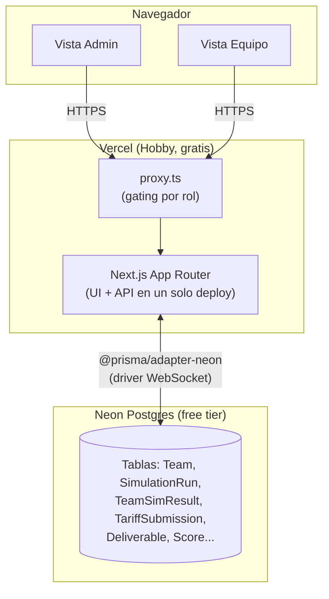
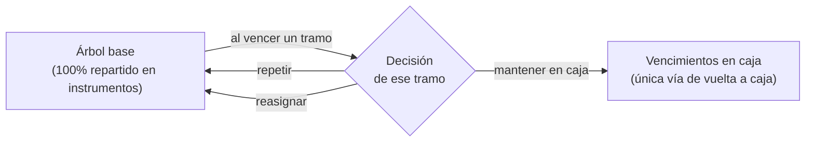
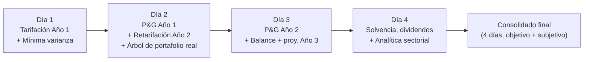
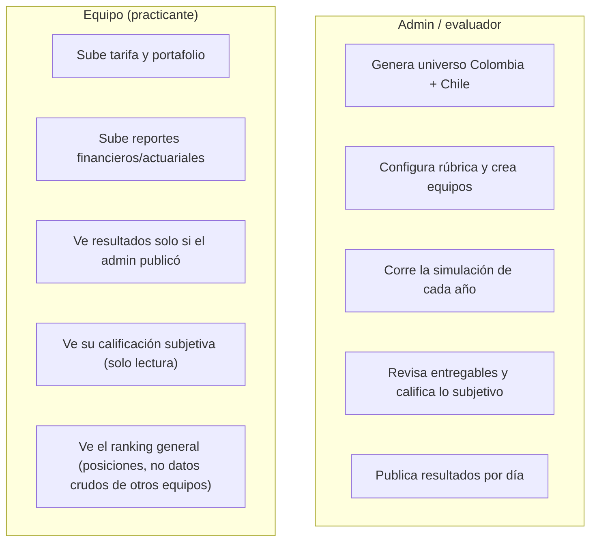

# simulador-financiero-y-actuarial

Plataforma web para una **prueba técnica de pasantía en ciencia actuarial, finanzas y riesgos** de una aseguradora colombiana. Equipos de practicantes tarifican un libro de autos, gestionan un portafolio de inversión y son evaluados a lo largo de **4 días de reto / 2 años simulados**, con calificación objetiva (motor actuarial/financiero) y subjetiva (rúbrica del evaluador).

Corre **100% en planes gratuitos** (Vercel Hobby + Neon Postgres free tier) — sin costo alguno para operar.

## Qué hace

- Genera un universo sintético de **1,000,000 de pólizas** de auto en Colombia (riesgo, siniestros y fechas fijados de forma determinística por semilla).
- Cada equipo sube su propia tarifa (prima por póliza) y compite contra los demás equipos en un mercado simulado (elección discreta tipo logit); lo que limita cuánto puede crecer cada equipo es su propio capital y solvencia, no un tope de cuota fijo igual para todos (ver §2.1).
- A lo largo de 4 días, los equipos tarifican, invierten, reservan, cierran P&G, calculan solvencia y hacen recomendaciones sectoriales — todo evaluado automáticamente contra un motor de referencia, más una calificación subjetiva del evaluador.
- El evaluador (admin) controla cuándo cada equipo ve sus resultados (publicación por día, no todo-o-nada).

## Arquitectura



| Capa | Elección | Por qué |
|---|---|---|
| Framework | Next.js 16 (App Router) | Un solo repo/deploy para UI + API, roles vía rutas |
| Base de datos | Neon Postgres + Prisma (`@prisma/adapter-neon`) | Tipado end-to-end, migraciones versionadas, tier gratuito generoso |
| Auth | NextAuth (Credentials) | Cuentas de equipo usuario+contraseña creadas por el admin, sin correo (evita servicios de pago) |
| Datos masivos | `bytea` en el mismo Postgres | 1M números Float32 ≈ 4 MB; evita un segundo servicio (Vercel Blob) |
| Deploy | Vercel Hobby | Integración directa con Next.js, dominio `*.vercel.app` gratis |
| CSV | Papa Parse + zod | Parseo real con validación de esquema (no `split(',')`) |

## El motor: universo, mercado y reservas


La generación es **determinística**: la misma semilla siempre produce el mismo universo, lo mismo que la asignación de mercado (dado el mismo β, factor de marca y techo de cuota — el límite de capital de cada equipo, ver §2.1, es una función pura de sus propios datos ya guardados, así que también es determinístico). Esto permite que cada corrida sea reproducible y auditable.

## Los modelos actuariales y financieros, en detalle

Esta sección explica **qué calcula el motor y por qué**, no solo el flujo general de arriba. Todo el código referenciado vive en `src/domain/` (puro, sin dependencias de Next.js/Prisma/React) y tiene tests unitarios con semilla fija.

### 1 · Generación del riesgo (frecuencia y severidad)

Cada póliza tiene 13 variables (edad, zona, tipo de vehículo, antigüedad, kilometraje, historial de siniestros, valor asegurado, uso, parqueadero, nivel educativo, estrato, género, marca). A partir de esas variables:

- **Frecuencia (λ)** — `calcLambda()` — un modelo GLM multiplicativo: se parte de una frecuencia base y se multiplica por factores de riesgo relativo por cada variable (ej. zona urbana ×1.45, historial de 2+ siniestros ×1.85–3.20, uso comercial ×1.70), más algunas **interacciones** (joven + deportivo, urbano + comercial) y un par de variables "trampa" deliberadamente débiles para que la señal real no sea trivial de encontrar. El resultado es la probabilidad de que esa póliza tenga al menos un siniestro en el año.
- **Severidad media** — `calcMediaSev()` — proporcional al valor asegurado del vehículo, con factores por tipo de vehículo, zona y antigüedad. El siniestro individual se muestrea de una **Gamma** con esa media (forma fija), lo que da una cola derecha realista (muchos siniestros pequeños, pocos grandes). Los siniestros del **Año 2** (`generateYear2Claims()`) usan el mismo modelo de severidad pero con un año adicional de inflación de costo de siniestros (`CLAIMS_INFLATION_ANNUAL = 9%` en `src/domain/generation/constants.ts`) aplicado como un multiplicador plano sobre la media, antes del sorteo Gamma — la frecuencia (λ) no cambia por esto, solo el costo de un siniestro que sí ocurre. Esta tasa exacta no se le comunica a los equipos — la guía del pasante de Día 2 solo les da la inflación general de referencia (`GENERAL_INFLATION_ANNUAL ≈ 6%`, ver abajo) y les señala que la inflación de costo de siniestros es mayor a esa, dejando la estimación del valor exacto como parte del reto (ver §1.1 para cómo un equipo podría acercarse a él combinando ese 6% con la tendencia real del dataset Chile).
- **Fecha de ocurrencia y aviso** — el mes de ocurrencia sigue un patrón estacional (más siniestros en diciembre/enero, `sampleClaimDate()`). El aviso **no es inmediato**: el rezago ocurrencia→aviso sigue una **lognormal** (`sampleReportingLag()`, μ=3.0/σ=1.2 en días, mediana ~20 días, cola topada en 730 días — hasta 2 años en casos extremos) — este rezago es la fuente real de IBNR (ver §3).

Todo esto se fija en el momento de `generateColombia(seed)`: la misma semilla siempre produce el mismo universo, byte a byte.

#### 1.1 · Dataset Chile — la referencia de tarificación

El CSV público del universo (`/api/universe/public-csv`) trae solo las 13 variables de riesgo, nunca siniestros ni severidad — ninguna aseguradora real regala esos resultados a la competencia, y un equipo tampoco los conoce de antemano de su propio libro. La única fuente con resultados reales que un equipo tiene antes de tarificar el Año 1 es el **dataset Chile** (`generateChile()`, `src/domain/generation/generateChile.ts`): 100,000 pólizas con **tres años de exposición independientes (2021, 2022, 2023)**, cada una con su propio sorteo de siniestro, fecha de ocurrencia y fecha de aviso — descargable como CSV desde la pestaña de Simulación del Día 1 (`/api/universe/chile-csv`, mismo patrón de regeneración desde semilla que el universo de Colombia, nunca un blob almacenado — ver CLAUDE.md §4.1).

No es un atajo: el dataset está diseñado con **retos de transferibilidad deliberados**, que ningún equipo ve documentados en ninguna vista del producto — solo aquí, como referencia del evaluador:

- **Variables con nombre distinto pero mismo concepto** (`kilometraje_anual` → `km`, `siniestros_previos` → `hist`) — transferibles sin más que renombrar.
- **Variables con el mismo nombre pero significado distinto** — `zona` en Chile es región administrativa (metropolitana/norte/centro/sur/austral), no densidad urbana como en Colombia; `comuna_tipo` (gran_ciudad/ciudad_media/rural) es en realidad el análogo más cercano al concepto colombiano de `zona`.
- **Categorías que no existen del otro lado** — `station_wagon`/`furgon` (tipo de vehículo) y `taxi`/`uber` (uso) no tienen equivalente colombiano directo; `caja_automatica`/`seguro_complementario` no existen como variables en Colombia.
- **Moneda** — la severidad de Chile está en UF (Unidad de Fomento chilena), no en pesos colombianos: requiere conversión antes de poder compararse con nada del universo de Colombia.
- **Brecha temporal** — Chile cubre 2021-2023, mientras que el Año 1 de Colombia es **2027**: incluso después de convertir de UF a COP, la severidad de Chile no está a valor presente. Usar la severidad de Chile tal cual para calibrar la tarifa del Año 1 la subestima sistemáticamente — ver el bullet de "Puente Chile → Colombia" más abajo para el mecanismo exacto (no es una sola tasa de inflación general; la UF ya neutraliza esa parte). La plataforma no publica las tasas exactas para cerrar esa brecha; es una decisión que cada equipo debe justificar con criterio propio, igual que el resto de ajustes de este dataset — la misma brecha, un año más, vuelve a aplicar al retarifar para el Año 2 en el Día 2.
- **Tendencia real dentro de Chile mismo (para estimar la inflación de siniestros de Colombia, ver §1.1 arriba, y para el rendimiento real de TES UVR, ver §5)** — `generateChile()` crece la severidad `CHILE_REAL_SEVERITY_GROWTH_ANNUAL = 3%` cada año (aplicado a `baseUf` antes del sorteo Gamma, igual que `CLAIMS_INFLATION_ANNUAL` en Colombia). Como está en UF — una unidad ya indexada a la inflación chilena —, esa tendencia es un crecimiento **real** de costo (repuestos/mano de obra), no inflación disfrazada. No se publica: la pista para un equipo que la mida por su cuenta (comparando severidad promedio 2021 vs. 2022 vs. 2023 en el CSV de Chile) es que, combinada con la inflación general de Colombia que sí se le da como referencia en la guía de Día 2 (`GENERAL_INFLATION_ANNUAL ≈ 6%`, ver arriba), puede acercarlos a la inflación de costo de siniestros real — esa combinación es multiplicativa, no una suma: `(1+CLAIMS_INFLATION_ANNUAL) = (1+GENERAL_INFLATION_ANNUAL)×(1+CHILE_REAL_SEVERITY_GROWTH_ANNUAL)` — el motor mismo nombra el resultado exacto `CLAIMS_INFLATION_ANNUAL = 9%` (`src/domain/generation/constants.ts`), que un equipo puede acercarse a estimar así aunque no se le publique directamente. La misma tendencia de Chile, junto con este mismo despeje, alimenta también cómo se le muestra a un equipo el rendimiento de TES UVR (ver §5, la tabla de instrumentos).

- **Puente Chile → Colombia (transferibilidad de severidad, `chileSeverityToColombia2027Cop()` en `src/domain/generation/constants.ts`)** — dado que la guía de Día 1 le pide a los equipos usar el dataset Chile (2021-2023, en UF) como referencia para su propia severidad de Colombia (Año 1 = 2027, en COP), hay que resolver dos brechas antes de comparar montos, no solo convertir la unidad. **Brecha temporal**: la UF no tiene un "crecimiento real" propio que ajustar — está indexada a diario al IPC chileno precisamente para que su poder adquisitivo real se mantenga constante — así que el único ajuste real necesario es extender `CHILE_REAL_SEVERITY_GROWTH_ANNUAL` desde el año de Chile observado (2021/2022/2023) hasta 2027 (4 a 6 años). **Brecha de moneda**: el monto en UF resultante se convierte a COP vía una tasa de referencia fija (no una proyección a 2027, poco confiable a esa distancia) — `UF_CLP_REFERENCE_VALUE = 40.845` CLP/UF y `CLP_COP_REFERENCE_RATE = 3.5` COP/CLP, ambas el valor de mercado real de jul-2026 (cuando se escribió este ejercicio; fuentes: valoruf.cl y valutafx.com/morsemoney.com). Ninguna de las dos tasas del puente se publica directamente al equipo — la guía de Día 1 explica las dos brechas conceptualmente (§ "El desafío de transferibilidad") y deja la investigación de los valores reales como parte del reto, igual que el resto de las pistas de esta sección. Esta función no la usa `generateColombia()`/`calcMediaSev()` (que se calibra de forma independiente, en COP) — existe para que el reto de transferibilidad tenga una respuesta concreta y verificable, no solo una narrativa. El rango de `valorUf` en `generateChile()` se recalibró de 50-8.000 UF (media ≈4.025) a 50-2.250 UF (media ≈1.150) para que, una vez convertida, la severidad de Chile caiga en el mismo orden de magnitud que la severidad propia de Colombia (~COP 30-40M promedio) — con el rango anterior, el puente daba ~3.5x la severidad real de Colombia, un desajuste que habría hecho que la comparación pareciera un error del equipo en vez de una validación útil.

Lo único que **sí** es directamente transferible sin ajuste es el patrón de desarrollo aviso→pago: ambos datasets muestrean el rezago con la misma distribución lognormal (μ=3.0, σ=1.2), que es justamente lo que calibra internamente la curva de desarrollo de reservas del motor (`src/domain/reserving/constants.ts`, ver §3) — a diferencia de la severidad, el tiempo de desarrollo no depende de en qué año ocurrió el siniestro.

La tabla variable-por-variable de qué tan transferible es cada campo de Chile a Colombia vive solo aquí, como referencia del evaluador — no se le muestra a los equipos, que deben llegar a ella por su cuenta:

| Variable Chile | Análogo Colombia | Truco de transferibilidad |
|---|---|---|
| `edad_conductor` | `edad` | Transferible directamente |
| `tipo_vehiculo` | `tipo` | `station_wagon` y `furgon` no existen en Colombia — requiere mapeo |
| `zona` | `zona` | Mismo nombre, significado distinto: en Chile es región geográfica, no densidad urbana |
| `antiguedad_vehiculo` | `antig` | Transferible |
| `kilometraje_anual` | `km` | Mismo concepto, nombre distinto |
| `siniestros_previos` | `hist` | Transferible |
| `valor_comercial_uf` | `valor` | En UF chilenas — requiere conversión de moneda y recalibración |
| `uso_vehiculo` | `uso` | `taxi`/`uber` no existen como categoría en Colombia |
| `caja_automatica` | — (no existe en Colombia) | Sin análogo directo |
| `seguro_complementario` | — (no existe en Colombia) | Indica si tiene SOAP activo — no existe en Colombia |
| `genero` | `genero` | Transferible (señal débil en ambos datasets — ver "trampas" en §1.2/§1.3) |
| `comuna_tipo` | — (más cercano a `zona` Colombia) | Más parecido al concepto colombiano de `zona` que la propia variable `zona` de Chile |

#### 1.2 · Coeficientes exactos de `calcLambda()` y `calcMediaSev()` (Colombia)

Modelo de referencia completo, para verificar entregables contra el motor exacto (no una aproximación) — `src/domain/pricing/frequency.ts` y `src/domain/pricing/severity.ts`. Ninguno de estos números se muestra en ninguna vista de equipo.

**Frecuencia (`calcLambda()`)** — base `0.065`, multiplicativo, truncado a `[0.01, 0.94]`. La constante de calibración global `CAL_FREQ = 0.33` (`src/domain/generation/constants.ts`) se aplica una sola vez, entre el factor de kilometraje y el de historial, en el orden exacto del código:

| Variable | Categoría → factor |
|---|---|
| Edad | ≤24 ×1.90 · 25–35 ×1.00 · 36–55 ×0.82 · 56–65 ×1.20 · >65 ×1.55 |
| Zona | urbana ×1.45 · rural ×0.70 · (otra) ×1.00 |
| Tipo de vehículo | deportivo ×1.38 · suv/pickup ×1.12 · van ×1.08 · (otro) ×1.00 |
| Historial de siniestros (`hist`) | 0 ×0.75 · 1 ×1.30 · 2 ×1.85 · 3 ×2.60 · 4 ×3.20 · 5+ ×3.20 |
| Kilometraje anual | <15,000 ×0.75 · 15,000–40,000 ×1.00 · 40,001–70,000 ×1.25 · >70,000 ×1.60 |
| Uso | comercial ×1.70 · mixto ×1.30 · (particular) ×1.00 |
| Parqueadero | sí ×0.82 · (no) ×1.00 |
| Educación | básica ×1.25 · técnica ×1.10 · posgrado ×0.90 · (otra) ×1.00 |
| Antigüedad del vehículo | ≤3 ×1.05 · >12 ×1.08 · (4–12) ×1.00 |
| Interacción edad≤24 × deportivo | ×1.40 |
| Interacción edad≤24 × (suv/pickup) | ×1.15 |
| Interacción zona=urbana × uso=comercial | ×1.35 |
| Interacción zona=rural × uso=comercial | ×1.10 |
| Interacción hist≥2 × antig≥8 | ×1.25 |
| Interacción edad≤24 × edu=básica | ×1.20 |
| Género (trampa) | M ×1.04 · F ×0.96 |
| Estrato (trampa, 1→6) | ×1.05 · ×1.03 · ×1.01 · ×0.99 · ×0.97 · ×0.95 |
| Marca (trampa) | chevrolet ×1.02 · renault ×1.01 · mazda ×0.99 · toyota ×0.97 · nissan ×1.01 · hyundai ×0.99 · kia ×0.98 · ford ×1.02 |

**Severidad media (`calcMediaSev()`)** — fracción del valor asegurado del vehículo (`e.valor`):

| Variable | Categoría → factor |
|---|---|
| Tipo de vehículo (factor base sobre `valor`) | deportivo ×0.19 · suv/pickup/van ×0.15 · (otro) ×0.12 |
| Zona | urbana ×1.28 · rural ×0.82 · (otra) ×1.00 |
| Antigüedad del vehículo | ≤3 ×1.22 · >10 ×0.72 · (4–10) ×1.00 |

El siniestro individual se muestrea de una Gamma con media `calcMediaSev()` y forma fija `SEVERITY_SHAPE = 3.306` (`src/domain/generation/constants.ts`). Un `2%` de los siniestros (`OUTLIER_CLAIM_PROBABILITY`) recibe además un multiplicador `×8` (`OUTLIER_CLAIM_MULTIPLIER`) vía un stream de RNG independiente — ver §6. La severidad del Año 2 aplica `CLAIMS_INFLATION_ANNUAL = 9%` como multiplicador plano adicional sobre la media, antes del sorteo Gamma (ver arriba).

**`gammaRand()` (`src/domain/generation/rng.ts`) tuvo un bug heredado del prototipo legacy, corregido.** El sampler Marsaglia-Tsang exige que su variable propuesta `x` venga de una normal estándar N(0,1); la versión portada la tomaba en cambio de `Uniform(-3.5, 3.5)` (varianza ≈4.08 contra la varianza=1 exigida, y una forma completamente distinta — plana y acotada, no acampanada con colas infinitas). Eso inflaba la media empírica del sampler ~33% por encima de la media teórica (`shape`) — verificado con 500,000 muestras: media empírica 4.41 vs. 3.306 esperado para `SEVERITY_SHAPE`, y confirmado contra una implementación corregida de referencia — afectando toda severidad de siniestro, tanto en el universo Colombia como en el dataset Chile (ambos usan la misma función). Corregido usando una normal estándar real (Box-Muller, misma técnica que ya usaba `lognormalRand()`). El fix cambia cuántos números aleatorios consume `gammaRand()` por intento (2 en vez de 1), así que resiembra cada dato posterior al primer siniestro de una semilla dada — todo golden value fijado en pruebas de generación (`generateColombia.test.ts`, `generateChile.test.ts`, `generateYear2Claims.test.ts`) se regeneró corriendo el motor corregido, no se ajustó a mano. El loss ratio real de todo el mercado colombiano — hipotético, con prima comercial de referencia (prima pura verdadera ÷ 0.55) en el denominador, no la prima que ningún equipo cobró — pasó de ~83% (con el bug) a ~63% (corregido) — la brecha restante sobre el 55% teórico de la fórmula queda explicada por completo por el mecanismo de siniestros catastróficos (`OUTLIER_CLAIM_PROBABILITY`/`OUTLIER_CLAIM_MULTIPLIER` de arriba), no por ningún sesgo adicional. Ese ~63% es solo una verificación de consistencia del motor — el loss ratio de mercado que un equipo ve en la guía de Día 2 (§2) es otro número, `computeMarketLossRatio()` (`src/lib/consolidado.ts`), calculado con la prima y los siniestros **reales** de todos los equipos del cohorte (los que de verdad cobraron, agregados, nunca desglosados por equipo) — depende de cómo tarifique ese cohorte específico, así que no tiene por qué acercarse a ese ~63% teórico.

#### 1.3 · Coeficientes exactos del dataset Chile (`calcLambdaChile()` / `calcSeverityBaseChile()`)

Mismo modelo funcional que Colombia, coeficientes propios — `src/domain/pricing/chile.ts`. `genero` se genera para Chile pero no se usa en este modelo (campo puramente descriptivo).

**Frecuencia (`calcLambdaChile()`)** — base `0.072 × CAL_FREQ`, truncado a `[0.01, 0.94]`:

| Variable | Categoría → factor |
|---|---|
| Edad | ≤24 ×1.85 · 25–35 ×1.00 · 36–55 ×0.84 · 56–65 ×1.18 · >65 ×1.50 |
| Zona | metropolitana ×1.40 · norte ×0.95 · centro ×1.05 · sur ×0.90 · austral ×0.78 |
| Tipo de vehículo | furgon ×1.35 · pickup ×1.12 · suv ×1.08 · station_wagon ×1.02 · (otro) ×1.00 |
| Historial de siniestros (`hist`) | 0 ×0.72 · 1 ×1.28 · 2 ×1.80 · 3 ×2.55 · 4 ×3.10 · 5+ ×3.10 |
| Kilometraje anual | <15,000 ×0.76 · 15,000–40,000 ×1.00 · 40,001–70,000 ×1.22 · >70,000 ×1.55 |
| Uso | comercial ×1.60 · taxi ×2.10 · uber ×1.80 · (particular) ×1.00 |
| Caja automática | sí ×0.92 |
| Seguro complementario | sí ×0.88 |
| Tipo de comuna | gran_ciudad ×1.15 · rural ×0.80 · (ciudad_media) ×1.00 |
| Antigüedad del vehículo | ≤3 ×1.04 · >12 ×1.10 · (4–12) ×1.00 |
| Interacción edad≤24 × tipo=furgon | ×1.30 |
| Interacción zona=metropolitana × uso∈{taxi,uber} | ×1.25 |
| Interacción hist≥2 × antig≥8 | ×1.22 |

**Severidad base en UF (`calcSeverityBaseChile()`)** — fracción del valor asegurado en UF (`valorUf`):

| Variable | Categoría → factor |
|---|---|
| Tipo de vehículo (factor base sobre `valorUf`) | furgon ×0.18 · suv/pickup ×0.15 · station_wagon ×0.13 · (otro) ×0.12 |
| Zona metropolitana | ×1.25 (resto de zonas, sin ajuste) |
| Antigüedad del vehículo | ≤3 ×1.20 · >10 ×0.74 · (4–10) ×1.00 |

El siniestro individual se muestrea con la misma Gamma (`SEVERITY_SHAPE = 3.306`) que el universo de Colombia (`generateChile.ts`).

### 2 · Mercado (a quién le toca cada póliza)

Cada equipo sube una tarifa (prima por póliza). El mercado se resuelve en 3 fases (`runSimulation()`):

1. **Preferencias (logit)**: cada póliza calcula una utilidad `u = -β·ln(prima/1,000,000) + ruido_Gumbel·factor_marca` por cada equipo, y "elige" al de mayor utilidad. β es la sensibilidad al precio (mayor β = mercado más sensible a precio); el ruido Gumbel con el factor de marca simula inercia/fidelidad de marca que no depende solo del precio.
2. **Racionamiento por capital y solvencia**: cada equipo tiene su propio límite de pólizas — no un porcentaje fijo igual para todos, sino uno derivado de cuánto capital tiene disponible y qué tan riesgoso es su portafolio (ver §2.1). Si más pólizas lo prefieren de las que su límite permite, se queda con las de **mayor prima** (maximiza ingreso dado el cupo) y rechaza el resto.
3. **Redistribución**: las pólizas rechazadas se reasignan entre los equipos con cupo restante, con el mismo mecanismo logit.

**Año 2** (`runSimulationYear2()`) repite esto pero con dos diferencias: (a) los siniestros del Año 2 son un sorteo **independiente** del Año 1 (mismo modelo de riesgo, un año más de antigüedad, e historial actualizado si hubo siniestro en el Año 1) — no se reciclan los siniestros del Año 1; y (b) cada póliza tiene un **bono de retención** hacia el equipo que la aseguró en el Año 1 (ruido Gumbel adicional escalado por un factor de retención configurable) — a mayor factor, más difícil que un equipo pierda un cliente solo por precio.

#### 2.1 · De dónde sale el límite de cada equipo (capital y solvencia, no un techo arbitrario)

El límite que efectivamente rechaza pólizas es **personalizado por equipo**, derivado del mismo modelo de solvencia que ya usa `finBench()` para el Día 4 (§4) — la idea real detrás: una aseguradora no puede seguir creciendo indefinidamente solo porque tenga buenos precios; el capital que respalda su negocio pone un techo natural a cuánto riesgo puede suscribir. `cuotaPct` (un techo parejo, ej. 30%, igual para los 12 equipos) sigue existiendo como **techo absoluto** que ningún equipo puede superar sin importar su capital (una salvaguarda regulatoria/técnica, no el mecanismo principal), pero el límite que normalmente aplica primero es el de capital.

**El problema de fondo**: `finBench()` calcula el margen de solvencia *después* de conocer cuánta prima y cuántas reservas resultaron del mercado — pero el límite de capacidad se necesita *antes* de correr ese mercado, porque es lo que decide cuántas pólizas puede ganar cada equipo. La solución (`src/domain/finance/capacity.ts`) invierte la fórmula de `finBench()`: en vez de "dado tu volumen de negocio, cuál es tu margen", pregunta "dado tu capital disponible, cuánto volumen de prima puedes sostener manteniendo un margen de solvencia objetivo".

- **`CAPACITY_TARGET_MARGIN = 1.0`** — el margen objetivo para dimensionar capacidad, deliberadamente distinto del `FZ.targetMargin = 1.5` que usa `finBench()` para decidir dividendos (una barra más exigente, "sobra capital para repartir", no "sigo siendo solvente"). Dimensionar la capacidad contra 1.5 habría sido innecesariamente conservador; 1.0 es la línea real de solvencia.
- **Reservas e inversiones, aproximadas proporcionalmente a la prima**: como todavía no se sabe qué pólizas va a ganar cada equipo (eso es justo lo que el racionamiento está decidiendo), no hay una reserva real que usar. Se aproxima como `reserva ≈ prima × 0.796`, donde 0.796 = 0.861 (la misma razón reserva/incurrido de §5.1, medida contra `generateColombia(42)`, invariante al tamaño del equipo porque depende solo de los rezagos aviso/pago del universo) × 0.925 (la razón de siniestralidad de referencia — el punto medio de la banda "sana" que ya usa la analítica sectorial: `LR_BAJO=0.85` "crecer" / `LR_ALTO=1.0` "disminuir", ver `analytics.ts`). El patrimonio se aproxima como el capital disponible mismo (sin sumar utilidad retenida, que todavía no se conoce antes de que el mercado cierre) — una aproximación deliberadamente conservadora, ya que el patrimonio real solo puede ser igual o mayor.
- **Volatilidad del portafolio (`volRatio`)**: el promedio ponderado de la volatilidad de los instrumentos elegidos (sin necesidad de simular nada, es una propiedad de los pesos, no de la simulación), vía el mismo `volRatioFromWeights()` compartido. La fuente de esos pesos es distinta por año (ver abajo): el portafolio de mínima varianza de Día 1 para el Año 1, el árbol real de Día 2 para el Año 2 — nunca el mismo día para ambos.
- **La prima máxima soportable (`maxPremiumForCapital()`) se resuelve por búsqueda binaria**, no con una fórmula cerrada derivada a mano — la función de riesgo de capital (`riskCapitalForPremium()`) es exactamente la misma suma de `rSusc`/`rFin`/`rOp` agregada vía `CORR_MOD` que usa `finBench()`, así que cualquier cambio futuro en esas fórmulas se refleja aquí automáticamente sin tener que re-derivar nada a mano. Esa prima máxima se convierte en un número de pólizas dividiendo por la prima promedio que el propio equipo ya subió (dato conocido antes de que el mercado corra, porque es su propio CSV).

**La conexión entre los dos años (`src/lib/capacityHelper.ts`)**, que es el punto central de este cambio:

- **Año 1** (calculado antes de que cierre el mercado de Año 1, al final de Día 1): todos los equipos parten del mismo `CAPITAL_SOCIAL` fresco — nadie ha comprometido nada todavía. El límite de cada equipo difiere por su propio precio promedio (una prima más barata necesita más pólizas para llegar al mismo techo de prima, así que tiene un límite de pólizas más alto) y la volatilidad del portafolio de mínima varianza que sometió en Día 1 (§5.6) — una especie de presentación regulatoria en el "momento 0", antes de escribir una sola póliza.
- **Año 2** (calculado antes de que cierre el mercado de Año 2, al final de Día 2): el capital disponible que alimenta la misma fórmula ya no es el `CAPITAL_SOCIAL` completo — es `bal1.patrimonio`, calculado por `computeFinBenchForCohort()` usando el ALM **real** de cada equipo (con su prima real, no la ficticia — ver §5.3). Un equipo que tuvo que comprometer mucho Capital Social cubriendo caja en el Año 1 entra al Año 2 con menos capacidad de crecer, **antes incluso de tarificar**. La volatilidad para este año viene del árbol real que el equipo somete en Día 2 (§5) — ya existe para cuando cierra este mercado.

**Qué ve cada equipo**: en los resultados objetivos de cada día (Día 1/2) se muestra el límite por capital, el límite efectivamente aplicado (el menor entre ese y el techo del admin) y cuántas pólizas se rechazaron por él. En el Día 4, un panel adicional pone lado a lado el límite de Año 1 y Año 2, para que un equipo que chocó contra su propio capital pueda conectarlo con el Requerimiento de Capital y el Margen de solvencia que está reportando ese mismo día. El panel del evaluador (`admin/day/[n]`) muestra lo mismo por equipo, directamente junto a las cifras de `finBench()`.

**Qué implica en la práctica, y qué es intencional**: un equipo que agota por completo su Capital Social en el Año 1 (`bal1.patrimonio <= 0`) puede quedar con un límite de capacidad de **cero** pólizas en el Año 2 — expulsado del mercado hasta que, en la vida real, levantara más capital. Es una consecuencia dura, deliberada: la lección es que la solvencia no es solo una nota que se reporta al final, sino una restricción real sobre cuánto se puede crecer.

### 3 · Reservas e IBNR

Al cierre del Año 1, no todos los siniestros ya ocurridos han sido *avisados* — el rezago aviso→pago (§1) implica que una porción real de la siniestralidad todavía no se conoce. `computeLiabilitySchedules()` construye, por equipo, el calendario de pago real de cada siniestro (severidad y timing verdaderos, nunca una estimación), y con eso la reserva técnica se compone de:

- **RSA** (reserva de siniestros avisados): siniestros ya notificados, pendientes de pago según el patrón de desarrollo real (curva de pagos calibrada contra el dataset de Chile).
- **IBNR** (*Incurred But Not Reported*): siniestros ya ocurridos pero todavía sin avisar — su monto real ya quedó fijado desde la generación del universo (la severidad no depende de cuándo se avisa), así que la reserva técnica de cualquier equipo siempre refleja el total pendiente verdadero, nunca una estimación de mercado.

Cada equipo, sin embargo, sí tiene que **estimar** su propia siniestralidad del Año 1 al armar su Costo de Siniestros A1 (Día 2) — sin conocer todavía cuánto de esa reserva corresponde a siniestros que aún no ha visto avisados, puede subestimarla o sobreestimarla. Al cierre del Año 2, esa estimación propia se compara contra el costo real del Año 1 (`year1.claimsAmount`) — la diferencia es "Ajuste de siniestralidad", su propia línea en el P&G del Año 2 (ver §4), que corrige la utilidad del Año 2 por el error de estimación del Año 1, nunca mezclada con el costo de siniestros del Año 2 mismo. Esto es deliberado: un equipo puede tarifar bien pero estimar mal su propia siniestralidad (o viceversa), y ambas cosas se califican por separado.

**Por qué Día 2 usa ELR y Día 3 puede usar Chain Ladder — un cambio real de mecánica, no solo de guía.** El reporte de Día 2 (`/api/teams/report?day=2`, `src/app/api/teams/report/route.ts`) censura los siniestros propios del Año 1 con la misma regla de IBNR que el reporte de Día 1 (avisado dentro del mismo año de ocurrencia) — un equipo solo ve una diagonal (12 meses de desarrollo), insuficiente para calcular ningún factor de desarrollo, así que el método apropiado es Expected Loss Ratio (Día 2's guide §2). El reporte de Día 3 amplía esa visibilidad del Año 1 a "avisado en su propio año o el siguiente" (24 meses) — segunda diagonal — y expone por primera vez `fecha_siniestro_a1`/`fecha_aviso_a1` (nunca dados antes), suficiente para que un equipo arme su propio triángulo 2×2 y calcule su propio factor edad a edad (12→24 meses). Los siniestros propios del Año 2 en ese mismo reporte siguen tan censurados como en Día 2 (avisado en su propio año únicamente) — todavía es su primera diagonal. El factor de cola que lleva esos 24 meses a costo último sí se le da directamente al equipo (`CHAIN_LADDER_TAIL_FACTOR = 1.003` en `src/domain/reserving/constants.ts`) porque no hay forma de derivarlo solo con datos propios — depende de la cola de rezago de aviso más allá del propio corte del reporte del equipo. Verificado empíricamente (no solo declarado): generando el universo completo de 1M exposiciones en 5 semillas, el 24 meses captura consistentemente 99.6-99.7% del costo último verdadero (frente a ~88.5% a los 12 meses) — de ahí el factor pequeño (~0.3%), justo lo esperado dado que `sampleReportingLag()` es lognormal(μ=3.0, σ=1.2) con mediana ~20 días, aunque con cola hasta 730 días (~24 meses).

**Cuándo se paga un siniestro, en detalle** — el pago de un siniestro puntual sigue tres tramos consecutivos, no uno solo (una fuente común de confusión al leer la tabla de caja del ALM, ver §5):

1. **Ocurrencia → aviso**: el rezago lognormal de §1 (mediana ~20 días, cola hasta 730 días/~24 meses).
2. **Aviso → primer pago**: un rezago **fijo** de 3 meses (`LAG_AVISO_PAGO`).
3. **Desarrollo del pago**: se reparte en 3 años (36 meses) desde ese primer pago, según `DEV_FRAC = [0.55, 0.30, 0.15]` (`buildKernel()` en `src/domain/reserving/constants.ts`) — 55% del monto en el año 1 de desarrollo, 30% en el año 2, 15% en el año 3.

En el peor caso estos tramos se **suman**: un siniestro ocurrido cerca del cierre del Año 1, con un aviso especialmente tardío (cola de la lognormal), puede seguir generando pagos hasta cerca del límite de la ventana simulada. Por eso `HORIZON=48` meses desde la valoración (4 años, no 3): se dejó holgura deliberada frente a los 3 años de desarrollo puro, justamente para no cortar la cola de los siniestros avisados tarde dentro del Año 1. Lo que aun así exceda esa ventana de 48 meses se trunca — no se paga ni se refleja en la reserva —, una simplificación aceptada del modelo, no un error.

### 4 · P&G, Balance y Solvencia (`finBench()`)

`finBench()` es el motor de referencia (el "Motor" que se compara contra lo que cada equipo reporta, ver §7) para tres entregables: el P&G de cada año, el Balance, y la Solvencia del Día 4. Esta sección explica, línea por línea, de dónde sale cada cifra — no solo el resultado final.

**Qué se reporta cada día.** El equipo nunca sube un solo número aparte — cada estado se reporta completo, línea por línea, en el mismo orden vertical de un P&G/Balance real (`DeliverablesForm` los agrupa así, ver `Concepto.group` en `concepts.ts`):

- **Día 2**: el P&G completo del Año 1 (`p1`, 13 líneas — ver §4.1).
- **Día 3**: el P&G del Año 2 (`p2`, 15 líneas — dos más que Año 1: libera la Reserva de Prima No Devengada de Año 1 y carga Ajuste de siniestralidad, la corrección del propio Costo de Siniestros A1 de Día 2 contra el costo real del Año 1) y la proyección del Año 3 (`p3`, 14 líneas — libera la de Año 2, sin línea de Ajuste de siniestralidad), más el Balance completo de Año 1, 2 y 3 (`bal1`/`bal2`/`bal3`, 10 líneas cada uno). Las reservas técnicas de Año 1 y Año 2 — nunca un reporte aparte del P&G — viven únicamente ahí, como la línea `reservasTec` de cada balance: el saldo de la reserva nunca aparece en ningún P&G, ni siquiera como una ganancia/pérdida.

**Cada línea que es una fórmula pura de otras líneas ya reportadas se califica distinto: contra lo que el equipo mismo reportó en esas otras líneas, no contra la cifra verdadera del motor.** Así, un solo error (una Prima Emitida o un Costo de siniestros equivocados) no se castiga una segunda, tercera y cuarta vez en cada línea que algebraicamente depende de él — Resultado Técnico, Resultado Industrial, Utilidad Antes de Impuestos, Impuesto, Utilidad Neta, y del lado del Balance, Activos/Pasivo/Pasivo+Patrimonio/Inversiones. Esas líneas se marcan **(fórmula)** en las tablas de abajo. Solo los hechos/estimaciones genuinamente primarios (Prima Emitida, Costo de Siniestros, Resultado de Inversiones, Reservas Técnicas, Patrimonio) se califican contra la cifra verdadera de `finBench()`. El mecanismo (`FormulaSpec`/`scoreFormulaConcepto()` en `concepts.ts`) recalcula el valor esperado de la línea-fórmula a partir de los **propios** valores que el equipo ya reportó para las líneas que la componen (incluyendo, en un puñado de casos, una línea reportada un día antes — la Reserva de Prima No Devengada liberada de un año siempre referencia la Prima Emitida de ese año anterior) y compara la línea contra ese número recalculado, no contra la verdad del motor — si falta alguno de esos insumos propios, la línea queda sin calificar (no en 0), igual que cualquier campo que el equipo dejó en blanco. Ajuste de siniestralidad es la única excepción: su fórmula usa el Costo de Siniestros A1 **verdadero**, no lo que el equipo reportó, para medir qué tan bien estimó su propia siniestralidad del Año 1 (ver §4.2).

`p2_pagos` (siniestros pagados en A2) queda deliberadamente fuera de los grupos anteriores — no es una línea del P&G que se sume o reste en algún lado, es una nota de auditoría actuarial: la caja efectivamente pagada durante el Año 2 (un concepto de **flujo de caja**), mientras que `costo`/`desarrollo` son lo **incurrido** en base contable (devengado, no necesariamente pagado todavía) — ambos números pueden diferir legítimamente. Se reporta y califica aparte porque es un chequeo de que el equipo entendió de dónde sale la cifra de costo, no porque haya que sumarla al P&G.

#### 4.1 · P&G del Año 1 (`p1`)

Construido por `pyg(primaEmitida, rpndLiberada, costo, rinv, reservas)`, con estos insumos. Año 1 no tiene año anterior del que liberar RPND, así que esa línea no aparece aquí (sí en Año 2, ver §4.2). Tampoco tiene "Ajuste de siniestralidad" — esa línea corrige, un día después, el propio Costo de Siniestros A1 que se reporta aquí (ver §4.2).

| Línea | De dónde sale |
|---|---|
| `primaEmitida` | `year1.totalPremium` — la prima real que el equipo efectivamente cobró en el mercado del Año 1 (§2), no la que tarificó: es la suma de las primas de las pólizas que realmente ganó, después del racionamiento por capital/solvencia (§2.1). |
| `rpndConstituida` (fórmula) | `20% × primaEmitida` (`FZ.rpndPct`) — la Reserva de Prima No Devengada que se constituye sobre la prima de este mismo año. |
| `primaDevengada` (fórmula) | `primaEmitida − rpndConstituida` — para Año 1 esto equivale a un 80% plano de la prima emitida, precisamente porque no hay RPND de un año anterior que liberar (ver Año 2, donde deja de ser un 80% plano). |
| `costo` | `year1.claimsAmount` — la severidad real incurrida de las pólizas que ese equipo ganó y tuvieron siniestro, tomada directamente del universo generado, en base **fecha de accidente**: es el costo total de los siniestros ocurridos en el Año 1, sin importar cuándo se avisen. |
| `gadq` (fórmula) | `4% × primaEmitida` (`FZ.gAdq`). |
| `gcom` (fórmula) | `15% × primaEmitida` (`FZ.gCom`). |
| `rt` (Resultado Técnico, fórmula) | `primaDevengada − costo − gadq − gcom` — deliberadamente sin el gasto administrativo, que tiene su propia línea (ver `ri`). |
| `gadm` (fórmula) | `6% × primaEmitida` (`FZ.gAdmin`). |
| `ri` (Resultado Industrial, fórmula) | `rt − gadm` — dónde realmente aterriza el gasto administrativo, separado del resultado técnico puro de suscripción. |
| `rinv` (resultado de inversiones) | El ingreso de inversión que el **ALM real** del Año 1 (§5.3) devengó en sus 12 meses, sobre el árbol de portafolio que el equipo sometió en Día 2 — `AlmRealYearResult.income`, no una fórmula. |
| `uai` (fórmula) | `ri + rinv`. |
| `imp` (fórmula) | `30% × max(0, uai)` (`FZ.tax` — nunca un impuesto negativo). |
| `uneta` (fórmula) | `uai − imp`. |

El saldo de reserva del Año 1 se explica en detalle en §4.3, junto con el resto de la Reserva Técnica.

#### 4.2 · P&G del Año 2 (`p2`) y proyección del Año 3 (`p3`)

Con desarrollo Año1→Año2 ya calculado (Día 3+, `computeDevelopment()` — ver §3):

| Línea | De dónde sale |
|---|---|
| `primaEmitida` | `year2.totalPremium` — prima real cobrada en el mercado del Año 2 (con retención de clientes, §2). |
| `rpndLiberada` (fórmula, cruza a Día 2) | `20% × primaEmitida del Año 1` — se libera el 100% de lo que Año 1 constituyó, ni una fracción distinta. |
| `rpndConstituida` (fórmula) | `20% × primaEmitida` de este mismo Año 2. |
| `primaDevengada` (fórmula) | `primaEmitida − rpndConstituida + rpndLiberada` — un roll-forward genuino, **no** un 80% plano de la prima emitida del Año 2: si la prima creció o bajó frente al Año 1, lo liberado (20% de la prima *vieja*) y lo constituido (20% de la prima *nueva*) no se cancelan exactamente. Solo coinciden con un 80% plano cuando la prima emitida no cambió de un año a otro. |
| `costo` | `development.ultY2` — el costo de los siniestros **propios del Año 2** únicamente, en base fecha de accidente, igual que Año 1. Nunca incluye el desarrollo de Año 1 (esa es su propia línea, `Ajuste de siniestralidad`, abajo): los siniestros del Año 1 avisados tarde ya están en el `costo` del Año 1 desde el principio (`year1.claimsAmount` ya es el último verdadero, avisado + IBNR — ver §3), así que sumarlos otra vez aquí los contaría dos veces. |
| `p2_ajusteSiniestralidad` (Ajuste de siniestralidad A1) | La diferencia entre la siniestralidad real del Año 1 (`year1.claimsAmount`) y lo que el equipo reportó como Costo de Siniestros A1 en Día 2 (`p1_costo`) — positivo si el equipo la subestimó, negativo si la sobreestimó. |
| `gadq` (fórmula) | `4% × primaEmitida` del Año 2. |
| `gcom` (fórmula) | `15% × primaEmitida` del Año 2. |
| `rt` (fórmula) | `primaDevengada − costo − p2_ajusteSiniestralidad − gadq − gcom`. |
| `gadm` (fórmula) | `6% × primaEmitida` del Año 2. |
| `ri` (fórmula) | `rt − gadm`. |
| `rinv` | El ingreso de inversión que el **ALM real** del Año 2 devengó en sus 12 meses — esta corrida no arranca de cero: continúa exactamente donde terminó el Año 1 real (mismas posiciones abiertas, mismo capital comprometido acumulado), financiada por el desarrollo del Año 1 que emerge en el Año 2 más los siniestros propios del Año 2 en su propio primer año (ver §5.3). |
| `uai` (fórmula) | `ri + rinv`. |
| `imp` (fórmula) | `30% × max(0, uai)`. |
| `uneta` (fórmula) | `uai − imp`. |

El saldo de reserva del Año 2 se explica en §4.3 junto al resto de la Reserva Técnica.

El **Año 3 no se simula** — no hay un tercer mercado ni un tercer ALM. Cuando `development` trae los campos de cola de Año 3 (ver §3) y además hay `insuredCount` de Año 1/Año 2 y la retención real de Año 2 (`year2Retention`, de `TeamSimResult.extra`), `p3` se construye igual que `p2` pero sin línea de Ajuste de siniestralidad (ver por qué, abajo):

| Línea | De dónde sale |
|---|---|
| `primaEmitida` | Pólizas retenidas + nuevas, no una tasa de crecimiento plana: `retentionRate = year2Retention.retainedCount / year1.insuredCount` (la retención real Año1→Año2) aplicada hacia adelante sobre el libro de Año 2 (`retainedPolicies3 = retentionRate × year2.insuredCount`), más las mismas pólizas nuevas que entraron en Año 2 (`newPolicies3 = year2Retention.newCount`) — `primaEmitida3 = (retainedPolicies3 + newPolicies3) × (primaEmitida2 / insuredCount2)`. |
| `rpndLiberada` (fórmula) | `20% × primaEmitida del Año 2`. |
| `rpndConstituida` (fórmula) | `20% × primaEmitida` de este mismo Año 3 (proyectada). |
| `primaDevengada` (fórmula) | `primaEmitida − rpndConstituida + rpndLiberada` — mismo roll-forward que Año 2. |
| `costo` | Únicamente el siniestro **propio de Año 3, proyectado**: frecuencia igual a la observada en Año 2 (`development.claimCountY2 / year2.insuredCount`) por severidad de Año 2 inflacionada un año más por `CLAIMS_INFLATION_ANNUAL` (9%, el mismo número que ya infla los siniestros de Colombia de Año1→Año2; ver §1.1 para por qué esto no es una segunda tasa distinta). Nunca incluye `devTailY1InY3`/`devTailY2InY3` (las colas reales de pago de Año 1/Año 2 que caen en el calendario de Año 3): ese dinero ya se reconoció como costo incurrido en el P&G de su propio año de accidente — sumarlo aquí también sería contarlo dos veces. Esas colas son puramente un movimiento de reserva (ver `reservas` abajo), sin ningún efecto en el P&G. |
| `gadq` / `gcom` / `rt` / `gadm` / `ri` (fórmula) | Mismas fórmulas que Año 1/Año 2, sobre la `primaDevengada`/`costo` de arriba — **sin** línea de Ajuste de siniestralidad: no hay un día posterior a Día 3 donde corregir un eventual error en la propia estimación de Costo de Siniestros A2. |
| `rinv` | `reservas3 × effectiveYield2`, donde `effectiveYield2` es el rendimiento **realmente devengado** por el ALM real de Año 2 (`income ÷ saldo invertido promedio de esos 12 meses`, no `portYield`, la tasa nominal del árbol) — un equipo que tuvo que vender forzado o comprometer capital en Año 2 arrastra esa consecuencia a su proyección de Año 3, en vez de que la proyección la "olvide". |
| `uai` / `imp` / `uneta` (fórmula) | Mismas fórmulas que Año 1/Año 2. |

El saldo de reserva del Año 3 (proyectado) se explica en §4.3 junto al resto de la Reserva Técnica.

Balance de Año 3: mismas fórmulas de caja/cxc/cxp/RPND que Año 1/2 (§4.3). El capital comprometido de Año 3, en cambio, sí se proyecta — no se limita a cargar el mismo corte de Año 2 hacia adelante — extrapolando la tendencia Año1→Año2 (`capitalComprometidoY2 + (capitalComprometidoY2 − capitalComprometidoY1)`): como ese acumulado nunca se repone solo (§5.1), el delta Y1→Y2 nunca es negativo, así que en el caso más común (sin erosión en ningún año) el resultado sigue siendo el mismo corte de Año 2 sin cambios, pero un equipo que ya venía comprometiendo capital adicional en Año 2 arrastra esa misma tendencia a su proyección de Año 3.

**Fallback** (cuando falta cualquiera de los insumos de arriba — `development` sin los campos de Año 3, o sin `insuredCount`/`year2Retention`): `p3` cae de vuelta a una proyección plana — `primaEmitida3 = primaEmitida2 × 1.06`, `costo3 = costo2 × 1.06`, `reservas3 = reservas2 × 1.06`, `rinv3 = reservas3 × portYield`, `rpndLiberada3 = rpndConstituida2` (`FZ.growth3 = 6%`).

#### 4.3 · Balance (`bal1`/`bal2`/`bal3`)

Construido por `balance()`, el mismo para los tres años, tomando el P&G de ese año como insumo:

| Línea | De dónde sale |
|---|---|
| `caja` / `cxc` / `cxp` (fórmula) | `15% / 7% / 10% × primaEmitida` de ese año (`FZ.cajaPct/cxcPct/cxpPct`) — porcentajes fijos, no simulados. Para Año 1, `primaEmitida` es la que se reportó un día antes, en Día 2 (§4.1) — la única otra fórmula (junto con `rpndLiberada` de Año 2) que cruza de un día a otro. |
| `rpnd` (Reserva de Prima No Devengada, fórmula) | El mismo número que `rpndConstituida` del P&G de ese año (§4.1/4.2) — un pasivo aparte de las reservas técnicas, la parte de la prima que todavía no se ha ganado. |
| `activos` (fórmula) | `caja + inversiones + cxc`. |
| `reservasTec` (Reserva Técnica) | La plata apartada para pagar siniestros que todavía no se han terminado de pagar — ver el detalle año por año justo debajo de esta tabla. Un hecho/estimación primario, no una fórmula de otras líneas del Balance. |
| `pasivo` (fórmula) | `reservasTec + rpnd + cxp` — la RPND es un pasivo aparte, junto a las reservas técnicas y las cuentas por pagar. |
| `patrimonio` | `CAPITAL_SOCIAL` (fijo, §5.1) `+ utilidades retenidas` (la suma acumulada de `uneta` hasta ese año, incluida la `uneta` proyectada de Año 3 — ver §4.2) `− capital comprometido` acumulado hasta el cierre de ese año. Para Año 1/2 viene directo del ALM real de ese año (`AlmRealYearResult.capitalComprometidoAcumulado`); Año 3 no tiene ALM propio, así que lo proyecta extrapolando la tendencia Año1→Año2 (ver §4.2). Un hecho/estimación primario — depende del ALM, no de otras líneas del Balance. |
| `pasivoPatrim` (fórmula) | `pasivo + patrimonio` — debe cuadrar exactamente con `activos` (la identidad contable básica); es la razón por la que existe como concepto reportable aparte, no solo de lectura. |
| `inversiones` (fórmula) | `reservasTec + rpnd + cxp + patrimonio − caja − cxc` — el residual que hace cuadrar el balance (activos = pasivos + patrimonio), no un valor de mercado del portafolio. |

**Cómo se calcula la Reserva Técnica (`reservasTec`) de cada año.** Es plata que la aseguradora ya reconoció como comprometida — siniestros que ya ocurrieron y hay que pagar, avisados o no (RSA/IBNR, ver §3) — pero que a la fecha de corte todavía no se ha pagado en efectivo. No es una línea del P&G: es un saldo, vive solo en el Balance.

- **Año 1**: siempre el total real por pagar de los siniestros del equipo (`liabilityYear1.reserva`), calculado por `computeLiabilitySchedules()` sobre el calendario de pago exacto de cada siniestro — avisado o no — nunca una estimación de mercado. Es un valor fijo: no cambia según cuándo se consulte (Día 1/2 o Día 3+, con o sin el desarrollo del Año 2 ya calculado), porque no depende de ningún factor agregado, solo de los siniestros reales de ese equipo.
- **Año 2**: lo que sigue pendiente de pago al cerrar el Año 2, sumando dos orígenes — la cola del Año 1 que todavía no se pagó, más lo que del Año 2 mismo sigue abierto. Si el desarrollo del Año 2 todavía no está calculado, se aproxima con un ratio simple: siniestros del Año 2 × (reserva del Año 1 ÷ siniestros del Año 1).
- **Año 3 (proyectado)**: la misma suma de colas pendientes de Año 1 y Año 2, más el 45% de los siniestros propios de Año 3 que a esa fecha todavía estarían en su primer año de desarrollo (el mismo `1 − DEV_FRAC[0]` de §3). Sin los insumos necesarios para esta proyección, la reserva simplemente crece un 6% plano sobre la del Año 2, igual que el resto del P&G proyectado (§4.2).

#### 4.4 · Solvencia (Día 4)

| Línea | De dónde sale |
|---|---|
| `solRPrimas` | `primaEmitida del año vigente × 14.76%` (`FZ.primeVol`) — deliberadamente sobre Prima **Emitida**, no Devengada: el riesgo de prima es sobre el volumen de negocio suscrito, no sobre cuánto de ese volumen ya se ganó. Igual que los gastos (§4.1), que también se calculan sobre Emitida. |
| `solRReservas` | `reservas del año vigente × 30%` (`FZ.resVol`). |
| `solRSusc` (riesgo de suscripción) | `√(rPrimas² + rReservas² + 2×0.75×rPrimas×rReservas)` — 0.75 es la correlación prima-reserva (`FZ.corrPR`). |
| `solRFin` (riesgo financiero) | `inversiones del balance vigente × 6.6% × volRatio` (`FZ.finRiskPct`) — `volRatio` es la volatilidad realizada del portafolio real de ese año dividida entre el promedio del menú (`avgVol/VOL_MENU_AVG`, ver §5.4). |
| `solROp` (riesgo operacional) | `primaEmitida del año vigente × 3%` (`FZ.opPct`) — misma base que `solRPrimas`. |
| `solRConc` (riesgo de concentración) | `inversiones del balance vigente × 3% × concRatio` (`FZ.concRiskPct`) — `concRatio` es `portfolioConcentrationRatio()` del mismo árbol de Día 2 (0 = repartido entre los instrumentos con plazo propio, 1 = concentrado en uno solo; LIQ no cuenta, ver §5.2). Es independiente de `volRatio` — un equipo 100% en CDT90 (baja volatilidad) paga este cargo completo aunque `solRFin` apenas se mueva. |
| `solRk` (capital requerido) | `√(ΣΣ CORR_MOD_CONCENTRACION[i][j] × R[i] × R[j])` sobre `R = [rSusc, rFin, rOp, rConc]` — la matriz de correlación (`CORR_MOD_CONCENTRACION`) hace que suscripción-operacional y financiero-operacional/concentración-operacional estén perfectamente correlacionados (1.0), suscripción-financiero y suscripción-concentración parcialmente (0.75), y financiero-concentración solo débilmente (0.5, dos riesgos relacionados pero con drivers distintos — ver §5.2). |
| `solFp` (fondos propios) | El `patrimonio` del balance vigente (§4.3) — ya neto de todo el capital comprometido acumulado hasta ese punto. |
| `solMargen` | `solFp / solRk`. |
| `div` (dividendos sugeridos) | `max(0, solFp − solRk × 1.5)` — 1.5 (`FZ.targetMargin`) es la barra de "sobra capital para repartir", más exigente que la de apenas-solvente (1.0, ver §2.1). |

"Año/balance vigente" es el Año 2 si existe, si no el Año 1 (`p2 || p1`, `bal2 || bal1`) — la solvencia del Día 4 siempre mira el año más reciente disponible.

Esta es la conexión directa entre la decisión de portafolio y la solvencia del Día 4: (a) un equipo que concentró su portafolio en instrumentos volátiles paga un capital requerido mayor (`rFin` más alto → RK más alto → margen y dividendo más bajos), (b) un equipo cuyo árbol quedó concentrado en un solo instrumento con plazo propio paga un cargo de concentración aparte (`rConc`), sin importar qué tan volátil fuera ese instrumento — es el mismo `concRatio` que ya descontó la nota de Rendimiento del Día 2 (§5.2), así que un equipo que entendió por qué bajó esa nota entonces está en mejor posición para reportar el RK correcto ahora, (c) un equipo que tuvo que comprometer Capital Social para cubrir una brecha de caja ve sus fondos propios directamente reducidos por ese monto, y (d) ese mismo capital comprometido — vía `bal1.patrimonio` — es exactamente lo que determina cuánto podía crecer ese equipo en el mercado del Año 2, *antes* de que el Día 4 llegara a mostrárselo (ver §2.1) — todo esto sin importar qué tan bien le fue en rendimiento nominal. La volatilidad y concentración que determinan `rFin`/`rConc`, tanto para el Año 1 como para el Año 2, vienen del mismo árbol real de Día 2 (§5) — es el único árbol que la plataforma recoge (ver §5.0); el portafolio de mínima varianza de Día 1 solo alimenta la cuota de mercado del Año 1 (§2.1), nunca la solvencia.

### 5 · Portafolio de inversión y ALM (asset-liability matching)

#### 5.0 · Dos ejercicios de portafolio distintos, en días distintos

Hay **dos decisiones de portafolio separadas**, deliberadamente en días distintos:

- **Día 1 — portafolio de mínima varianza** (una foto, sin fecha de vencimiento ni reinversión): el equipo asigna pesos entre el menú de instrumentos buscando la **mínima varianza posible sujeta a un retorno mínimo objetivo**, dada una matriz de covarianza — un ejercicio de optimización con respuesta objetiva, no una decisión estratégica libre. Narrativa: es la presentación del equipo al regulador en el "momento 0", antes de escribir una sola póliza. Se detalla en §5.6.
- **Día 2 — el árbol de decisiones real** descrito en el resto de esta sección: la decisión de inversión real del equipo, informada por sus propias cifras de prima/siniestros ya conocidas, con reinversión y vencimientos genuinos a lo largo de 60 meses simulados.

**Por qué el árbol se somete en Día 2, no en Día 1**: para esa fecha el equipo ya conoce sus propias cifras reales de prima y siniestros del Año 1 (junto con las que reporta en el P&G, ver §4.1) — puede razonar su árbol de inversión con datos reales en la mano, no a ciegas sobre lo que todavía no sabe.

**El desface deliberado en la cuota de mercado**: la cuota de mercado por solvencia del Año 1 (§2.1) usa la volatilidad del portafolio de mínima varianza que el equipo sometió en Día 1, nunca el árbol real. La cuota del Año 2 usa el árbol real de Día 2, que ya existe para cuando cierra ese mercado. El portafolio de mínima varianza no vuelve a usarse para nada más allá de la cuota del Año 1: no alimenta ALM, P&G, Balance ni Solvencia.

Cada equipo construye su portafolio real como un **árbol de decisiones**, no una asignación estática en dos momentos. Parte de una base (cómo repartir 100 entre los instrumentos del menú) y, para **cada tramo** de esa base, decide qué pasa cuando llegue a su propio vencimiento:

```ts
interface Tranche {
  instrumentId: string;
  weight: number;
  durationM?: number; // obligatorio solo para LIQ/ACC — ninguno tiene plazo contractual propio
  onMaturity:
    | { action: "cash" }                            // pasa a caja disponible
    | { action: "repeat" }                           // se refondea igual, indefinidamente
    | { action: "reallocate"; tranches: Tranche[] }; // se reparte entre nuevos tramos, cada uno con su propia decisión
}
```

LIQ y acciones (ACC) no tienen un plazo fijo como un bono, así que el equipo les asigna un **vencimiento personalizado** (`durationM`): el momento en que se le vuelve a preguntar qué hacer con esa porción. La interfaz de equipo lo recoge como un asistente paso a paso — una decisión a la vez, incluyendo las que se generan en cascada cuando la respuesta es "reasignar" — no un formulario con todo el árbol a la vez.

**El menú de instrumentos tiene un verdadero trade-off riesgo/retorno**, no solo distintos rendimientos — cada instrumento también tiene una **volatilidad anualizada** (`volAnual` en `src/domain/finance/instruments.ts`):

| Instrumento | Rendimiento | Volatilidad | Rendimiento ajustado por riesgo* |
|---|---|---|---|
| LIQ (caja) | 5.0% | 1.0% | 4.65% (el peor del menú — la seguridad total tiene un costo de oportunidad real) |
| CDT 90 días | 9.5% | 3.2% | 8.38% |
| TES 1 año | 10.5% | 4.0% | 9.10% |
| TES 3 años | 11.5% | 7.0% | 9.05% |
| **TES UVR 8 años** | **12.0%** | **6.0%** | **9.90% (el mejor del menú)** |
| Acciones (ACC) | 14.0% | 20.0% | 7.00% |

*Rendimiento − 0.35 × Volatilidad (`VOL_PENALTY_LAMBDA` en `src/domain/finance/constants.ts`). El TES UVR está calibrado deliberadamente como el mejor balance del menú: su volatilidad es menor de lo que su plazo nominal de 8 años sugeriría, modelando que al estar indexado a inflación queda protegido de la inflación inesperada que sí penaliza a un bono nominal del mismo plazo — una simplificación explícita del modelo, no un dato de mercado real. Las acciones quedan penalizadas pero no son el peor caso: su 14% nominal no compensa del todo su volatilidad, mientras que LIQ, con el rendimiento nominal más bajo del menú, termina siendo el peor ajustado por riesgo — quedarse completamente seguro también tiene un costo, no solo el riesgo tiene precio.

**Lo que un equipo ve para TES UVR no es el 12.0% nominal de esta tabla.** `displayYield()`/`displayYieldLabel()` (`src/domain/finance/instruments.ts`) son una capa puramente de presentación — nunca tocada por el motor de simulación ni por ningún cálculo (ALM, Markowitz, `scoreFinanciero()`, `finBench()` siguen usando `ins.yield = 12.0%` sin cambios) — que muestran el rendimiento de TES UVR **neto de inflación general** en vez de nominal, con la etiqueta explícita `"Inflación + 5.8%"` (no solo el número solo): `(1+12.0%)/(1+GENERAL_INFLATION_ANNUAL) − 1 ≈ 5.83%` (`src/domain/generation/constants.ts` — descomposición multiplicativa tipo Fisher a partir de `CLAIMS_INFLATION_ANNUAL` y `CHILE_REAL_SEVERITY_GROWTH_ANNUAL`, no una resta). Es una trampa deliberada, del mismo estilo que las de §1.1: TES UVR está indexado a inflación, así que un retorno real por encima de inflación es su verdadera ventaja — el prefijo "Inflación +" avisa que no está en la misma base que el resto del menú (todos nominales), pero no revela cuánto vale esa inflación; un equipo que no la estime por su cuenta no puede comparar TES UVR de igual a igual contra el resto, exactamente el mismo tipo de razonamiento que exige la brecha temporal de Chile.

El rendimiento (con o sin la etiqueta) **no aparece en absoluto** dentro de los formularios interactivos donde un equipo arma su portafolio (`PortfolioForm.tsx`/`MinVarianceForm.tsx` — solo muestran volatilidad por instrumento): el formulario de mínima varianza necesita calcular un retorno esperado agregado contra el `ins.yield` **nominal** real (para validar `TARGET_RETURN`), y mostrar ese agregado nominal junto a una etiqueta de "Inflación + X%" por instrumento en la misma pantalla dejaría despejar la inflación exacta comparando ambos números. Por eso ese formulario tampoco muestra el retorno esperado logrado como número — solo si cumple o no el mínimo (`"Cumple"/"No cumple con el rendimiento mínimo"`). El rendimiento por instrumento sigue siendo visible (con la etiqueta) en las tablas de referencia que no calculan nada agregado: `InstrumentsPanel`, ambas guías y el CSV descargable — consistentes entre sí, así que no hay dos números distintos para el mismo instrumento en ninguna vista.

**Esta columna se normaliza contra lo que la simulación realmente logra, no contra la fórmula nominal de arriba.** `RISK_ADJUSTED_YIELD_MIN`/`MAX` (`src/domain/finance/alm.ts`) son el rendimiento ajustado por riesgo **realizado** — no el de esta tabla, y ya con el descuento de concentración de §5.2 incluido — de dos portafolios de referencia corridos completos a través de `almSim()`/`scoreFinanciero()`: el piso es 100% LIQ (`durationM=12`, "repeat" indefinido — LIQ no paga descuento de concentración por diseño, así que este número es puramente el efecto de la volatilidad); el techo es un portafolio repartido en partes iguales entre CDT90/TES1/TES3/TESUVR8 (25% cada uno, ACC excluido — su volatilidad no compensa ni siquiera diluida), no 100% en TES UVR — concentrarse en el instrumento individual con mejor rendimiento ajustado por volatilidad ya no gana una vez se aplica el descuento de concentración (verificado contra una búsqueda en grilla sobre el simplex de 5 instrumentos, mismo método que la validación cruzada de `markowitz.test.ts`). Para un portafolio sin descuento de concentración, lo *realizado* y lo nominal quedan prácticamente iguales (diferencia de una centésima o menos) — cada posición devenga rendimiento exactamente por los meses que estuvo abierta (ver §5, el mecanismo de acumulación en `stepMonth()`), así que ese pequeño margen es el único efecto restante y no un artefacto del cálculo.



`almSim()` simula mes a mes (60 meses: 12 de fondeo + 48 de corrida) dos vistas separadas del mismo portafolio:

- **Un estado de caja** con seis columnas — **Caja Inicial, Prima Cobrada, Pago Siniestros, Gastos, Vencimientos en caja, Inversión Neta, Caja Final** — contra una **Caja Mínima** obligatoria cada mes (15% de Prima+Siniestros, `FZ.cajaPct`).
- **Una evolución del valor del portafolio** — Saldo Inicial, Rendimiento devengado, Saldo Final — separada del estado de caja anterior, porque responde una pregunta distinta: no "¿hay caja suficiente?" sino "¿cuánto vale lo que llevamos invertido?". `Saldo Final = Saldo Inicial + Rendimiento − Vencimientos en caja − Inversión Neta` (un mes con superávit invertido tiene Inversión Neta negativa, así que ese término *suma* al saldo; un mes con retiro para cubrir una brecha la *resta*) — es una identidad exacta, verificada en `alm.test.ts`, y **el Saldo Final puede ser negativo** (ver §5.1).

**Cómo se determina cuánto sobra para invertir cada mes** (`stepMonth()` en `alm.ts`): `Caja Disponible = Caja Inicial + Prima Cobrada − Pago Siniestros − Gastos + Vencimientos en caja`. Esa Caja Disponible se compara contra la Caja Mínima del mes (15% de Prima+Siniestros): si la excede, el excedente completo (`Caja Disponible − Caja Mínima`) es lo que se invierte según el árbol de decisión — nunca la Prima Cobrada cruda del mes. Si no la alcanza, no hay nada que invertir ese mes; en su lugar se activa la jerarquía de venta forzada/capital comprometido de abajo. **La Caja Final nunca es una variable libre — el motor la fija exactamente en la Caja Mínima todos los meses** (verificado como invariante en `alm.test.ts`); la Inversión Neta es la que se ajusta (negativa cuando se invierte el excedente, positiva cuando se retira para cubrir una brecha) para que esa igualdad siempre se cumpla.

#### 5.1 · Capital Social y cuándo el portafolio se vuelve negativo

Todos los equipos parten del **mismo Capital Social fijo: $81,000,000,000 COP** (`CAPITAL_SOCIAL` en `src/domain/finance/constants.ts`), deliberadamente independiente de la prima propia de cada equipo — si dependiera de la prima, la elección de tarifa de un equipo alteraría indirectamente cuánto colchón de capital tiene su ALM, y eso no tiene nada que ver con el riesgo que realmente está asumiendo. El monto se calibró contra el tamaño real de los siniestros, no se inventó: un equipo representativo con ~10% de cuota de mercado (100,000 de las 1,000,000 pólizas) tiene una siniestralidad incurrida esperada de ≈$313.9B COP (esta cifra ya incluye los siniestros catastróficos ocasionales que el universo inyecta — ver §6); de eso, ≈86.1% queda como reserva al cierre del Año 1 (medido con `computeLiabilitySchedules()` sobre el universo real, no estimado), dando una reserva de referencia de ≈$270.3B COP; aplicando el 30% de capital de solvencia (la misma razón que ya usaba el modelo) da ≈$81.1B, redondeado a $81B.

Si en algún mes ni LIQ ni el resto del portafolio (vendido antes de tiempo, ver la jerarquía de venta forzada abajo) alcanzan a cubrir la Caja Mínima, la Caja Mínima **se sigue cumpliendo igual** — el motor cubre lo que falte directamente con Capital Social. Esto es intencional: en la vida real, una aseguradora que se queda sin activos líquidos no simplemente "no paga" — sus accionistas inyectan capital o se activa una línea de crédito para cubrir el bache, a costa de erosionar su patrimonio. Ese capital comprometido:

- **Nunca se "recupera" solo** — si el mes siguiente hay superávit, ese superávit se invierte de cero según el árbol de decisiones; el capital ya comprometido en meses anteriores queda como una marca permanente, no una sobregiro temporal que se paga sola.
- **Deja el Saldo Final del portafolio en negativo** — una vez que LIQ y el resto del portafolio llegan a 0, cualquier capital adicional comprometido resta directamente del Saldo Final reportado (ver la identidad de §5 arriba), y ese número puede quedar negativo indefinidamente.
- **Reduce el patrimonio real** — ver §5.3 y §4: el capital comprometido a fin del Año 1 y a fin del Año 2 (dos cortes del ALM corrido con la prima real de cada equipo, no el ficticio — ver §5.3) se resta directamente del patrimonio en `finBench()`, lo que baja el margen de solvencia del Día 4 automáticamente, sin lógica adicional.

#### 5.2 · Las cuatro notas del ALM (`scoreFinanciero()`)

- **Cumplimiento de Caja Mínima (35%)** — la Caja Mínima siempre se cumple (ver §5.1), así que esta nota mide **cuánto Capital Social hubo que comprometer** para lograrlo: el peor mes individual (riesgo de cola) y lo acumulado en los 60 meses (erosión crónica), cada uno como fracción del Capital Social fijo, combinados 50/50. Un equipo que nunca tocó su capital obtiene 100 aquí, sin importar cómo lo logró.
- **Rendimiento ajustado por riesgo (35%)** — no es el rendimiento efectivo simulado a secas: es `rendimiento efectivo − 0.35 × volatilidad promedio realizada − 0.03 × concentración del portafolio` (`VOL_PENALTY_LAMBDA` y `CONCENTRATION_PENALTY_MU` en `src/domain/finance/constants.ts`). El término de volatilidad usa la misma fórmula y λ de la tabla de arriba, pero aplicada a lo que el equipo *realmente* mantuvo invertido mes a mes, no solo a su asignación inicial (un tramo que pasó la mayoría del horizonte en ACC pesa más en este promedio que uno que solo estuvo ahí un mes antes de reasignarse). El término de concentración es independiente de la volatilidad: `portfolioConcentrationRatio()` mide, sobre los tramos de nivel superior del árbol, qué tan repartido queda el peso entre los instrumentos con plazo propio (CDT90/TES1/TES3/TESUVR8/ACC) vía un índice Herfindahl normalizado a [0,1] — 0 si está repartido en partes iguales entre los 5, 1 si está 100% en uno solo. **LIQ queda fuera de este cálculo por completo**, no solo puntuado bajo: es un fondo de liquidez pooled, no una exposición individual a un solo emisor/mercado, así que un equipo con la mitad en LIQ y la mitad en ACC queda exactamente tan concentrado como uno 100% en ACC — la mitad en LIQ no "diversifica" ese riesgo, solo tiene menos de él (algo que la volatilidad promedio ya descuenta por su cuenta). Es la implementación directa de la "frontera eficiente" en dos ejes a la vez: perseguir el rendimiento nominal más alto sin cuidar la volatilidad (todo en ACC) da una nota peor que un portafolio que también usa TES UVR; y concentrar todo en el instrumento individual con mejor balance riesgo/retorno del menú (TES UVR 100%) también da una nota peor que repartir ese mismo capital entre varios de los instrumentos con plazo propio — verificado en `alm.test.ts`: TES UVR 100% pesa más antes de aplicar el descuento de concentración, pero queda por debajo una vez se aplica.
- **Venta forzada de portafolio (20%)** — el castigo por verse obligado a vender antes de tiempo (antes de llegar a comprometer capital), y no es un castigo plano: pesa el monto vendido por la volatilidad *del instrumento vendido* (`ventaForzadaVolWeighted`, normalizado contra el peor caso posible — vender toda la Caja Mínima acumulada en ACC — para dar un score 0-100). Vender ACC bajo presión sale mucho más caro en la nota que vender CDT90 o TES por el mismo monto; vender LIQ no cuenta en absoluto, porque ese es exactamente su trabajo. Esta nota mide *disciplina de liquidez*, no el riesgo del portafolio en sí (eso ya lo mide el Rendimiento ajustado por riesgo de arriba) ni la insolvencia (eso lo mide Cumplimiento de Caja Mínima).
- **Liquidez (10%)** — cobertura de los pagos de los siguientes 6 meses con lo que sigue líquido en ese momento (LIQ, más cualquier tramo que venza dentro de esa ventana).

**Cómo se acumula el rendimiento mes a mes en `stepMonth()`.** Cada mes, el motor procesa primero los vencimientos y la inversión del excedente de ese mismo mes, y solo después acumula rendimiento sobre las posiciones abiertas — así que cada posición devenga rendimiento exactamente por los meses que estuvo abierta, ni uno menos, sin importar si acaba de crearse ese mismo mes (por reinversión de un vencimiento o por invertir plata nueva). Esto importa más mientras más corto el plazo del tramo: para un vencimiento personalizado de 1 mes, el rendimiento realizado de ese mes depende por completo de que se cuente ese único mes de tenencia.

En conjunto, las cuatro notas forman una **jerarquía de consecuencias** ante una misma brecha de caja: primero se drena LIQ (gratis), luego se vende el resto del portafolio empezando por lo menos volátil (castiga Venta forzada, proporcional a qué tan volátil era lo vendido), y solo si eso tampoco alcanza se compromete Capital Social (castiga Cumplimiento de Caja Mínima). Ningún paso de esta cadena está oculto — todos son visibles mes a mes en las tablas de la interfaz.

Por separado, `almNAV()` valora el portafolio y la reserva a valor de mercado bajo escenarios de tasa (base/alza/baja) — un diagnóstico de sensibilidad a tasa, informativo (no alimenta la solvencia, que usa la volatilidad realizada y el capital comprometido en su lugar, ver §4). Usa la asignación inicial como foto del balance en la fecha de valoración, no el árbol completo de reinversión.

#### 5.3 · El ALM es ficticio — el ALM real es solo para el evaluador

Todo lo anterior corre sobre una **hipótesis deliberadamente irreal**: que la Prima Cobrada de cada mes es exactamente 1/12 de `reserva + pagos del Año 1` — es decir, que la prima cobrada siempre alcanza exactamente para fondear la reserva, ni más ni menos. En la realidad, la prima de un equipo es la que **el mercado le pagó** por su tarifa (Día 1/§2), y casi nunca coincide con su reserva. Este ALM "ficticio" no es un error del modelo — es **a propósito**, y sigue siendo el único que se califica (§5.2) y el único que ve el equipo.

El ALM real (`almSimRealYear()` en `alm.ts`) es un motor **genuinamente distinto** del ficticio, no el mismo motor con un número distinto. Las diferencias son deliberadas:

- **El ALM real solo corre 12 meses por año, nunca 60.** Su único propósito es alimentar el P&G/Balance real de *ese* año — no tiene sentido simular 48 meses de más cuando nada los va a usar. El ALM ficticio, en cambio, corre 60 meses completos por año (12 de fondeo + 48 de corrida) porque eso es lo que su propia nota (§5.2) necesita evaluar.
- **El Año 2 real es una continuación genuina del Año 1 real, no una corrida independiente desde cero.** El motor recibe el estado exacto con el que terminó el Año 1 (las mismas posiciones abiertas — que siguen devengando rendimiento y venciendo según su propia regla — y el mismo capital comprometido acumulado, que nunca se repone solo) y sigue simulando 12 meses más a partir de ahí, con la prima real del Año 2 y el mismo árbol de decisión que el equipo sometió en Día 2 — es el único árbol que existe, no hay una segunda oportunidad de someter uno distinto para el Año 2. El ALM ficticio, en contraste, trata cada año como una hipótesis independiente ("qué habría pasado si este árbol hubiera corrido desde el mes 0").
- **El siniestro que financia cada año real es distinto al del ficticio.** El Año 1 real se financia contra los siniestros propios del Año 1 (`liabilityYear1.payY1`, los mismos 12 meses que usa el ficticio en su propia fase de fondeo). El Año 2 real se financia contra la **suma de dos cosas**: el desarrollo del Año 1 que emerge en el Año 2 (los primeros 12 meses de `liabilityYear1.L[]` — la misma reserva que el ficticio arrastra indefinidamente, aquí usada solo por 12 meses) *más* los siniestros propios del Año 2 en su propio primer año (una `LiabilitySchedule` nueva, calculada igual que la del Año 1 pero sobre los siniestros de `generateYear2Claims()`). El ALM ficticio, en cambio, usa siempre la reserva del Año 1 para todo su horizonte de 48 meses.

Esto es **exclusivo del panel de admin** (`AlmPnlBreakdown`, dentro de `admin/day/[n]`), como cruce de referencia para el evaluador, no algo que el equipo pueda consultar. La razón es deliberada: el ejercicio es que el equipo **razone** cómo se vería su ALM con su propia prima, no que lea la respuesta de una pantalla — el ALM real automático existe para que el evaluador pueda verificar qué tan cerca estuvo el número que el equipo reportó, no para resolvérselo de antemano.

Comparando ambos runs (el evaluador sí puede hacerlo) queda claro qué depende de la prima y qué no:

- **La Reserva y el Rendimiento nominal del portafolio (`portYield`) nunca cambian** entre el ficticio y el real — ambos dependen solo del árbol de decisión del equipo, nunca de qué prima fondeó la simulación.
- **Lo que sí puede cambiar es el ingreso de inversión realmente devengado** y el capital comprometido — ambos dependen de cuándo *realmente* entra la caja, y eso sí depende de la prima real.

**La fórmula de referencia para el resultado de inversiones del P&G es directa, no una aproximación**: es el ingreso de inversión que el ALM real simuló mes a mes durante los 12 meses de ese año específico (`AlmRealYearResult.income`, la suma de la columna Rendimiento de la tabla "Valor del portafolio" en esa corrida de 12 meses). No es `reserva × portYield` (ignora el calce real de caja) ni una resta de saldos de portafolio a inicio/fin de año (se contaminaría con cuánta plata nueva entró o salió, que no es rendimiento). El capital comprometido **no** entra en esta cuenta — ya se resta directamente del patrimonio en el Balance (§5.1/§4); incluirlo también aquí sería castigar el mismo evento dos veces.

**Cuánto queda del Capital Social al final de cada ALM real** se muestra siempre de forma explícita en `AlmPnlBreakdown` — `AlmRealYearResult.capitalSocialRestante = CAPITAL_SOCIAL − capitalComprometidoAcumulado`, acumulado desde el Año 1 para el corte del Año 2 (nunca se repone solo, ver §5.1). Es exactamente el mismo número que `finBench()` resta del patrimonio en el Balance real de ese año — no un cálculo paralelo.

**Importante para no confundir qué ALM alimenta qué**: la nota de ALM del Día 2 (§5.2, lo que ve el equipo) se califica con el ALM **ficticio** (`almSim()`/`scoreFinanciero()`, 60 meses, independiente por año). Pero `finBenchHelper.ts` — la plomería que alimenta a `finBench()` (§4) — corre el ALM **real** (`almSimRealYear()`, 12 meses, Año 2 continuando el Año 1) específicamente para eso: benchmarquear un entregable real (Resultado de Inversiones, Balance, Solvencia) contra el ALM ficticio sería comparar contra un escenario hipotético en el que el equipo nunca estuvo. Son dos motores distintos, para dos propósitos distintos — ninguno alimenta al otro.

#### 5.4 · Qué es un portafolio óptimo, y por qué

No existe un solo instrumento "correcto" — un portafolio óptimo balancea las cuatro notas de §5.2 simultáneamente, y eso significa aceptar tensiones reales, no maximizar una sola cosa:

- **Necesita algo de LIQ**, no por su rendimiento (el más bajo del menú) sino porque es la única fuente de cobertura de caja sin castigo — sin nada de LIQ, cualquier brecha cae directo en venta forzada o, peor, en capital comprometido.
- **Debería inclinarse hacia TES UVR** — no porque sea el instrumento con mayor rendimiento nominal (no lo es: ACC lo supera), sino porque tiene el **mejor rendimiento ajustado por riesgo del menú por diseño** (ver la tabla de §5). Un portafolio que ignora TES UVR y se queda solo en instrumentos "seguros" (LIQ/CDT90/TES1) deja rentabilidad ajustada por riesgo sobre la mesa sin necesidad.
- **No debería quedarse 100% en TES UVR tampoco, aunque sea el mejor individualmente** — el descuento de concentración de §5.2 castiga eso exactamente: repartir ese mismo capital entre varios de los instrumentos con plazo propio (CDT90/TES1/TES3/TESUVR8) da una nota de Rendimiento más alta que concentrarlo todo en el mejor de ellos, y además evita el cargo de concentración aparte de la solvencia del Día 4 (§4.4).
- **Debería evitar concentrarse en ACC** — su 14% nominal no compensa su 20% de volatilidad: pesa mal en Rendimiento ajustado por riesgo (por partida doble: volatilidad y, si es la única posición riesgosa, concentración), pesa peor si alguna vez hay que vender ACC bajo presión (Venta forzada), y encima sube el capital de solvencia requerido en el Día 4 (§4). ACC no es un error por sí solo — un peso pequeño y deliberado puede tener sentido — pero concentrarse ahí persiguiendo el rendimiento nominal es, con estos números, un error sistemático.
- **Debería evitar cadenas de reasignación muy largas sin un colchón líquido** — reasignar un vencimiento hacia otro instrumento de plazo largo (o encadenar varios) puede ser una buena decisión de rendimiento, pero cada eslabón de esa cadena es dinero que no vuelve a estar disponible hasta que *ese* eslabón madure. Si esas cadenas absorben toda la liquidez del equipo justo cuando los siniestros están en su punto más alto, el resultado es venta forzada o capital comprometido, sin importar qué tan bien calibrado esté el resto del portafolio.

En resumen: el óptimo no es "todo seguro" (deja rentabilidad ajustada por riesgo sin aprovechar) ni "todo rendimiento" (castiga en tres de las cuatro notas y en solvencia) — es un balance deliberado, con suficiente LIQ para nunca depender de una venta forzada, un peso real en TES UVR, y cadenas de reasignación cortas o con salida líquida.

#### 5.5 · Errores comunes, y por qué son errores

- **"Todo en LIQ, para no arriesgar nada"** — cumple Caja Mínima y Venta forzada perfectamente, pero sacrifica casi toda la nota de Rendimiento ajustado por riesgo: LIQ es el instrumento con peor rendimiento del menú, y esa nota vale 35%, tanto como Cumplimiento de Caja Mínima.
- **"Todo en ACC, para maximizar el rendimiento"** — el error más costoso posible: castiga Rendimiento ajustado por riesgo (su volatilidad supera su rendimiento nominal en la fórmula, y encima paga el descuento de concentración por estar 100% en un solo instrumento), expone a Venta forzada al peor precio posible si hay que vender ACC bajo presión, y sube el capital de solvencia requerido en el Día 4 por dos vías independientes (`rFin` y `rConc`) — cuatro penalizaciones distintas por la misma decisión.
- **"Todo en TES UVR, porque es el mejor del menú ajustado por riesgo"** — un error más sutil que el de ACC, porque el instrumento en sí es una buena elección: el problema es concentrarse en él por completo. El descuento de concentración de §5.2 hace que repartir ese mismo capital entre varios de los instrumentos con plazo propio dé una nota de Rendimiento más alta que quedarse 100% en TES UVR, y el mismo número (`concRatio`) sube el capital de solvencia requerido en el Día 4 (`rConc`, independiente de `rFin`) sin importar que la volatilidad elegida sea baja.
- **"Vencimiento personalizado largo en LIQ, para no tener que decidir tan seguido"** — un error de incentivos, no de liquidez: el vencimiento personalizado de LIQ solo controla cuándo se le vuelve a preguntar al equipo qué hacer, LIQ sigue disponible para cubrir una brecha sin importar ese plazo. El error real es fijar un plazo tan largo que el equipo pierda la oportunidad de redirigir esa plata hacia TES UVR u otro instrumento con mejor rendimiento ajustado por riesgo mientras tanto.
- **"Vencimiento personalizado corto en ACC, pensando que es más líquido así"** — al revés de lo anterior: el vencimiento personalizado de ACC sí es un bloqueo de liquidez real (a diferencia de LIQ) — acortarlo no adelanta el acceso al dinero, solo adelanta cuándo toca decidir qué hacer con una posición que hasta ese momento sigue completamente ilíquida.
- **"Reasignar siempre hacia el instrumento de mayor plazo, para maximizar el rendimiento compuesto"** — encadenar TES3→TESUVR8→TES3... sin nunca dejar una salida en caja o LIQ construye una cadena de vencimientos cada vez más lejana; cuando por fin llega una brecha de caja que LIQ no cubre, esa cadena entera queda expuesta a venta forzada del instrumento más caro de liquidar (justo el de mayor plazo, ver el orden ascendente por volatilidad en §5.2).
- **"Copiar el resultado de inversiones del ALM ficticio directo al P&G real, sin ajustarlo a la prima propia"** — ver §5.3: el equipo solo ve el ALM ficticio (asume prima = reserva), así que el número que reporte debe ser su propio razonamiento sobre cómo cambiaría ese resultado con su prima real — no un número que la interfaz le resuelva.

#### 5.6 · Mínima varianza (Día 1)

**Por qué no es un mínima-varianza sin restricción.** La volatilidad de LIQ (1%) sigue muy por debajo de la de cualquier otro instrumento del menú (el siguiente más bajo, CDT90, está en 3.2%) — con una diferencia así de grande, el portafolio de mínima varianza *sin restricción* (long-only, sin piso de retorno) termina casi enteramente en LIQ para casi cualquier estructura de correlaciones razonable, lo que volvería el ejercicio trivial (un equipo podría "resolverlo" escogiendo el instrumento más seguro a simple vista, sin usar la matriz de covarianza para nada). Por eso el problema real es un **Markowitz clásico con piso de retorno**: minimizar la varianza sujeto a `pesos ≥ 0`, `Σpesos = 1`, y `retorno esperado ≥ TARGET_RETURN = 10%` — un objetivo bien por encima del ~5% que da el mínimo-varianza sin restricción (esencialmente LIQ puro, a su propio rendimiento nominal — ver §5), pero bien por debajo del 14% de ACC, para que la restricción realmente ate sin colapsar en ningún extremo.

**La matriz de covarianza (`src/domain/finance/markowitz.ts`)** se construye vía un modelo de 2 factores (`Σ = L·Lᵀ + D`, un factor de tasa/duración y un factor de renta variable) — esto garantiza que Σ sea definida positiva *por construcción* (nunca hay que verificarlo en runtime) y fija `diag(Σ)` exactamente a `volAnual²` de cada instrumento, así que nada calibrado contra `volAnual` en otro lado (`VOL_PENALTY_LAMBDA`, `finBench()`'s `rFin`, `VOL_MENU_AVG`) se descalibra. TES UVR8 carga mucho menos en el factor de tasa que TES3 (mismo nivel de volatilidad) — modela que su indexación UVR la blinda del riesgo de tasa nominal, igual que en §5. La matriz de correlaciones implícita resultante: TES1/TES3 ≈0.75 (alta, ambos bonos nominales), CDT90/TES1 ≈0.68 y CDT90/TES3 ≈0.71 (por debajo del 0.75 de TES1/TES3, consistente con que CDT90 es el más corto de los tres y por tanto el más alejado en plazo de ambos), LIQ vs. todo ≈0.15-0.27 (débil), ACC vs. bonos ≈-0.015 a -0.044 (débil-negativa). Una carga de factor nunca puede superar la `volAnual` propia del instrumento (la varianza idiosincrática que queda, `volAnual² − carga²`, se volvería negativa) — es el techo que fija qué tan alto puede llegar `RATE_LOADING.CDT90` sin romper la matriz.

**El solver (`solveLongOnlyMinVariance()`)** usa un método de conjunto activo: resuelve el sistema Lagrangiano de 2 restricciones de igualdad (`Σpesos=1`, `retorno=target`) por eliminación gaussiana sobre el conjunto de instrumentos activo, descarta el de peso más negativo si alguno sale negativo, y repite hasta que todos los pesos sobrevivientes sean ≥0 — converge, para `TARGET_RETURN=10%`, a una mezcla genuina de 5 de los 6 instrumentos (excluye solo TES3): `LIQ≈8.4%, CDT90≈44.5%, TES1≈25.8%, TESUVR8≈16.9%, ACC≈4.5%`, con varianza resultante ≈0.000885 (vol≈2.97% anual) — verificado con condiciones KKT y una validación cruzada por grid-search independiente en `markowitz.test.ts`.

**Calificación**: se compara la varianza que el equipo realmente logró (con los pesos que sometió, ya normalizados a que sumen 1) contra esa varianza mínima real, con la misma banda de tolerancia de error relativo que usa `scoreConcepto()` para el resto de entregables numéricos (100 dentro de `tolerancePerfect`, decae linealmente a 0 en `toleranceZero`) — el error es siempre ≥0 por definición de "mínimo", así que la fórmula no necesita valor absoluto. El servidor rechaza (no persiste) cualquier envío cuyo retorno esperado no alcance `TARGET_RETURN`, para que un equipo sepa de inmediato que su combinación de pesos no es una respuesta válida, en vez de guardarla y calificarla con 0 en silencio.

**Conexión con la cuota de mercado del Año 1** (ver §2.1 y §5.0): los pesos que el equipo sometió alimentan `volRatio` para el cálculo de capacidad del Año 1, vía el mismo `volRatioFromWeights()` que usa el árbol real para los años siguientes. Un equipo que concentra su portafolio de mínima varianza en ACC paga esa volatilidad alta también en su cuota de mercado del Año 1, no solo en la nota del ejercicio — la narrativa es que este portafolio es la presentación del equipo al regulador en el "momento 0", antes de que exista ningún dato real del negocio.

### 6 · Analítica sectorial (Día 4)

**Por qué esto no es una segmentación univariada.** El motor de riesgo (`calcLambda()`, `src/domain/pricing/frequency.ts`) tiene interacciones reales entre variables, que una segmentación por *una* sola dimensión a la vez (zona, uso, edad o estrato, cada una marginalizando sobre las otras tres) no puede capturar: `zona=urbana × uso=comercial` (×1.35 adicional), `edad≤24 × tipo=deportivo` (×1.40), `hist≥2 × antig≥8` (×1.25), `edad≤24 × edu=básica` (×1.20). Una segmentación univariada no puede detectar ninguna de ellas — "zona:urbana" sola mezcla el urbano-comercial (malo) con el urbano-personal (normal) y el promedio diluye la señal. Un caso concreto: `zona=rural` sola tiene un multiplicador protector (×0.7), pero `rural × comercial` específicamente es peor que el promedio del mercado (interacción ×1.1 adicional sobre una base ya mala de "comercial") — un equipo que solo mira el marginal vería "rural" como sano y recomendaría crecerlo, arrastrando consigo la porción rural-comercial que no lo es.

**Sectores, no segmentos.** `src/domain/grading/sectors.ts` define 8 dimensiones categóricas — zona, uso, edad (bucketed), estrato (bucketed), tipo de vehículo, antigüedad del vehículo (bucketed), historial de siniestros (0/1/2+) y educación — de las cuales el equipo cruza **2 a la vez** (28 combinaciones posibles de dimensión, cada una con varias combinaciones de valores) para nombrar un "sector" (ej. `zona=urbana × uso=comercial`). Dos variables, no una ni cuatro: suficiente para capturar cualquiera de las interacciones reales de arriba, sin que el espacio de búsqueda ni el riesgo de sectores minúsculos armados a mano se disparen.

**"Historial de siniestros" es una trampa deliberada, no un sector.** `hist` sigue en la lista de dimensiones que un equipo puede elegir — no se le quitó la opción — pero está excluida de todo ranking real (`TRUE_RANKING_EXCLUDED_DIMENSIONS` en `sectors.ts`): ningún cruce que involucre `hist` aparece nunca en `trueCrecer`/`trueDisminuir`, así que nombrarla como prioridad siempre da 0 puntos en esa posición. La razón conceptual: el historial de siniestros de un asegurado es un factor de *suscripción individual* (qué tan riesgoso es ese conductor en particular), no un *sector de mercado* que una aseguradora pueda targetear para crecer o encoger su book — "conductores con 2+ siniestros previos" no es un segmento comercial accionable de la misma forma que "urbano-comercial" o "jóvenes con carro deportivo" sí lo son. Un equipo que reconoce esto y descarta `hist` de su recomendación está razonando correctamente sobre la diferencia entre riesgo individual y sector de mercado; uno que la incluye pensando que es "otra variable más para cruzar" pierde puntos por no distinguir ambos conceptos. Esto **no se menciona en ninguna vista de equipo** (formulario, guía, `ModelDocs`) — deben deducirlo ellos mismos, igual que con las variables trampa débiles de `calcLambda()` (género, marca).

**La verdad es global, nunca de la cartera propia de un equipo.** La cartera de cada equipo no es una muestra aleatoria del mercado — como el mercado se reparte por precio (cada asegurado elige la aseguradora más conveniente), un equipo que subvalora un riesgo específico termina ganando desproporcionadamente ese riesgo. Calificar contra la propia cartera de un equipo sería circular. En cambio, `computeSectorStats()` calcula, **una sola vez por cohorte** sobre el universo completo de 1.000.000 de expuestos (nunca por equipo), el multiplicador de cada sector: **pérdida agregada** del sector ÷ **pérdida agregada** de todo el universo — 1.0× siempre significa "igual al promedio del mercado", sin importar qué par de dimensiones se cruce. "Pérdida agregada" (`aggregateLoss`) es la métrica combinada frecuencia×severidad: `(siniestros del sector / expuestos del sector) × mediana de severidad del sector` — no confundir con "severidad" a secas, que en este archivo siempre se refiere solo al monto de un siniestro individual (`medianSeverity`), nunca a la métrica combinada. Solo cuentan sectores con al menos `SECTOR_MIN_COUNT=2000` expuestos en el universo completo (muy por encima de los estándares clásicos de credibilidad actuarial) — el piso aplica al universo, no a la cartera de ningún equipo, porque el ejercicio es justamente lidiar con información incompleta: un equipo nunca ve este ranking directamente, solo su propia cartera (parcial y sesgada) y el CSV público del universo (características de riesgo, sin resultados).

**Por qué mediana, y por qué hay outliers.** La severidad de cada sector se resume con la **mediana**, no el promedio, de las severidades de sus siniestros — y la generación de siniestros (`generateColombia`/`generateYear2Claims`) inyecta una fracción pequeña y determinística de siniestros atípicamente altos (`OUTLIER_CLAIM_PROBABILITY=2%` de los siniestros, multiplicados por `OUTLIER_CLAIM_MULTIPLIER=8×`, vía un stream de RNG independiente del resto de la generación — ver `src/domain/generation/constants.ts`). La combinación de ambas cosas es deliberada: un equipo que resume severidad con un promedio simple sobre datos con cola pesada verá sectores "inflados" por un puñado de siniestros catastróficos que no representan el riesgo típico de ese sector, y llegará a un ranking distinto (y peor calificado) que uno que reconoce la necesidad de una medida robusta a outliers. Esto es exactamente lo que un actuario real enfrenta con severidad de siniestros (distribución de cola pesada, unos pocos siniestros grandes dominan la media pero no la mediana) — **no se menciona en ninguna vista de equipo**, deben inferirlo de los datos mismos.

**Los CSV exportados están sucios a propósito.** Tanto el CSV público del universo (`/api/universe/public-csv`) como el reporte propio de cada equipo (`/api/teams/report`, Día 1 y 2) pasan sus columnas de riesgo (nunca `id_expuesto` ni las columnas de resultado — prima, fechas, montos) por `dirtyRow()` (`src/lib/dirtyCsv.ts`): ~3% de las filas salen con un valor categórico en mayúsculas y espacios extra, un sentinela numérico (`9999`) en vez del valor real, un campo vacío, o (raramente) la fila duplicada. Es puramente cosmético a nivel de exportación — el motor de simulación sigue usando los arrays tipados internos sin tocar, así que ningún resultado financiero de ningún equipo cambia — pero **un equipo que no limpia estos datos antes de tarificar o de calcular sus sectores va a operar sobre números corruptos sin saberlo**: un sentinela de `9999` en `antig` o `km`, o un espacio/mayúscula que rompe un `GROUP BY`/`groupby` de texto, alteran silenciosamente cualquier agregación aguas abajo. La corrupción es una función pura y determinística de `(seed, índice de fila)` — la misma exposición recibe siempre el mismo tratamiento sin importar en qué exportación aparezca (universo público, reporte Día 1, reporte Día 2), así que es reproducible y nunca aleatoria entre corridas. **No se menciona en ninguna vista de equipo** — la necesidad de limpiar los datos es algo que deben descubrir al abrir el CSV, como en un caso real.

**El equipo entrega dos listas rankeadas, no un formulario por segmento**: hasta 3 sectores priorizados para **crecer** y hasta 3 para **disminuir** (todo lo no nombrado queda implícito en "mantener"). Además del sector en sí, cada posición nombrada exige una segunda cosa: una estimación del **multiplicador** real de ese sector (`estimatedMultiplier`, `AnalyticsRecommendation.estimatedMultiplier`, opcional a nivel de esquema — dejarlo en blanco es una respuesta incompleta, no un error).

Cada posición *i* se califica en dos mitades iguales (`scoreSectorPicks()`):

- **Posición**: se compara contra el rango real de ese sector en el ranking verdadero (`rankForCrecer`/`rankForDisminuir`, ordenado por multiplicador ascendente/descendente, **excluyendo siempre los cruces con `hist`**) — acertar la posición exacta da 100 puntos, y decae linealmente hasta 0 una vez la diferencia alcanza `SECTOR_RANK_WINDOW=10` posiciones. Nombrar un sector que ni siquiera aparece en el ranking real (dirección equivocada, cruce con `hist`, o no alcanza el piso de credibilidad) también da 0 aquí.
- **Multiplicador estimado**: `toleranceBandScore()` (`src/domain/grading/concepts.ts` — la misma banda de tolerancia sobre el error relativo que califica cualquier otro entregable numérico de la plataforma, extraída de `scoreConcepto()` para que ambas compartan una sola implementación) contra el `multiplier` real del `SectorStat` encontrado en el ranking verdadero. Da 0 (no se salta) si el sector no está en el ranking real — no hay un multiplicador verdadero contra el cual comparar — o si el equipo dejó la estimación en blanco: nombrar el sector correcto sin estimar su multiplicador es una respuesta a medias, no una versión más pequeña de la respuesta completa.

Cada slot llenado promedia sus dos mitades; la nota del día promedia ambas listas (`scoreSectorRecommendation()`), y las posiciones que un equipo deja completamente en blanco simplemente no cuentan, ni para bien ni para mal.

### 7 · Calificación compuesta

- **Objetivo por día** — mezcla actuarial/financiero (peso configurable): el actuarial incluye la calidad de la tarifa más cualquier entregable numérico de ese perfil; el financiero, los entregables financieros más la nota ALM/analítica cuando aplica. La calidad de la tarifa se mide sobre el mismo RT que usa `finBench()` (`prima − siniestros − gastos de adquisición/comisión`, `RT_EXPENSE_PCT` en `src/domain/finance/constants.ts` — deliberadamente sin gasto administrativo, que es su propia línea, Resultado Industrial, ver §4.1) para que "RT" signifique lo mismo en todo el modelo. A propósito, sobre prima **emitida** cruda, no devengada — esta nota es sobre calidad de tarificación/suscripción, no sobre la contabilidad de reconocimiento de ingreso que sí importa en el P&G completo (§4.1):
  - **Año 1** (`notaTarifacionAbsoluta`) — anclada al propio modelo, no al cohorte: cada equipo se compara contra el RT que *su propia* siniestralidad real habría dado de haberla tarificado a un margen técnico neto objetivo del 20% (`GOOD_PERFORMANCE_MARGIN_PCT`, ya después de los gastos fijos) — esa referencia escala con el tamaño de cartera de cada equipo, así que un equipo chico y uno grande se juzgan con la misma vara relativa, no con el RT absoluto en COP. Ese RT de referencia (`goodRt`) sale de resolver `premium·(1−RT_EXPENSE_PCT) − claims = premium·MARGIN` para la prima que un equipo *habría necesitado* cobrar sobre su propia siniestralidad real para llegar exactamente a ese margen, y sustituyendo de vuelta en RT: `goodRt = claims · MARGIN / (1 − RT_EXPENSE_PCT − MARGIN)`.

    El RT real pasa por una curva logística `nota = 100 / (1 + e^(−k·RT/goodRt))`, con `k` resuelto para que `RT = goodRt` dé exactamente `GOOD_PERFORMANCE_SCORE = 75` (no más cerca de 100: un margen neto del 20% ya es un resultado sobresaliente, y dejar cupo por encima evita que la curva castigue como si fuera catastrófico cualquier resultado apenas mediocre). Por construcción, para cualquier entrada: `RT = 0` (después de gastos) da nota 50 exacta, todo `RT > 0` da más de 50, todo `RT < 0` da menos de 50 — sin importar quién más se presentó ni cómo tarificó, y sin que un resultado apenas por debajo del punto de equilibrio se desplome a un solo dígito: un loss ratio de 0.95 (apenas mediocre, no catastrófico) sigue quedando cómodamente por encima de un solo dígito.
  - **Año 2** (`notaTarifacionAnio`) — sigue siendo relativa al cohorte (normalización entre percentil 10-90 del RT del mercado, o por posición/ranking, configurable).
- **Subjetivo** — es **por integrante**, no por equipo, y solo existe para **Días 2-4**: el Día 1 no tiene calificación subjetiva, porque todavía no ha habido suficiente contacto con los equipos para evaluar a cada integrante. Para cada integrante y cada día, el evaluador registra un único `MemberDayEvaluation` con cinco campos:
  - **Nota general del día** (1.0-5.0, un decimal) — el único campo que entra en el cálculo: la nota subjetiva del equipo es el **promedio** de la Nota general de sus integrantes, escalado a 0-100 sobre esa escala fija de 5 (`notaSubjetivaEquipo()`, `src/domain/grading/composite.ts`).
  - **¿Aprobó el día?** (sí/no) — independiente de la Nota general por diseño: no entra en ningún cálculo, es un check administrativo aparte (un integrante puede tener una nota baja y aun así estar "aprobado", o viceversa).
  - **Perfil** (actuarial / financiero / generalista) — metadata descriptiva del rol que jugó ese integrante ese día; tampoco alimenta ningún cálculo.
  - **Comentarios del día** — texto libre del evaluador.
  - **Autor de los comentarios** — nombre del evaluador que escribió el comentario (campo de texto libre; hoy no hay cuentas de evaluador separadas, solo la cuenta admin compartida).

  Un equipo sin roster cargado no tiene nota subjetiva — no hay atajo de equipo.
- **Nota final** — promedio de los objetivos de los 4 días (ponderado actuarial/financiero) combinado con el promedio subjetivo de los 3 días que sí lo tienen (Días 2-4), según el peso subjetivo configurado en la rúbrica.

## Los 4 días



Cada día tiene las mismas 5 sub-pestañas: **Tarifas/Simulación** (solo Días 1-2, ya que el Año 2 es el último año simulado), **Entregables** (incluye el portafolio de mínima varianza en Día 1, y el árbol de portafolio real en Día 2 — ver §5/§5.6), **Resultados objetivos**, **Calificación subjetiva** y **Top del día**.

| Día | Actuarial | Financiero |
|---|---|---|
| 1 | Tarificar Año 1 | Portafolio de mínima varianza sujeto a un retorno objetivo (ver §5.6) — también alimenta la cuota de mercado del Año 1 (§2.1) |
| 2 | Retarifar Año 2 (con retención de clientes) | Estado de resultados completo Año 1 (13 líneas, ver §4.1 — sin reservas por separado, esas viven en el Balance de Día 3) + árbol de portafolio real Año 1 (ALM ficticio, calce con reservas — ver §5) |
| 3 | Reservas técnicas Año 1 y Año 2 (como línea del Balance de cada año) | Estado de resultados Año 2 + proyección Año 3, Balance de Año 1/2/3 |
| 4 | Recomendación sectorial (top 3 sectores a crecer/disminuir, rankeados, cada uno con un multiplicador estimado — ver §6) | Solvencia (capital requerido, margen) y dividendos |

## Roles



Todo acceso a datos de un equipo se filtra por `teamId` en la capa de datos (no solo en la UI), y ningún resultado se expone a una sesión de equipo sin que el flag `published` esté activo.

## Estructura del repo

```
/prisma            Schema y migraciones
/src
  /domain          Motor puro (sin Next.js/Prisma/React) — generación, mercado, reservas, finanzas, calificación
  /lib             Server Actions, helpers de Prisma/CSV/binario, orquestación por equipo
  /app
    /(team)/...    Vistas de equipo (dashboard, día/[n], ranking)
    /admin/...     Vistas de admin (universo, configuración, día/[n], consolidado, modelo técnico)
    /api/...       Route Handlers (universo, simulación, tarifas, reporte)
    proxy.ts       Gating por rol (Next.js 16 renombró middleware.ts a proxy.ts)
```

`src/domain` no importa nada de Next.js/Prisma/React: recibe datos planos (arrays tipados) y devuelve datos planos, así que se prueba en aislamiento (`npm run test`).

## Cómo correrlo localmente

```bash
npm install
npx prisma migrate dev      # aplica migraciones contra tu Neon Postgres
npm run dev                 # servidor de desarrollo
npm run test                # tests unitarios del motor (src/domain)
```

Variables de entorno esperadas (`.env.local`, ver `.env.example`): `DATABASE_URL` (Neon), `AUTH_SECRET`.

## Despliegue

Vercel Hobby (gratis) + Neon Postgres free tier. Sin dominio propio (usa `*.vercel.app`). El cómputo pesado (generación del universo, simulación de mercado) corre de forma síncrona dentro de Route Handlers normales (`maxDuration = 300`, el máximo real del plan Hobby) — no hay cola ni worker separado, por diseño, para no depender de un servicio de pago.
